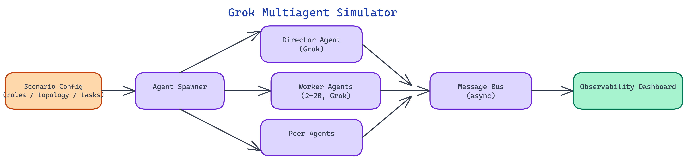

# Grok Multiagent Simulator: Test Emergent Behavior in Multi-Agent Systems Before You Deploy

## The Problem

> Multi-agent systems exhibit emergent behaviors that cannot be predicted by reasoning about individual agents in isolation. Two agents with individually correct and sensible behaviors can create feedback loops, deadlocks, or quality degradation when placed in communication. Testing these interactions in production is expensive and risky. Testing them in a realistic simulation environment before deployment is the right approach, but building that environment from scratch for every new multi-agent design is substantial work.

NEO built the Grok Multiagent Simulator to provide that simulation environment — configurable, observable, and built on the Grok model family.

## Agent Configuration and Role System

The simulator uses a declarative YAML configuration format to define agent systems. Each agent definition includes a role description, a system prompt, a communication protocol, and a set of tools the agent can use. Roles are not labels — they materially affect behavior by shaping what the agent knows, what it can do, and who it can communicate with.

The role system supports three communication topologies:

**Flat / peer-to-peer**: Any agent can send a message to any other agent. This is the most flexible topology and the one most likely to produce emergent coordination — agents discover which peers are useful and preferentially route messages accordingly.

**Hierarchical**: Agents are arranged in a tree. Leaf agents report to supervisor agents; supervisor agents report to a coordinator. Information flows up through summarization and down through task assignment. This topology is appropriate for decomposable tasks where a coordinator can assign sub-tasks and aggregate results.

**Role-specialized**: Agents are organized into functional roles (Researcher, Critic, Synthesizer, Executor) with defined communication rules. Only specified role pairs can communicate, preventing spurious cross-role interactions that dilute role specialization.

All three topologies can be mixed in a single simulation — a hierarchical coordinator can manage a flat team of peer specialists.

## Communication Protocols and Message Handling

Agent communication is mediated by a message bus. Messages are typed: task assignments, status updates, information requests, information responses, and escalations each have a distinct message type that the receiving agent can route differently. This prevents the common failure mode where all inter-agent communication is treated as undifferentiated natural language and agents lose track of whether they are being asked to do something or told something.

Each agent maintains a context window that includes its system prompt, its current task, and a recent message history. The message history is managed by a priority queue that gives higher weight to task assignments and recent status updates, evicting older low-priority messages when the context window fills. This simulates realistic memory constraints rather than giving agents unlimited context, which would not reflect production behavior.

The simulator supports asynchronous message passing. Agents do not wait for responses — they send messages and continue processing other inputs. This is important for simulating realistic multi-agent behavior where agents must make decisions under uncertainty about other agents' states. Synchronous communication is also available as an option for experiments that require strict coordination.

## Collaborative Problem-Solving and Negotiation Scenarios

The simulator ships with a library of scenario templates that exercise different multi-agent interaction patterns.

**Collaborative synthesis**: Multiple researcher agents independently investigate sub-questions; a synthesizer agent aggregates their findings into a coherent report. The scenario measures whether the synthesizer correctly integrates conflicting findings from different researchers and whether the researchers' division of labor produces better coverage than a single agent would.

**Negotiation and resource allocation**: Agents competing for a shared resource (API rate limit budget, token budget, tool access slots) must negotiate allocation. The scenario tests whether agents develop fair and efficient allocation strategies or whether dominant agents crowd out others.

**Adversarial quality checking**: A generator agent produces outputs; a critic agent evaluates them and can request revisions. The scenario tests whether the generator improves over iterations and whether the critic provides actionable feedback or degenerates into generic criticism.

**Cascading task decomposition**: A coordinator receives a complex task, decomposes it, assigns sub-tasks to specialist agents, waits for completions, and assembles the final output. The scenario tests decomposition quality, error propagation (does a failed sub-task cause appropriate escalation or silent failure?), and assembly accuracy.

## Observability Dashboard

A major design goal for the simulator is making emergent behavior visible. The observability dashboard provides real-time and post-hoc views of simulation runs.

The **message flow graph** shows every message exchanged during a simulation, with nodes representing agents and directed edges representing messages. Edge weight scales with message volume, making the actual communication topology visible — which often differs from the configured topology because agents develop preferences for specific peers.

The **timeline view** shows all agent actions on a shared time axis. This makes it possible to identify bottlenecks (one agent is waiting 60% of the time), feedback loops (agents A and B are exchanging messages in a cycle without producing output), and coordination patterns (agents synchronize their actions even without explicit synchronization instructions).

**Quality metrics** track the quality of intermediate outputs at each step where quality can be measured. For synthesis tasks, this might be factual accuracy of each agent's contribution. For code generation tasks, this might be whether each agent's code snippet passes its test cases. Plotting quality over iteration reveals whether the multi-agent system is converging or diverging.

**Token and cost accounting** tracks the total token consumption per agent and per simulation run. This is essential for evaluating whether a multi-agent approach is cost-effective compared to a single-agent approach on the same task.

## Scaling from 2 to 20 Agents

The simulator is designed to support system sizes from 2 agents to 20 agents. Beyond 20, communication overhead and context management become dominant factors that make the simulation less predictive of real deployments without additional infrastructure.

The scaling behavior itself is a research question the simulator helps answer. Does adding more researcher agents improve output quality linearly, sublinearly, or not at all beyond a certain count? Does a larger critic panel improve feedback quality or produce inconsistent, harder-to-reconcile critiques? The simulator makes these questions answerable by running the same scenario at different agent counts and comparing output quality and cost.

NEO built the Grok Multiagent Simulator to give engineers a safe environment to discover how their multi-agent system actually behaves before it touches production traffic. See what else NEO ships at [heyneo.so](https://heyneo.so/).

---

## Try NEO in Your IDE

Install the NEO extension to bring AI-powered development directly into your workflow:

- **VS Code**: [NEO in VS Code](https://marketplace.visualstudio.com/items?itemName=NeoResearchInc.heyneo)
- **Cursor**: <a href="cursor://extension/NeoResearchInc.heyneo" style="color:#0066FF;font-weight:bold;">Install NEO for Cursor →</a>

---
