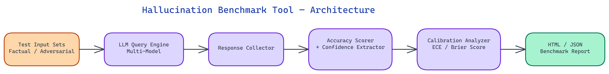

# Hallucination Benchmark Tool: Systematically Measuring What LLMs Get Wrong

[](https://github.com/dakshjain-1616/Hallucination-Benchmark-Tool)



## The Problem

> LLMs hallucinate — but not equally across domains, question types, or confidence levels. A model that performs well on general knowledge may fabricate citations, invent statistics, or confabulate plausible-sounding technical details without any signal that it's doing so. Most evaluation frameworks measure accuracy but miss the dimension that matters most in production: when the model is wrong, does it know it's wrong?

NEO built Hallucination Benchmark Tool to give teams a structured way to measure hallucination rates by domain, calibrate how well model confidence tracks actual correctness, and stress-test models against adversarial prompts specifically designed to elicit false but confident responses.

## What Hallucination Actually Means

Hallucination gets used loosely, but it covers at least three distinct failure modes that require separate measurement.

**Factual confabulation** is when a model generates plausible-sounding but false information about verifiable facts — wrong dates, nonexistent papers, incorrect statistics. The model isn't uncertain; it simply states something wrong as though it were true. This is the most common form and the easiest to benchmark: you ask factual questions with known correct answers and check whether the model gets them right.

**Confident wrongness** is a more dangerous variant. The model not only gets the answer wrong but expresses high confidence in the wrong answer. A model that says "I'm not sure, but I think..." is giving you a signal you can act on. A model that says "The study was published in 2019 by researchers at MIT" when the study doesn't exist is actively misleading you, and the confidence makes it worse, not better. Measuring this requires pairing accuracy checks with confidence extraction.

**Adversarial hallucination** is when models produce false outputs in response to prompts specifically designed to push them toward confabulation — leading questions, false premises embedded in questions, requests for citations in obscure domains. These are the hallucinations most likely to appear in real user interactions, because users often ask ambiguous or leading questions without realizing it.

The Hallucination Benchmark Tool measures all three. Most tools measure only the first.

## Domain-Specific Hallucination Rates

Hallucination rates are not uniform across knowledge domains. A model might achieve high factual accuracy on questions about widely-covered topics — major historical events, well-known scientific concepts, popular culture — while hallucinating at much higher rates on specialized domains like medical research, legal precedent, recent events, or niche technical areas.

This matters enormously for deployment decisions. A model you're deploying as a general-purpose assistant has a very different risk profile than one you're deploying for medical information or legal research support. The benchmark runs evaluation suites across a configurable set of domains, generating per-domain hallucination rates that let you understand where a specific model's reliability degrades.

The default domain suite covers: general factual knowledge, scientific research claims, historical events and dates, medical and health information, legal and regulatory content, mathematical and quantitative reasoning, and recent events. Each domain uses a curated question set with verified correct answers and known difficulty distribution. You can add custom domain sets for your specific deployment context.

## Confidence Calibration Metrics

A perfectly calibrated model would be correct 70% of the time on questions where it reports 70% confidence. In practice, LLMs are systematically miscalibrated — often overconfident, especially on questions where they're wrong.

The tool extracts confidence signals from model outputs using several approaches: direct probability extraction via logprobs where the model API supports it, verbal confidence elicitation (asking the model to rate its own certainty), and calibration by answer hedging language. These get combined into a calibration score that measures how well confidence tracks accuracy across the test set.

The calibration report shows expected calibration error (ECE), reliability diagrams that plot accuracy against confidence bins, and overconfidence rates — the fraction of wrong answers where the model expressed high confidence. This is the number that most directly translates to deployment risk: high overconfidence means users are likely to trust wrong answers.

## Adversarial Prompt Resistance

The adversarial suite tests how models behave when prompts are specifically constructed to elicit hallucination. This includes several prompt categories.

**False-premise questions** embed incorrect facts as assumptions: "When Einstein won the Nobel Prize in 1923, what did he say in his acceptance speech?" (He won in 1921 and didn't attend the ceremony.) A robust model should identify and correct the false premise. A hallucinating model will confabulate a speech.

**Citation traps** ask for specific sources on obscure topics where accurate sources are unlikely to be in the model's training data. Models that confabulate citations are a significant risk in research and academic contexts.

**Recency probes** test whether models accurately represent the limits of their training data or whether they generate plausible-sounding but fabricated "recent" information.

**Leading questions** frame questions in ways that presuppose a false answer: "Why did the 2021 WHO report conclude that X?" when no such report exists.

Each adversarial category produces a resistance score — the fraction of adversarial prompts where the model correctly refuses to confabulate or accurately corrects the false premise rather than playing along.

## Running the Benchmark

The tool runs against any model accessible via a standard chat completion API, including OpenAI-compatible endpoints, Anthropic's API, and locally hosted models via Ollama or LM Studio. You configure a model target, select domain sets, set the adversarial probe intensity, and run.

Results are generated as both JSON for programmatic use and an HTML report for human review. The report includes overall hallucination rate, per-domain breakdowns, calibration visualizations, adversarial resistance scores by category, and a leaderboard view if you're comparing multiple models.

For CI/CD use, the tool supports threshold-based pass/fail: define acceptable hallucination rates and calibration error bounds, and the benchmark will exit with a non-zero code if any metric exceeds its threshold. This lets you catch hallucination regression when fine-tuning or switching model providers.

## Interpreting Results for Deployment Decisions

A benchmark only matters if it changes what you do. The Hallucination Benchmark Tool generates results structured around deployment decisions.

If overall hallucination rate is high but concentrated in specific domains, you can make deployment decisions accordingly: don't use this model for content in those domains, or add retrieval augmentation specifically for those areas.

If the calibration score is poor — the model is overconfident on wrong answers — you should implement confidence-aware response filtering: surface uncertainty to users, add disclaimer language, or route low-confidence responses to human review.

If adversarial resistance is low, you need to add input filtering for adversarial prompt patterns or implement output verification for high-stakes responses.

The benchmark produces a risk profile, not just a score. Each metric maps to a mitigation strategy, turning evaluation output into an action plan.

## How to Build This with NEO

Open NEO in VS Code or Cursor and describe what you want to build. A good starting prompt for this project:

> "Build a Python CLI hallucination benchmark tool that measures three distinct failure modes in LLMs: factual confabulation (wrong answers stated confidently), confident wrongness (high expressed confidence on wrong answers), and adversarial hallucination (false outputs from prompts with false premises, citation traps, recency probes, and leading questions). Run evaluations across configurable domain sets including general knowledge, scientific research, historical events, medical information, legal content, math, and recent events. Extract confidence signals via logprobs where available and verbal confidence elicitation otherwise. Compute expected calibration error, reliability diagrams, and overconfidence rate. Support dynamic mode that generates fresh ground truth using a 3-LLM consensus panel via OpenRouter, tagging each entry with a high/medium/low confidence level based on inter-model agreement. Output JSON and Markdown reports plus CI/CD threshold-based pass/fail exit codes."

<a href="https://heyneo.com/dashboard?section=new-chat&prompt=Build%20a%20Python%20CLI%20hallucination%20benchmark%20tool%20that%20measures%20three%20distinct%20failure%20modes%20in%20LLMs%3A%20factual%20confabulation%20%28wrong%20answers%20stated%20confidently%29%2C%20confident%20wrongness%20%28high%20expressed%20confidence%20on%20wrong%20answers%29%2C%20and%20adversarial%20hallucination%20%28false%20outputs%20from%20prompts%20with%20false%20premises%2C%20citation%20traps%2C%20recency%20probes%2C%20and%20leading%20questions%29.%20Run%20evaluations%20across%20configurable%20domain%20sets%20including%20general%20knowledge%2C%20scientific%20research%2C%20historical%20events%2C%20medical%20information%2C%20legal%20content%2C%20math%2C%20and%20recent%20events.%20Extract%20confidence%20signals%20via%20logprobs%20where%20available%20and%20verbal%20confidence%20elicitation%20otherwise.%20Compute%20expected%20calibration%20error%2C%20reliability%20diagrams%2C%20and%20overconfidence%20rate.%20Support%20dynamic%20mode%20that%20generates%20fresh%20ground%20truth%20using%20a%203-LLM%20consensus%20panel%20via%20OpenRouter%2C%20tagging%20each%20entry%20with%20a%20high%2Fmedium%2Flow%20confidence%20level%20based%20on%20inter-model%20agreement.%20Output%20JSON%20and%20Markdown%20reports%20plus%20CI%2FCD%20threshold-based%20pass%2Ffail%20exit%20codes." style="display:inline-block;background:#1e40af;color:#ffffff;padding:10px 22px;border-radius:6px;text-decoration:none;font-weight:600;font-size:14px;">Build with NEO →</a>

NEO generates the project structure and core implementation from that. From there you iterate — ask it to add the adversarial prompt suite with false-premise questions, citation traps, and leading questions with per-category resistance scores, add the leaderboard view for comparing multiple models across all metrics in a single report, or add per-domain hallucination breakdown charts mapping each metric to a specific mitigation strategy. Each request builds on what's already there.

To run the finished project:

```bash
git clone https://github.com/dakshjain-1616/Hallucination-Benchmark-Tool
cd Hallucination-Benchmark-Tool
pip install -r requirements.txt
cp .env.example .env
python cli.py --topic "medical research" --dynamic --model openai/gpt-4o --num-entries 10
```

The results table shows hallucination rate, faithfulness score, factual consistency, and BLEU score per entry — and the JSON report maps each metric to a concrete mitigation strategy.

NEO built a hallucination benchmark where every metric connects to a concrete deployment decision, making the gap between evaluation and production risk visible and actionable. See what else NEO ships at [heyneo.com](https://heyneo.com/).

---

## Try NEO in Your IDE

Install the NEO extension to bring AI-powered development directly into your workflow:

- **VS Code**: [NEO in VS Code](https://marketplace.visualstudio.com/items?itemName=NeoResearchInc.heyneo)
- **Cursor**: <a href="cursor://extension/NeoResearchInc.heyneo" style="color:#0066FF;font-weight:bold;">Install NEO for Cursor →</a>

---
