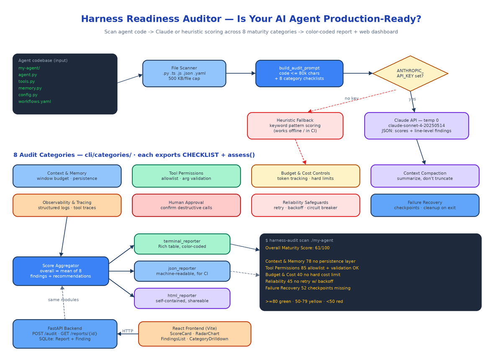

# Harness Readiness Auditor: Scoring Your AI Agent's Production Readiness Across 8 Dimensions

[](https://github.com/dakshjain-1616/Harness-Readiness-Auditor)



## The Problem

> The demo went great. The agent answered every question, called every tool, closed every ticket. Then it shipped. Week one: a session ran out of context mid-task and silently dropped the user's instructions. Week two: a rate limit turned into a crash loop because there was no retry. Week three: someone asked "what did the agent actually do at 2am?" and the answer was a folder of print statements. Nobody wrote a bad agent on purpose — they just never had a checklist for a production one.

There is a real gap between an agent that works and an agent that is ready. Production agents need context budgets, tool allowlists, cost ceilings, structured traces, human approval gates for destructive actions, retries with backoff, and checkpoints to resume from after a crash. Most agent codebases have two or three of these. Harness Readiness Auditor is a CLI and web platform that points at a directory of agent code and tells you exactly which of the eight you have, which you don't, and what to fix first — with scores, file-level findings, and remediation recommendations generated by Claude.

## The 8 Maturity Dimensions

The audit logic lives in `cli/categories/` — one module per dimension, each exporting a `CATEGORY_NAME`, a `DESCRIPTION`, a `CHECKLIST` of what good looks like, and an `assess()` function. The registry in `categories/__init__.py` maps the eight keys (`context_memory`, `tool_permissions`, `budget_controls`, `compaction`, `observability`, `human_approval`, `reliability`, `failure_recovery`) to their modules, so adding a ninth dimension is one file and one dict entry.

**Context & Memory Management** — context window budgeting, cross-session persistence, memory search instead of cold prompts.

**Tool Permission Architecture** — allowlists of approved tools, argument validation before execution, separation of read-only from destructive tools.

**Budget & Cost Controls** — per-session token tracking, hard cost limits with clear errors, per-call cost logging.

**Context Compaction Strategies** — intelligent summarization when the window fills, instead of truncation that drops the highest-priority messages.

**Observability & Tracing** — structured logs (not print statements), per-tool-call traces with input, output, and latency. The bar: can you reconstruct a session from logs alone?

**Human Approval Workflows** — confirmation prompts before destructive or financial tool calls, with timeouts that deny rather than proceed.

**Reliability Safeguards** — retry with exponential backoff, circuit breakers, timeouts on all external calls, retryable-vs-non-retryable error classification.

**Failure Recovery** — periodic state checkpoints, partial-result saving before re-raising, resource cleanup on exit.

Every category returns a 0–100 score with at least three findings and concrete recommendations.

## How a Scan Works

`cli/auditor.py` is the whole pipeline. `scan_directory()` walks the target recursively, picking up `.py`, `.ts`, `.js`, `.json`, `.yaml`, and `.yml` files while skipping hidden directories and `__pycache__`. Files over 500 KB are flagged and skipped rather than read.

`build_audit_prompt()` then assembles a single prompt containing the code (capped at 80,000 characters so a large repo doesn't blow the token budget) plus all eight category checklists, and demands one JSON object back: an `overall_score` and, per category, a score, findings with `severity`, `file_path`, and `line_number`, and a recommendations list. One API call covers all eight dimensions — `call_claude_api()` sends it at `temperature=0` and parses the JSON out of the response, tolerating markdown wrapping.

The model defaults to `claude-sonnet-4-20250514` against the Anthropic API. Set `OPENROUTER_API_KEY` instead of `ANTHROPIC_API_KEY` and the same client routes through OpenRouter with `anthropic/claude-sonnet-4-5` as the default — `MODEL_NAME` overrides either. If the API call fails for any reason, `run_audit()` catches it, falls back to local scoring, and notes the error in the report instead of dying.

## No API Key? Heuristics Still Work

Each category module's `assess()` function has a no-client path. Without a key, the auditor scores based on keyword patterns in the code — retry decorators, `structlog` usage, permission resolvers, checkpoint classes — and returns the category's `FALLBACK_ANALYSIS`: findings like "No retry mechanism with exponential backoff found" at `critical` severity, plus actionable recommendations ("Implement retry decorator with exponential backoff, e.g. tenacity or custom"). The Claude path improves precision and adds line references; the heuristic path means the tool runs in CI environments with no API access at all.

## The CLI

```bash
cd cli && pip install -e .                # installs the harness-audit command
export ANTHROPIC_API_KEY=sk-ant-...       # optional — enables Claude analysis

harness-audit scan /path/to/agent                              # Rich terminal report
harness-audit scan /path/to/agent --format json -o report.json # machine-readable
harness-audit scan /path/to/agent --format html -o audit.html  # self-contained HTML
```

The terminal reporter (`cli/reporters/terminal_reporter.py`) renders a Rich table with scores color-coded green (≥80, production ready), yellow (50–79, needs improvement), or red (<50, critical gaps):

```
Harness Readiness Auditor — Assessment Report
============================================================
Directory: /path/to/agent
Files scanned: 12

Overall Maturity Score: 61/100

Category                       Score   Top Findings
Context & Memory Management    78      🟡 Context window tracked but no persistence layer
Tool Permission Architecture   85      🔵 PermissionResolver covers all registered tools
Budget & Cost Controls         40      🔴 No hard cost limit — runaway sessions unbounded
Observability & Tracing        55      🟠 print() statements instead of structured logs
Reliability Safeguards         45      🔴 No retry mechanism with exponential backoff found
```

`json_reporter` and `html_reporter` emit the same data as JSON (for CI assertions) and a self-contained HTML file with embedded CSS (for sharing with the team). Two fixture codebases ship in `cli/tests/fixtures/` — `good_agent` implements all eight patterns and scores 80+, `bad_agent` is missing all of them and scores below 50 — so you can verify the scorer before pointing it at your own code.

## The Web Interface

The backend (`backend/main.py`) is a deliberately thin FastAPI wrapper: it imports `build_audit_prompt`, `call_claude_api`, and `compute_fallback_scores` straight from the CLI package, so there is exactly one copy of the audit logic. Three endpoints — `POST /audit` accepts a list of files with path, content, and language; `GET /reports` lists past audits; `GET /reports/{id}` returns the full report. The blocking Claude call and the SQLite writes both run through `asyncio.to_thread` so the event loop never stalls. Results persist as SQLAlchemy `Report` and `Finding` rows.

The React frontend (Vite + Tailwind) has five components: `AuditRunner` uploads code and triggers the audit, `ScoreCard` shows per-category scores, `RadarChart` draws an SVG radar across all eight dimensions, `FindingsList` sorts findings by severity, and `CategoryDrilldown` shows the full checklist detail per category. `docker compose up --build` brings up the backend on port 8000 and the frontend on port 80; the only configuration is `ANTHROPIC_API_KEY` in `.env`.

45 tests cover the whole thing — 35 on the CLI (all eight category modules, both fixture agents, all three reporters, an end-to-end scan-to-report test) and 10 on the API with in-memory SQLite. The suite runs in under a second.

## Audited Against Itself

The repo's README documents a live run: `harness-audit scan` pointed at the tool's own codebase, with analysis routed through OpenRouter. Overall maturity score: 85/100. The model credited the `PermissionResolver` with explicit `RiskLevel` categorization, the `TokenBudget` class with hard limits and 75%-threshold alerts, structured logging with trace ID propagation via `@logged_tool_call`, and the `retry_with_backoff` decorator plus `CircuitBreaker` state machine. Top recommendations it returned: vector-based context pruning, per-tool budget allocation, and incremental checkpointing. An auditor that scores green on its own audit is a reasonable smoke test.

## How to Build This with NEO

Open NEO in VS Code or Cursor and describe what you want to build. A good starting prompt for this project:

> "Build a CLI and web platform called Harness Readiness Auditor that evaluates whether an AI agent codebase is production-ready. The CLI (Click + Rich) has a `harness-audit scan <directory>` command with --format terminal/json/html and --output. It recursively scans .py/.ts/.js/.json/.yaml files, then scores the code across 8 maturity categories, each its own module exporting CATEGORY_NAME, DESCRIPTION, CHECKLIST, and assess(): context & memory management, tool permission architecture, budget & cost controls, context compaction, observability & tracing, human approval workflows, reliability safeguards, and failure recovery. With an ANTHROPIC_API_KEY, build one combined prompt (code capped at 80k chars) and call Claude at temperature 0 for structured JSON with per-category scores, severity-tagged findings with file paths and line numbers, and recommendations; without a key, fall back to keyword-heuristic scoring. Color-code scores green ≥80, yellow 50–79, red <50. Add a FastAPI backend that reuses the CLI's audit functions with POST /audit, GET /reports, GET /reports/{id}, persisting Report and Finding models to SQLite. Build a React frontend with AuditRunner, ScoreCard, an SVG RadarChart, FindingsList, and CategoryDrilldown components. Include good_agent and bad_agent test fixtures, pytest suites for CLI and API, and docker-compose for the full stack."

<a href="https://heyneo.com/dashboard?section=new-chat&prompt=Build%20a%20CLI%20and%20web%20platform%20called%20Harness%20Readiness%20Auditor%20that%20scores%20AI%20agent%20codebases%20for%20production%20readiness%20across%208%20maturity%20categories%3A%20context%20%26%20memory%2C%20tool%20permissions%2C%20budget%20controls%2C%20compaction%2C%20observability%2C%20human%20approval%2C%20reliability%2C%20failure%20recovery.%20Click%20%2B%20Rich%20CLI%20with%20terminal%2FJSON%2FHTML%20reports%2C%20Claude-powered%20analysis%20with%20heuristic%20fallback%2C%20FastAPI%20backend%20with%20SQLite%2C%20React%20frontend%20with%20radar%20chart%2C%20good%2Fbad%20agent%20fixtures%2C%20and%20docker-compose." style="display:inline-block;background:#1e40af;color:#ffffff;padding:10px 22px;border-radius:6px;text-decoration:none;font-weight:600;font-size:14px;">Build with NEO →</a>

NEO scaffolds the category modules, the prompt builder and JSON parsing, the three reporters, the FastAPI wrapper, the React dashboard, and both fixture agents. From there you tune the checklists to your team's bar — add a dimension for prompt-injection defenses, wire `harness-audit scan --format json` into CI and fail the build below a threshold score, or extend the heuristics for the frameworks your agents actually use.

Most agents fail in production for predictable reasons; this tool makes the checklist executable. See what else NEO ships at [heyneo.com](https://heyneo.com/).

---

## Try NEO in Your IDE

Install the NEO extension to bring AI-powered development directly into your workflow:

- **VS Code**: [NEO in VS Code](https://marketplace.visualstudio.com/items?itemName=NeoResearchInc.heyneo)
- **Cursor**: <a href="cursor://extension/NeoResearchInc.heyneo" style="color:#0066FF;font-weight:bold;">Install NEO for Cursor →</a>

---
