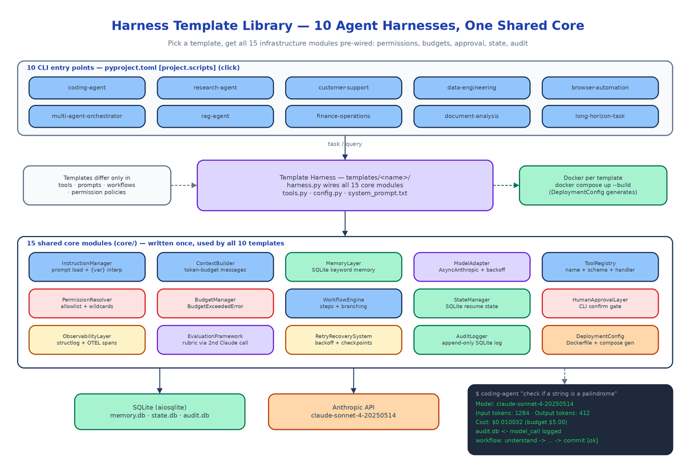

# Harness Template Library: 10 Production-Ready Agent Harnesses on 15 Shared Infrastructure Modules

[](https://github.com/dakshjain-1616/Harness-Template-Library)



## The Problem

> The prototype took an afternoon. The agent calls Claude, calls a few tools, prints an answer. Then someone asks to run it in production and the list starts: what happens when the API rate-limits mid-task? Who approved that $40 session? Why did the agent write to that file? Can we resume the run that died at step 7 of 9? Three weeks later you've written a context manager, a retry wrapper, a budget tracker, and half an audit log — and you haven't touched the actual agent logic since the prototype.

Every production agent needs the same fifteen things, and almost none of them are about the model. Rate limits need exponential backoff. Context windows fill up and need careful pruning. Tool calls need permission checks before they execute. Financial operations need a human in the loop. Mid-task failures need checkpoints. Costs need per-session hard limits. The Harness Template Library writes that infrastructure once — 15 real, async Python modules in `core/` — and ships 10 complete agent templates that wire all of them together for a specific use case. You pick the template that matches your problem and get the whole stack on day one.

## Pick a Template, Get the Whole Stack

Installing the package registers 10 CLI entry points, one per template:

```bash
pip install -e ".[dev]"
export ANTHROPIC_API_KEY=sk-ant-your-key-here

coding-agent "Write a Python function that checks if a string is a palindrome"
research-agent "Summarize the key architectural differences between GPT-4 and Claude"
finance-operations "Create an invoice for client ACME for $1,200"
long-horizon-task "Migrate the test suite from unittest to pytest"
```

The full set: `coding-agent`, `research-agent`, `customer-support`, `data-engineering`, `browser-automation`, `multi-agent-orchestrator`, `rag-agent`, `finance-operations`, `document-analysis`, and `long-horizon-task`. Each is a Click CLI with `--model`, `--max-tokens`, `--budget`, and `--data-dir` flags, defaulting to `claude-sonnet-4-20250514`.

Each template lives in `templates/<name>/` with the same four-file anatomy plus deployment and tests:

- `harness.py` — instantiates and wires all 15 core modules for the domain
- `tools.py` — the domain-specific tool handlers (the coding agent ships `read_file`, `write_file`, `run_tests`, `git_diff`, `search_code`)
- `config.py` — a `pydantic-settings` class with a per-template env prefix like `CODING_AGENT_`
- `system_prompt.txt` — the agent persona
- `Dockerfile`, `docker-compose.yml`, and `tests/test_harness.py`

The templates differ in tools, prompts, workflow steps, and permission policy — never in infrastructure. The RAG agent runs cosine similarity over an in-memory vector store and cites passages; the multi-agent orchestrator spawns subagents and merges their results; the long-horizon template checkpoints after every workflow step so an interrupted run resumes instead of restarting. All ten sit on the identical `core/`.

## The 15 Core Modules

Everything in `core/` is a working async Python class, not a stub. The roll call:

| Module | What it does |
|--------|-------------|
| `InstructionManager` | Loads system prompts from file or env, `{variable}` interpolation |
| `ContextBuilder` | Assembles the messages array under a token budget with intelligent truncation |
| `MemoryLayer` | SQLite-backed memory with keyword search across past sessions |
| `ModelAdapter` | Wraps `AsyncAnthropic`, retries rate limits with exponential backoff |
| `ToolRegistry` | Registers tools by name with JSON schema and Python handler |
| `PermissionResolver` | Allowlist policy with wildcard support, checked before every tool call |
| `BudgetManager` | Tracks tokens and cost per session, raises `BudgetExceededError` at the hard limit |
| `WorkflowEngine` | Named steps with conditional branching on step results |
| `StateManager` | Serializes full agent state to SQLite for resuming interrupted tasks |
| `HumanApprovalLayer` | Pauses on sensitive tools and prompts the operator |
| `ObservabilityLayer` | `structlog` structured logs plus OTEL spans for every tool and model call |
| `EvaluationFramework` | Scores agent output against a rubric with a second Claude call |
| `RetryRecoverySystem` | Backoff wrapper that saves partial results to disk before re-raising |
| `AuditLogger` | Append-only SQLite log of every action, decision, and tool call |
| `DeploymentConfig` | Generates Dockerfiles and `docker-compose.yml` programmatically |

Because the modules are shared, a fix to `RetryRecoverySystem` lands in all ten templates at once. A template's `harness.py` is mostly configuration — here is the coding agent declaring its permission policy and budget:

```python
self.permission_resolver = PermissionResolver(
    allowlist=["read_file", "write_file", "run_tests", "git_diff", "search_code"]
)
self.budget_manager = BudgetManager(
    session_budget_usd=self._config.session_budget_usd,
)
```

## Two Gates, Deliberately Separate

The library treats "is this tool allowed" and "did a human say yes" as different questions answered by different modules.

`PermissionResolver` is the policy gate: every tool call is checked against the allowlist (with wildcards) before the handler runs, and a violation raises `PermissionDeniedError`. `HumanApprovalLayer` is an upstream, per-tool gate that stops execution and asks the operator on the CLI. The finance template configures every payment-related tool to require approval regardless of what the permission policy says — money does not move because a wildcard matched.

Keeping the gates separate is an audit decision as much as a safety one: the `AuditLogger` records both the policy check and the human decision as distinct entries, so the append-only log can answer "was this allowed?" and "who approved it?" independently.

Budget enforcement follows the same blunt philosophy. Even though the library is async throughout, `BudgetManager.check_budget()` raises `BudgetExceededError` synchronously. Any caller that doesn't catch it propagates it up, which means no tool call or model call can quietly slip past the session limit.

## SQLite Everywhere

Memory, state persistence, and the audit trail all run on SQLite via `aiosqlite` — three databases per template, zero external services:

```
MEMORY_DB_PATH=memory.db    # keyword-searchable cross-session memory
STATE_DB_PATH=state.db      # full agent state for resume-after-crash
AUDIT_DB_PATH=audit.db      # append-only, non-repudiable action log
```

That choice is what makes the templates genuinely runnable on day one: they work in air-gapped environments, on a laptop, and in ephemeral CI without provisioning anything. The data lands under `~/.harness/<template>/` by default and every path is overridable through `pydantic-settings`, so config comes from `.env` or environment variables with sensible defaults — only `ANTHROPIC_API_KEY` is required.

## Grading the Agent's Homework

`EvaluationFramework` scores agent output against a weighted rubric using a second Claude call. The coding agent's rubric weighs correctness at 0.4, completeness at 0.3, and code quality at 0.3:

```python
self.evaluation = EvaluationFramework(
    model_adapter=self.model_adapter,
    rubric=EvaluationRubric(
        name="coding_quality",
        dimensions=[
            {"name": "correctness", "weight": 0.4, ...},
            {"name": "completeness", "weight": 0.3, ...},
            {"name": "code_quality", "weight": 0.3, ...},
        ],
    ),
)
```

A second model call adds latency and cost, so evaluation is opt-in per template rather than always-on — and when it runs, the spend is visible to the same `BudgetManager` as everything else.

## Docker Out, Tests Green

Every template ships a `Dockerfile` and `docker-compose.yml`, so `cd templates/coding_agent && docker compose up --build` works immediately. For custom services, `DeploymentConfig` generates both files programmatically:

```python
from core.deployment_config import DeploymentConfig

dc = DeploymentConfig(service_name="my-coding-agent")
dockerfile = dc.generate_dockerfile()
compose = dc.generate_compose()
```

The test suite covers all 15 core modules — 78 tests with a mocked Anthropic client, temp SQLite fixtures, and a sub-5-second runtime — plus a per-template `test_harness.py`. `python -m pytest tests/ -v` is the whole story.

## How to Build This with NEO

Open NEO in VS Code or Cursor and describe what you want to build. A good starting prompt for this project:

> "Build a Python library of production-grade AI agent harness templates. Create 15 shared infrastructure modules in core/: InstructionManager (prompt loading + interpolation), ContextBuilder (token-budget message assembly), MemoryLayer (SQLite keyword-search memory), ModelAdapter (AsyncAnthropic with exponential backoff), ToolRegistry (name + JSON schema + handler), PermissionResolver (allowlist with wildcards), BudgetManager (cost tracking that raises BudgetExceededError at a hard limit), WorkflowEngine (named steps with branching), StateManager (SQLite state save/restore), HumanApprovalLayer (CLI confirmation for sensitive tools), ObservabilityLayer (structlog + OTEL spans), EvaluationFramework (rubric scoring via a second Claude call), RetryRecoverySystem (backoff + partial checkpoints), AuditLogger (append-only SQLite log), and DeploymentConfig (Dockerfile/compose generation). Then build 10 templates that wire all 15 together — coding agent, research agent, customer support, data engineering, browser automation, multi-agent orchestrator, RAG agent, finance operations (human approval mandatory for all financial tools), document analysis, and long-horizon task — each with harness.py, tools.py, a pydantic-settings config.py, system_prompt.txt, Dockerfile, docker-compose.yml, and tests. Register one Click CLI entry point per template in pyproject.toml. Use aiosqlite for all storage and write a pytest suite with a mocked Anthropic client."

<a href="https://heyneo.com/dashboard?section=new-chat&prompt=Build%20a%20Python%20library%20of%2010%20AI%20agent%20harness%20templates%20%28coding%2C%20research%2C%20customer%20support%2C%20data%20engineering%2C%20browser%20automation%2C%20multi-agent%20orchestrator%2C%20RAG%2C%20finance%20operations%2C%20document%20analysis%2C%20long-horizon%20task%29%20sharing%2015%20core%20infrastructure%20modules%3A%20instruction%20manager%2C%20context%20builder%2C%20SQLite%20memory%2C%20AsyncAnthropic%20adapter%20with%20backoff%2C%20tool%20registry%2C%20permission%20resolver%2C%20budget%20manager%20with%20hard%20limits%2C%20workflow%20engine%2C%20state%20manager%2C%20human%20approval%20layer%2C%20observability%20%28structlog%20%2B%20OTEL%29%2C%20evaluation%20framework%2C%20retry%20recovery%2C%20audit%20logger%2C%20deployment%20config.%20One%20Click%20CLI%20per%20template%2C%20pydantic-settings%20config%2C%20Docker%20per%20template%2C%20pytest%20suite%20with%20mocked%20Anthropic%20client." style="display:inline-block;background:#1e40af;color:#ffffff;padding:10px 22px;border-radius:6px;text-decoration:none;font-weight:600;font-size:14px;">Build with NEO →</a>

NEO scaffolds the 15 core modules, the 10 template packages, the CLI entry points, the Docker files, and the test suite. From there you swap the stub tools for real integrations — a live browser driver for the automation template, your actual payment API behind the finance tools, a real vector database for the RAG agent — and the permission, budget, approval, and audit layers keep working unchanged around them.

NEO built the agent infrastructure layer that every production deployment ends up writing by hand, ten times over, in one shared core. See what else NEO ships at [heyneo.com](https://heyneo.com/).

---

## Try NEO in Your IDE

Install the NEO extension to bring AI-powered development directly into your workflow:

- **VS Code**: [NEO in VS Code](https://marketplace.visualstudio.com/items?itemName=NeoResearchInc.heyneo)
- **Cursor**: <a href="cursor://extension/NeoResearchInc.heyneo" style="color:#0066FF;font-weight:bold;">Install NEO for Cursor →</a>

---
