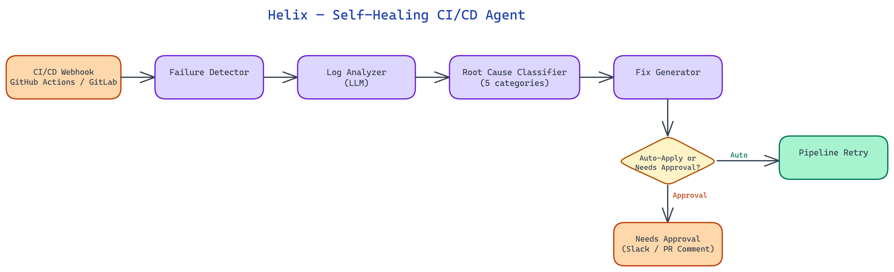

# Helix: A Self-Healing CI/CD Agent That Fixes Pipeline Failures Autonomously

[](https://github.com/dakshjain-1616/Helix-Self-Healing-CI-CD-Agent)



## The Problem

> CI/CD pipelines fail constantly. Dependency version conflicts, environment drift, flaky tests, expired credentials, and misconfigured runners account for a substantial fraction of pipeline failures — failures that have nothing to do with the code change being tested. Each failure requires a developer to stop what they are doing, read the log, diagnose the root cause, apply a fix, and re-trigger the pipeline. In teams with frequent deployments, this cost accumulates into hours per week per engineer.

NEO built Helix to handle the class of CI/CD failures that do not require deep knowledge of the business logic — failures that are mechanical, repeatable, and diagnosable from the error log alone.

## How Helix Intercepts and Diagnoses Failures

Helix integrates with GitHub Actions and GitLab CI via their respective webhook and API systems. When a pipeline fails, the CI platform sends a webhook notification to the Helix server. Helix immediately fetches the full job log for the failed step, the pipeline configuration file, and the diff of the triggering commit.

These three inputs are passed to the diagnostic layer. The diagnostic layer is not a simple regex matcher — it is an LLM-powered analysis step that reasons about the relationship between the error message, the pipeline configuration, and the recent change. This distinction is important: many pipeline failures are triggered by a code change but are not caused by a bug in that change. A dependency upgrade in `requirements.txt` that introduces a version conflict is caused by the change but requires a different fix than a test that broke because the code logic changed.

The diagnostic layer classifies each failure into one of several root cause categories:

- **Dependency conflict**: a version constraint in the package manifest is incompatible with another package or the Python/Node version in the runner environment.
- **Environment drift**: a system dependency, environment variable, or secret has changed outside the pipeline definition.
- **Flaky test**: the failure is non-deterministic — the test passes when retried without any code change.
- **Configuration error**: the pipeline YAML has a syntax error, references a non-existent secret, or uses a deprecated runner image.
- **Genuine regression**: the code change introduced a bug that causes a test to fail.

Only the first four categories trigger autonomous remediation. Genuine regressions are escalated to the developer with a diagnosis but no automated fix — Helix does not attempt to fix business logic.

## Autonomous Remediation Strategies

For each root cause category, Helix maintains a library of remediation strategies. The strategy selected depends on the specific diagnosis.

**Dependency conflicts** are resolved by querying the package registry (PyPI or npm) for a compatible version range that satisfies all constraints. Helix computes the minimum version change required to resolve the conflict, generates a patch to the manifest file, commits it to a new branch, and creates a pull request. The PR includes a comment from Helix explaining the conflict and the resolution, with links to the relevant package changelogs. This is not a blind version pin — it is a minimum-change resolution with explanation.

**Environment drift** is handled differently depending on the type of drift. Missing environment variables trigger a notification to the team's configured alert channel (Slack, PagerDuty, email) with the name of the missing variable and the step that requires it. Expired secrets trigger a similar notification with the secret name and the last rotation date if Helix has access to the secrets management system. Helix does not attempt to rotate credentials autonomously — that action is too consequential for automated execution without human approval.

**Flaky tests** are detected by re-triggering the failed step up to three times. If it passes on any retry, the test is classified as flaky. Helix adds the test to a flaky test registry (stored in the repository as `.helix/flaky-tests.json`), modifies the pipeline configuration to add a retry count for that specific test, and creates a tracking issue for the team to investigate and fix the underlying flakiness.

**Configuration errors** are resolved by correcting the YAML directly. Helix validates the corrected pipeline configuration against the CI platform's schema before committing to avoid introducing new configuration errors.

## Safety Controls and Approval Gates

Autonomous action on production infrastructure requires strict safety controls. Helix implements a tiered approval model.

Low-risk actions (adding a test retry, creating a tracking issue, posting a diagnostic comment) execute immediately without approval. Medium-risk actions (modifying `requirements.txt` or `package.json`, changing pipeline configuration) create a pull request for human review and require at least one approval before merging. The PR is clearly labeled as Helix-generated and includes a confidence score for the diagnosis.

Helix maintains a rate limit on autonomous actions per repository per hour. If a pipeline is failing repeatedly on the same root cause and Helix has already applied a fix that has not merged, it will not create duplicate PRs — it will comment on the existing PR with updated context.

A dry-run mode is available for teams onboarding Helix. In dry-run mode, Helix performs full diagnosis and remediation planning but posts all proposed actions as PR comments rather than executing them. This allows teams to evaluate Helix's reasoning before granting it write permissions.

## Observability and Learning

Helix tracks the outcome of every remediation action. When a PR it creates is merged and the pipeline subsequently passes, that is recorded as a successful remediation. When a PR is closed without merging (because the developer found a different fix), the alternate fix is captured for analysis.

This feedback loop feeds a continuous improvement process. Patterns in failed remediations surface cases where Helix's diagnosis was incorrect or where its remediation strategy was right but its implementation was wrong. The remediation strategy library is updated accordingly.

## How to Build This with NEO

Open NEO in VS Code or Cursor and describe what you want to build. A good starting prompt for this project:

> "Build a Python webhook server called Helix that integrates with GitHub Actions and GitLab CI to autonomously fix pipeline failures. When a pipeline fails, receive a webhook, fetch the full job log, pipeline config, and triggering commit diff, then use an LLM via OpenRouter to classify the root cause into: dependency conflict, environment drift, flaky test, configuration error, or genuine regression. For dependency conflicts, query PyPI/npm for a minimum-change version resolution and create a PR with a changelog explanation. For flaky tests, retry up to 3 times, add the test to .helix/flaky-tests.json, modify the pipeline to add a retry count, and create a tracking issue. For config errors, validate the corrected YAML against the CI schema before committing. Implement a tiered approval model: low-risk actions execute immediately, medium-risk actions create PRs requiring one approval. Include DRY_RUN=true mode that posts all proposed actions as PR comments without executing them."

<a href="https://heyneo.com/dashboard?section=new-chat&prompt=Build%20a%20Python%20webhook%20server%20called%20Helix%20that%20integrates%20with%20GitHub%20Actions%20and%20GitLab%20CI%20to%20autonomously%20fix%20pipeline%20failures.%20When%20a%20pipeline%20fails%2C%20receive%20a%20webhook%2C%20fetch%20the%20full%20job%20log%2C%20pipeline%20config%2C%20and%20triggering%20commit%20diff%2C%20then%20use%20an%20LLM%20via%20OpenRouter%20to%20classify%20the%20root%20cause%20into%3A%20dependency%20conflict%2C%20environment%20drift%2C%20flaky%20test%2C%20configuration%20error%2C%20or%20genuine%20regression.%20For%20dependency%20conflicts%2C%20query%20PyPI%2Fnpm%20for%20a%20minimum-change%20version%20resolution%20and%20create%20a%20PR%20with%20a%20changelog%20explanation.%20For%20flaky%20tests%2C%20retry%20up%20to%203%20times%2C%20add%20the%20test%20to%20.helix%2Fflaky-tests.json%2C%20modify%20the%20pipeline%20to%20add%20a%20retry%20count%2C%20and%20create%20a%20tracking%20issue.%20For%20config%20errors%2C%20validate%20the%20corrected%20YAML%20against%20the%20CI%20schema%20before%20committing.%20Implement%20a%20tiered%20approval%20model%3A%20low-risk%20actions%20execute%20immediately%2C%20medium-risk%20actions%20create%20PRs%20requiring%20one%20approval.%20Include%20DRY_RUN%3Dtrue%20mode%20that%20posts%20all%20proposed%20actions%20as%20PR%20comments%20without%20executing%20them." style="display:inline-block;background:#1e40af;color:#ffffff;padding:10px 22px;border-radius:6px;text-decoration:none;font-weight:600;font-size:14px;">Build with NEO →</a>

NEO generates the project structure and core implementation from that. From there you iterate — ask it to add rate limiting so Helix won't create duplicate PRs when a pipeline is failing repeatedly on the same root cause, add the remediation outcome tracking loop that records whether Helix's PRs are merged or closed with alternate fixes, or add Slack and PagerDuty notification delivery for environment drift failures. Each request builds on what's already there.

To run the finished project:

```bash
git clone https://github.com/dakshjain-1616/Helix-Self-Healing-CI-CD-Agent
cd Helix-Self-Healing-CI-CD-Agent
pip install -r requirements.txt
DRY_RUN=true python server/webhook.py
```

In dry-run mode Helix performs full LLM diagnosis and posts proposed fixes as PR comments so you can evaluate the reasoning quality before granting write permissions.

NEO built Helix to turn CI/CD failures from developer interruptions into background events that resolve themselves. See what else NEO ships at [heyneo.com](https://heyneo.com/).

---

## Try NEO in Your IDE

Install the NEO extension to bring AI-powered development directly into your workflow:

- **VS Code**: [NEO in VS Code](https://marketplace.visualstudio.com/items?itemName=NeoResearchInc.heyneo)
- **Cursor**: <a href="cursor://extension/NeoResearchInc.heyneo" style="color:#0066FF;font-weight:bold;">Install NEO for Cursor →</a>

---
