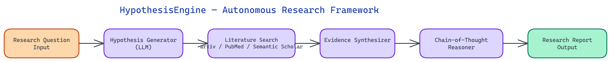

# HypothesisEngine: An Autonomous Research Agent That Reads the Literature So You Don't Have To

[](https://github.com/dakshjain-1616/HypothesisEngine---Autonomous-Research-Framework)



## The Problem

> Scientific research begins with a literature review, and literature reviews are brutally slow. A researcher entering a new sub-field can spend weeks reading papers before forming a coherent picture of what is known, what is contested, and where the gaps are. Even experienced researchers struggle to track the accelerating pace of publication across arxiv, PubMed, and dozens of other repositories simultaneously.

NEO built HypothesisEngine to compress that process — not by summarizing individual papers, but by reasoning across them, surfacing connections, and generating testable hypotheses grounded in evidence.

## How the Hypothesis Generation Loop Works

HypothesisEngine operates as a multi-stage agent loop rather than a single-pass pipeline. The distinction matters. A single-pass system reads some papers and produces output. A loop refines its own hypotheses by searching for contradicting evidence, updating confidence scores, and deciding when it has gathered enough to synthesize.

The loop begins with a research question provided by the user. This is deliberately broad — "what mechanisms link gut microbiome composition to depression?" is a valid starting point. The agent decomposes the question into structured sub-queries using chain-of-thought reasoning. Each sub-query targets a specific facet: epidemiological associations, candidate mechanisms, intervention studies, conflicting findings.

Sub-queries fan out to three literature sources in parallel: arxiv for recent preprints, PubMed for peer-reviewed biomedical literature, and Semantic Scholar for cross-domain citation graphs. Results are ranked by relevance using a combination of semantic similarity and citation recency weighting. The agent does not assume that newer papers are more correct — it tracks the citation genealogy of claims to identify which findings have propagated widely versus which remain isolated results.

## Chain-of-Thought Evidence Synthesis

The core technical contribution of HypothesisEngine is its evidence synthesis layer. After each search round, the agent runs a structured reasoning pass using chain-of-thought prompting. It is not summarizing — it is building an argument.

For each candidate hypothesis, the agent constructs an evidence chain: a sequence of findings from different papers that together support or undermine the hypothesis. Each link in the chain includes the source paper, the specific claim being extracted, the study type (RCT, cohort, in vitro, computational), and an uncertainty flag if the claim conflicts with other sources. This produces a reasoned argument tree rather than a flat list of citations.

The agent also tracks hypothesis confidence as a first-class value. A hypothesis supported by three independent RCTs has a different confidence profile than one supported by two preprints and a review article that cites both. HypothesisEngine makes that distinction explicit in its output.

When contradictions arise — and they frequently do — the agent does not discard either finding. Instead it generates a resolution hypothesis: a more nuanced claim that can accommodate both results. This often surfaces the most interesting research directions, the precise conditions under which effect A appears but effect B does not.

## Multi-Source Search Architecture

The search layer uses adapter-based architecture. Each literature source (arxiv, PubMed, Semantic Scholar) has a dedicated adapter that normalizes the API response format into a shared document schema. The schema captures title, abstract, authors, publication date, citation count, DOI, and a pre-computed embedding of the abstract.

Embeddings are computed once and cached. This matters for the iterative loop — on the second and third passes, the agent retrieves documents by vector similarity to its current hypothesis state rather than re-running keyword searches. The search strategy evolves as the agent's understanding deepens.

The Semantic Scholar adapter is particularly valuable for cross-domain discovery. A mechanism first described in neuroscience may have a counterpart in immunology that the researcher would not have thought to search for. Citation graph traversal from a seed paper can surface these connections automatically. HypothesisEngine uses forward and backward citation traversal — both "papers that cite this" and "papers this cites" — to map the intellectual neighborhood of each key finding.

## Output: Structured Research Reports

The final output is a structured research report in Markdown and JSON formats. The Markdown version is human-readable — organized into sections for background, candidate hypotheses (ranked by confidence), supporting evidence, contradicting evidence, identified research gaps, and suggested experimental designs.

Suggested experimental designs are a notable feature. Once the agent has characterized what is known and what is uncertain, it can reason about what kind of study would most efficiently resolve the uncertainty. A hypothesis with strong observational support but no mechanistic evidence calls for a different experiment than one with proposed mechanisms but inconsistent epidemiology. The agent makes that distinction and proposes study designs accordingly — not detailed protocols, but conceptual designs at the level of "a randomized controlled trial in human subjects measuring X would test whether Y causes Z under condition W."

The JSON output is intended for downstream integration — feeding into project management tools, citation managers, or other research automation systems.

## Practical Applications and Limitations

HypothesisEngine is most useful at the beginning of a research project, when the landscape of a field is unfamiliar, or when exploring a speculative cross-disciplinary connection. It is substantially less useful for highly specialized technical questions where the relevant literature is too small for pattern extraction.

The tool does not replace domain expertise. A senior researcher reading the output will immediately spot when the agent has over-weighted a poorly-designed study or missed a critical methodological issue. The value is not in replacing that judgment but in doing the mechanical work of retrieval, reading, and initial synthesis fast enough that the researcher can focus their judgment on the interesting parts.

## How to Build This

HypothesisEngine uses only the Python standard library, so there are no additional package installs. Clone and set up a virtual environment:

```bash
git clone https://github.com/dakshjain-1616/HypothesisEngine---Autonomous-Research-Framework
cd HypothesisEngine---Autonomous-Research-Framework
python3 -m venv venv
source venv/bin/activate
```

Run in interactive mode and enter your research question when prompted:

```bash
python3 src/hypothesis_engine.py
```

Or pass a hypothesis directly on the command line:

```bash
python3 src/hypothesis_engine.py \
  --hypothesis "Regular exercise improves cognitive function in older adults" \
  --output reports/exercise_cognition.md \
  --questions 5
```

The engine decomposes the question into sub-queries, fans them out to arxiv, PubMed, and Semantic Scholar in parallel, ranks results by semantic similarity and citation recency, and runs a chain-of-thought synthesis pass over the retrieved papers. The terminal shows progress through each stage. When the run completes, a Markdown research brief is written to the output path with sections covering candidate hypotheses ranked by confidence, supporting and contradicting evidence for each, identified research gaps, and suggested experimental designs. A full timestamped log is saved alongside the report for reproducibility.

NEO built HypothesisEngine to give researchers a collaborator that never gets tired of reading papers. See what else NEO ships at [heyneo.so](https://heyneo.so/).

---

## Try NEO in Your IDE

Install the NEO extension to bring AI-powered development directly into your workflow:

- **VS Code**: [NEO in VS Code](https://marketplace.visualstudio.com/items?itemName=NeoResearchInc.heyneo)
- **Cursor**: <a href="cursor://extension/NeoResearchInc.heyneo" style="color:#0066FF;font-weight:bold;">Install NEO for Cursor →</a>

---
