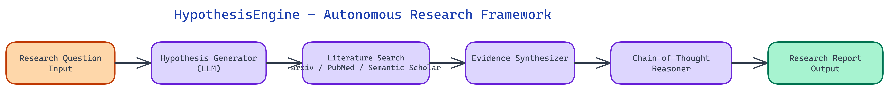

# HypothesisEngine: Autonomous Research Framework That Investigates Claims with Evidence-Based Reasoning

## The Problem

> Separating fact from fiction requires systematic investigation. A single source is unreliable. Anecdotes feel true but prove nothing. Most research tools aggregate search results—they don't actually investigate. They leave you reading raw links and drawing your own conclusions.

NEO built HypothesisEngine to conduct full investigations using three distinct methods: web search for empirical evidence, code execution for quantitative analysis, and logical reasoning to evaluate implications. Evidence is weighted by source reliability and synthesized into verdicts with explicit confidence scoring.

## Three-Method Investigation Architecture

The engine works by combining three complementary investigation approaches, each feeding into a central synthesis layer.

### Method 1: Web Search and Evidence Gathering

Conducts web searches to find empirical evidence from reliable sources. Each finding is weighted by source type—peer-reviewed publications rank highest, followed by institutional sources, news outlets, and general web content.

Results are confidence-scored based on source reliability and corroboration across multiple sources. A finding from one blog receives lower confidence than the same finding confirmed across multiple peer-reviewed studies.

### Method 2: Code Execution for Quantitative Analysis

For claims involving numbers, code execution verifies quantitative claims empirically. The engine computes statistics, runs simulations, or processes datasets directly rather than relying on cited numbers.

This matters because reported statistics are often incomplete or misrepresented. Running analysis yourself ensures testing what actually matters.

### Method 3: Logical Reasoning and Implication Analysis

Applies logical reasoning to evaluate implications. If A is true and B is true, what follows? Are there contradictions? What would need to be true for the overall hypothesis to hold?

This reasoning layer catches internal inconsistencies that raw evidence gathering misses.

## Evidence Synthesis and Verdicts

After investigation, findings are synthesized across all three methods:

- **SUPPORTED**: Multiple independent methods confirm the hypothesis
- **REFUTED**: Multiple methods contradict the hypothesis
- **PARTIALLY SUPPORTED/REFUTED**: Evidence points in different directions
- **INCONCLUSIVE**: Insufficient evidence

Each verdict includes a confidence score visualized as a bar. A 95% confident "SUPPORTED" verdict is actionable. A 45% confident verdict signals to dig deeper.

## Reports and Documentation

Investigation results include an executive summary with verdict tables, detailed per-question analysis with method badges, synthesis narratives, and complete source citations with URLs.

All work is timestamped. You can review how conclusions changed as evidence accumulated. The system logs every web search, code execution, and reasoning step for reproducibility.

## No External Dependencies

The framework operates entirely offline using Python 3.8+ with only the standard library. No API keys, no external services, no cloud dependencies. This is critical for sensitive investigations where keeping work private is non-negotiable.

## How to Build This with NEO

Open NEO in VS Code or Cursor and describe what you want to build:

> "Build an autonomous research framework that investigates hypotheses by combining three investigation methods: (1) web search with source reliability weighting (peer-reviewed sources ranked highest), (2) code execution for quantitative analysis, (3) logical reasoning to evaluate implications. The system should synthesize evidence across methods and output verdicts as SUPPORTED, REFUTED, PARTIALLY_SUPPORTED/REFUTED, or INCONCLUSIVE with explicit confidence scoring. Generate comprehensive investigation reports with executive summaries, detailed findings with method badges, source citations, and timestamped logs. Use only Python 3.8+ standard library, no external APIs."

<a href="https://heyneo.com/dashboard?section=new-chat&prompt=Build%20an%20autonomous%20research%20framework%20that%20investigates%20hypotheses%20by%20combining%20three%20investigation%20methods" style="display:inline-block;background:#1e40af;color:#ffffff;padding:10px 22px;border-radius:6px;text-decoration:none;font-weight:600;font-size:14px;">Build with NEO →</a>

NEO generates the investigation framework, evidence synthesis logic, confidence scoring system, and report generator. From there you iterate — add domain-specific investigation templates, implement confidence threshold filters, or integrate real-time source reliability scoring.

---

## Try NEO in Your IDE

- **VS Code**: [NEO in VS Code](https://marketplace.visualstudio.com/items?itemName=NeoResearchInc.heyneo)
- **Cursor**: <a href="cursor://extension/NeoResearchInc.heyneo" style="color:#0066FF;font-weight:bold;">Install NEO for Cursor →</a>
