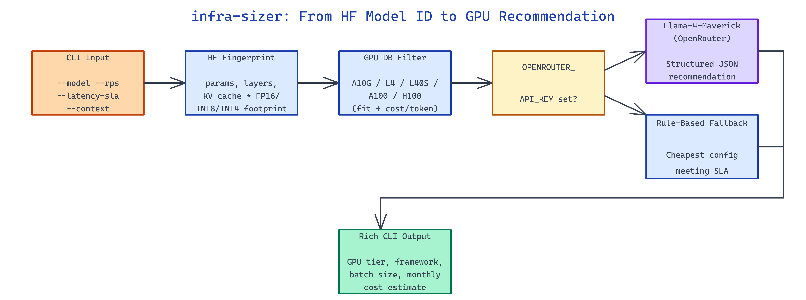

# infra-sizer: LLM Inference Infrastructure Planner

[](https://github.com/dakshjain-1616/infra-sizer)



## The Problem

> Infrastructure sizing for LLM inference means juggling parameter count, context length, throughput targets, and latency SLAs at the same time — get it wrong and you either overpay for idle H100s or breach your SLA on every spike.

NEO built infra-sizer to turn that four-way trade-off into a single command that outputs a grounded hardware recommendation with a cost estimate attached.

## Model Fingerprinting from Hugging Face

**infra-sizer** starts by fingerprinting the target model. Given a Hugging Face model ID, it queries the HF API for the config file, pulls parameter count, hidden size, num layers, and KV cache dimensions, and derives the weight memory footprint at FP16, INT8, and INT4 quantization. For gated models it falls back to a curated local lookup so planning works without an HF token.

```bash
python main.py --model Qwen/Qwen3-32B --rps 50 --latency-sla 2.0 --context 8192
```

The fingerprint feeds into a throughput model that estimates tokens/sec per GPU tier using a combination of memory bandwidth, compute FLOPs, and published vLLM/TGI benchmarks for common model families. This bounds the search before any LLM reasoning runs.

## GPU Database and Framework Selection

A built-in GPU database covers six tiers — `A10G`, `L4`, `L40S`, `A100-40G`, `A100-80G`, `H100-80G` — with per-tier memory, FP16 throughput, token generation benchmarks for 7B/13B/34B/70B reference models, and hourly AWS/GCP pricing. The planner filters out any tier that can't fit the quantized model plus KV cache for the requested context length, then scores survivors on cost-per-token under the target load.

| GPU | VRAM | $/hr | Max Model (FP16) | Batch @ 8K ctx |
|---|---|---|---|---|
| A10G | 24GB | $1.20 | 13B | 4 |
| L40S | 48GB | $1.85 | 34B | 8 |
| A100-80G | 80GB | $4.10 | 70B | 16 |
| H100-80G | 80GB | $8.90 | 70B | 32 |

Framework selection is rule-based: `vLLM` for throughput-optimized workloads above 20 RPS, `TGI` when strict first-token latency matters, and `llama.cpp` for CPU fallback or edge deployments under 5 RPS.

## LLM-Assisted Reasoning with Rule-Based Fallback

For the final recommendation, infra-sizer sends the shortlist to OpenRouter's Llama-4-Maverick with a structured prompt that includes the model fingerprint, workload profile, and GPU candidates. The model returns a JSON recommendation with justification, which the CLI validates against sanity bounds before rendering. If no `OPENROUTER_API_KEY` is set, a deterministic rule-based planner takes over and picks the cheapest configuration that meets the SLA.

```bash
python main.py \
  --model meta-llama/Llama-3.1-70B-Instruct \
  --rps 100 --latency-sla 1.5 --context 16384 \
  --quantization int8
```

Output is rendered with Rich: GPU tier, instance count, serving framework, recommended max batch size, and a monthly cost estimate assuming on-demand pricing and 24/7 utilization.

## How to Build This with NEO

Open NEO in VS Code or Cursor and describe what you want to build. A good starting prompt for this project:

> "Build a CLI that recommends GPU infrastructure for serving any Hugging Face LLM. It should fetch model metadata from the HF API, compute memory footprint across quantization levels, match against a GPU database with AWS pricing and throughput benchmarks, then use an OpenRouter-hosted model to pick a final configuration with a rule-based fallback. Output GPU tier, framework, batch size, and monthly cost."

<a href="https://heyneo.com/dashboard?section=new-chat&prompt=Build%20a%20CLI%20that%20recommends%20GPU%20infrastructure%20for%20serving%20any%20Hugging%20Face%20LLM.%20It%20should%20fetch%20model%20metadata%20from%20the%20HF%20API%2C%20compute%20memory%20footprint%20across%20quantization%20levels%2C%20match%20against%20a%20GPU%20database%20with%20AWS%20pricing%20and%20throughput%20benchmarks%2C%20then%20use%20an%20OpenRouter-hosted%20model%20to%20pick%20a%20final%20configuration%20with%20a%20rule-based%20fallback.%20Output%20GPU%20tier%2C%20framework%2C%20batch%20size%2C%20and%20monthly%20cost." style="display:inline-block;background:#1e40af;color:#ffffff;padding:10px 22px;border-radius:6px;text-decoration:none;font-weight:600;font-size:14px;">Build with NEO →</a>

NEO generates the project structure and core implementation. From there you iterate — add spot instance pricing, extend the GPU database with custom benchmarks, or wire it up to Terraform for direct provisioning. Each request builds on what's already there.

To run the finished project:

```bash
git clone https://github.com/dakshjain-1616/infra-sizer
cd infra-sizer
pip install -r requirements.txt
python main.py --model Qwen/Qwen3-32B --rps 50 --latency-sla 2.0 --context 8192
```

The CLI prints a single ranked recommendation with GPU tier, serving stack, batching config, and estimated monthly cost.

NEO built a grounded infrastructure planner that turns "what do I need to serve this model?" into one reproducible CLI command. See what else NEO ships at [heyneo.com](https://heyneo.com/).

---

## Try NEO in Your IDE

Install the NEO extension to bring AI-powered development directly into your workflow:

- **VS Code**: [NEO in VS Code](https://marketplace.visualstudio.com/items?itemName=NeoResearchInc.heyneo)
- **Cursor**: <a href="cursor://extension/NeoResearchInc.heyneo" style="color:#0066FF;font-weight:bold;">Install NEO for Cursor →</a>

---
