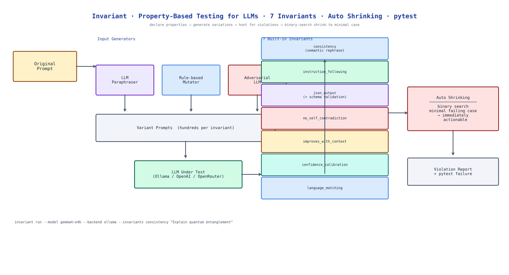

# Invariant: Property-Based Testing for LLMs — Seven Invariants, Automatic Shrinking

[](https://github.com/dakshjain-1616/Invariant)



## The Problem

> You write a test for your LLM application. It passes. You ship. Then a user rephrases their question slightly and the model gives a completely different answer. Or they add context that should help and the quality drops. Or they switch languages and the model responds in English. These failures are not edge cases — they are systematic behavioral properties that your test suite never checked, because testing LLM behavior by checking specific outputs doesn't scale.

NEO built Invariant to bring property-based testing to LLM evaluation. Instead of testing "does this prompt return this exact response?", you declare "the response should be consistent across semantic rephrases" — and Invariant automatically generates hundreds of variations to hunt for violations.

## Seven Built-in Invariants

Each invariant is a testable property with a name, a generator, and a checker:

**consistency** — the model should return semantically equivalent answers to semantically equivalent questions. Generator: paraphrase the input prompt in five different ways. Checker: cosine similarity between responses. This catches models that are sensitive to surface phrasing when they shouldn't be.

**instruction_following** — if the system prompt says "respond in JSON", the model should do that under any user input. Generator: mutate user inputs in various ways. Checker: structural validator.

**json_output** — the model should return valid JSON when instructed, optionally with schema validation. Generator: varied user inputs. Checker: `json.loads()` + jsonschema.

**no_self_contradiction** — the model should not contradict itself within a single response or across a short conversation. Generator: construct multi-turn conversations. Checker: LLM-as-judge for logical consistency.

**improves_with_context** — adding relevant context to a prompt should not reduce answer quality. Generator: add/remove context sections. Checker: quality score comparison.

**confidence_calibration** — when the model says it's 90% confident, it should be right roughly 90% of the time. Generator: varied questions on a topic with known answers. Checker: calibration curve analysis.

**language_matching** — the model should respond in the same language as the input. Generator: translate the input to different languages. Checker: language detection.

## Automatic Shrinking

When a violation is found — a rephrase that breaks consistency, a context addition that reduces quality — Invariant runs automatic shrinking. Binary search reduces the failing case to its minimal triggering form:

- "The response was inconsistent across 12 variations" → "This specific 8-word rephrase triggers the inconsistency"

Minimal failing cases are immediately actionable. You know exactly what to fix or to add to your prompt.

## Three Input Generators

**Paraphraser** — uses the LLM itself to generate semantic paraphrases of the original prompt. Creates linguistically diverse variations while preserving meaning.

**Rule-based mutator** — applies deterministic transformations: synonym substitution, sentence reordering, formality shifts. Fast and reproducible.

**Adversarial LLM** — instructs a second model to generate inputs specifically designed to break the invariant. Finds failures that neither paraphrasing nor rule-based mutations would find.

## pytest Integration

Invariant integrates with pytest automatically:

```python
import invariant

@invariant.test(invariants=["consistency", "instruction_following"])
def test_my_model(prompt, model):
    return model.complete(prompt)
```

Failed invariant checks appear as test failures with the minimal shrunk case attached.

## How to Build This with NEO

Open NEO in VS Code or Cursor and describe what you want to build. A good starting prompt for this project:

> "Build a property-based testing library for LLM evaluation. Define seven invariants: consistency across semantic rephrases, instruction following under input variation, valid JSON output with optional schema validation, no self-contradiction in multi-turn conversations, quality improvement with added context, confidence calibration accuracy, and language matching. Implement three input generators: paraphraser (LLM-based), rule-based mutator (synonym substitution, reordering), and adversarial LLM. Add automatic shrinking using binary search to reduce failing cases to minimal form. Integrate with pytest automatically. Support Ollama, OpenAI, Anthropic, and OpenRouter backends. Publish as PyPI package with a CLI."

<a href="https://heyneo.com/dashboard?section=new-chat&prompt=Build%20a%20property-based%20testing%20library%20for%20LLM%20evaluation.%20Define%20seven%20invariants%3A%20consistency%2C%20instruction%20following%2C%20JSON%20output%2C%20no%20self-contradiction%2C%20quality%20improvement%20with%20context%2C%20confidence%20calibration%2C%20language%20matching.%20Implement%20three%20input%20generators%3A%20LLM%20paraphraser%2C%20rule-based%20mutator%2C%20adversarial%20LLM.%20Add%20automatic%20binary-search%20shrinking.%20Integrate%20with%20pytest.%20Support%20Ollama%2C%20OpenAI%2C%20Anthropic%2C%20OpenRouter." style="display:inline-block;background:#1e40af;color:#ffffff;padding:10px 22px;border-radius:6px;text-decoration:none;font-weight:600;font-size:14px;">Build with NEO →</a>

NEO scaffolds the seven invariant definitions, the three generator types, the shrinking algorithm, the pytest plugin, and the backend adapters. From there you iterate — write a custom invariant for your application's specific behavioral contract, add a report generator that visualizes failure rates per invariant over time, or wire the test suite into CI so new prompts require invariant sign-off before shipping.

To run the finished project:

```bash
pip install invariant-llm

# CLI usage
invariant run --model gemma4:e4b --backend ollama --invariants consistency "Explain quantum entanglement"
invariant run --model gpt-4o --backend openrouter --invariants all "Your prompt here"

# pytest integration
pytest tests/  # Invariant failures appear as test failures
```

NEO built property-based testing for LLMs with seven invariants, three generator types, automatic binary-search shrinking, and pytest integration — so you test what your model should always do, not just what it does on one specific input. See what else NEO ships at [heyneo.com](https://heyneo.com/).

---

## Try NEO in Your IDE

Install the NEO extension to bring AI-powered development directly into your workflow:

- **VS Code**: [NEO in VS Code](https://marketplace.visualstudio.com/items?itemName=NeoResearchInc.heyneo)
- **Cursor**: <a href="cursor://extension/NeoResearchInc.heyneo" style="color:#0066FF;font-weight:bold;">Install NEO for Cursor →</a>

---
