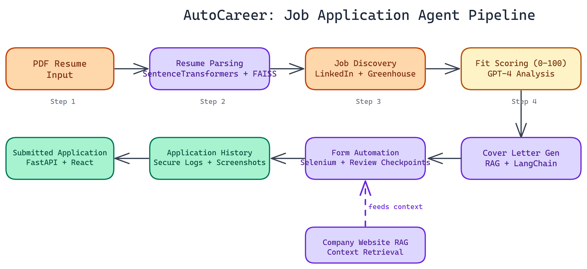

# NEO Built an AI Agent That Fills Out Job Applications End-to-End

<a href="https://github.com/Dakshjain1604/Job-Application-AutoFiller-Agent" target="_blank" style="display:flex;align-items:center;gap:14px;padding:16px 20px;border:1px solid #30363d;border-radius:10px;background:#0d1117;color:#e6edf3;text-decoration:none;font-family:-apple-system,BlinkMacSystemFont,'Segoe UI',sans-serif;margin:20px 0;width:fit-content;max-width:480px;transition:border-color 0.2s;">
  <svg width="22" height="22" viewBox="0 0 16 16" fill="#e6edf3" xmlns="http://www.w3.org/2000/svg"><path d="M8 0C3.58 0 0 3.58 0 8c0 3.54 2.29 6.53 5.47 7.59.4.07.55-.17.55-.38 0-.19-.01-.82-.01-1.49-2.01.37-2.53-.49-2.69-.94-.09-.23-.48-.94-.82-1.13-.28-.15-.68-.52-.01-.53.63-.01 1.08.58 1.23.82.72 1.21 1.87.87 2.33.66.07-.52.28-.87.51-1.07-1.78-.2-3.64-.89-3.64-3.95 0-.87.31-1.59.82-2.15-.08-.2-.36-1.02.08-2.12 0 0 .67-.21 2.2.82.64-.18 1.32-.27 2-.27.68 0 1.36.09 2 .27 1.53-1.04 2.2-.82 2.2-.82.44 1.1.16 1.92.08 2.12.51.56.82 1.27.82 2.15 0 3.07-1.87 3.75-3.65 3.95.29.25.54.73.54 1.48 0 1.07-.01 1.93-.01 2.2 0 .21.15.46.55.38A8.013 8.013 0 0016 8c0-4.42-3.58-8-8-8z"/></svg>
  

    
Dakshjain1604/Job-Application-AutoFiller-Agent

    
View on GitHub →

  

</a>

## The Problem

> Job hunting is repetitive by design. Copy your resume details into a form. Write a cover letter. Submit. Repeat forty times. The process is structured enough that a machine should handle it — but no existing tool closes the full loop from discovery through submission, with cover letters that actually reference specific company context rather than generic templates.

AutoCareer is an autonomous job application agent. It reads your resume, finds relevant listings, decides whether you're a good fit, writes a tailored cover letter, and submits the application. The whole thing runs without you sitting at a keyboard.

## How the Pipeline Works

The system is composed of six tightly integrated modules, each handling a distinct part of the workflow.

### Resume Parsing and Indexing

We start by converting the candidate's PDF resume into vector embeddings using SentenceTransformers. Those embeddings get indexed with FAISS, which enables fast semantic retrieval when matching against job descriptions. This isn't keyword matching. It's meaning-level comparison, so a resume that mentions "model deployment" still surfaces for roles asking for "MLOps experience."

### Job Discovery

The scraper pulls listings from LinkedIn and Greenhouse. NEO built anti-bot handling in from the start using Playwright, because naive scrapers get blocked within minutes. Rate limiting, session rotation, and realistic browser fingerprinting are all part of the default configuration.

### Candidate Fit Scoring

Each listing gets a fit score from **0 to 100**. The base scoring uses keyword alignment between the job description and the resume embedding. When higher-confidence reasoning is needed, we pipe the job description and resume into GPT-4 for structured analysis. The GPT-4 path is optional and controlled by a config flag, so you're not making API calls for every listing if you don't need to.

### Cover Letter Generation

This is where the RAG pipeline matters most. Before writing the cover letter, the system fetches the company's website and extracts relevant context. That context gets retrieved and fed into the generation prompt alongside the job description and resume. The output is a letter that references the company's actual product focus or stated values, not a generic template. LangChain handles the retrieval and prompt orchestration.

### Form Automation

Selenium handles the form-filling step. NEO built in review checkpoints so the candidate can inspect what's about to be submitted before it goes through. There's also a dry-run mode that walks through the entire flow without actually submitting anything. Both features exist because blind automation on job applications is a bad idea.

### Application History

Every submission gets logged with a timestamp and a screenshot. The logs are cryptographically secured so they can't be silently altered. If you ever need to audit what was sent to which employer, the record is there.

## The Tech Stack

The backend runs on **FastAPI** with Python 3.10+. The frontend is **React 18**. The full stack spins up with Docker Compose: frontend on port 3000, API server on port 8000 with auto-generated documentation. **SQLite** handles local persistence with no cloud storage dependency, which matters if you're cautious about where your resume data lives.

Core dependencies: LangChain for RAG workflows, OpenAI GPT-4 for fit analysis and cover letter generation, SentenceTransformers for embeddings, FAISS for vector indexing, Playwright and Selenium for web automation.

## Where This Gets Useful

The obvious use case is individual job seekers who want to apply at scale without spending hours on repetitive form entry. But there are other angles.

Recruiting platforms could run this internally to auto-populate candidate profiles. Career coaching tools could use the fit scoring module alone to help candidates identify which listings are worth pursuing. Staffing agencies managing applications across multiple clients could run parallel instances per candidate.

The modular architecture makes it straightforward to swap components. Want to replace FAISS with Pinecone for production scale? That's one module. Want to add Indeed or Lever to the scraper? Same deal.

## What We Paid Attention To

Two things stood out during development. First, cover letter quality depends heavily on the RAG context. A letter written with real company information reads differently than one generated from the job description alone. The retrieval step is not optional if you want output that doesn't sound generic.

Second, the review checkpoints in the form automation aren't a courtesy feature. They're load-bearing. An agent that submits without human review creates a trust problem that's hard to recover from. We kept those checkpoints in the default flow.

## Build Your Own Automation

AutoCareer works best as a starting point. The scoring logic is extensible, the scraper can target new boards, and the RAG pipeline is general enough to handle different document types.

NEO built an end-to-end job application agent where RAG-powered cover letter generation, semantic fit scoring, and form automation close the full loop from discovery to submission. See what else NEO ships at [heyneo.so](https://heyneo.so/).

---

## Try NEO in Your IDE

Install the NEO extension to bring AI-powered development directly into your workflow:

- **VS Code**: [NEO in VS Code](https://marketplace.visualstudio.com/items?itemName=NeoResearchInc.heyneo)
- **Cursor**: [**Install NEO for Cursor →**](cursor:extension/NeoResearchInc.heyneo)
