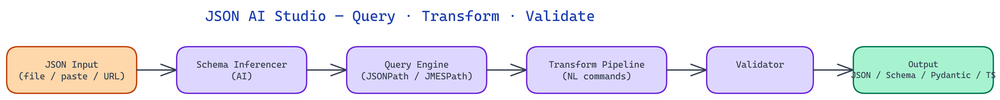

# JSON AI Studio: Validate, Transform, and Query JSON with Natural Language

[](https://github.com/dakshjain-1616/JSON-AI-Studio)



## The Problem

> JSON is the universal exchange format, and working with it at any scale beyond a small config file is genuinely painful. Validating a complex nested structure against a schema requires schema authoring tools that are frustrating to use. Querying a deeply nested document for a specific value requires remembering JSONPath syntax. Transforming data between two JSON structures requires writing and debugging transformation scripts. None of these are hard problems, but each one adds friction that slows down the work that actually matters.

NEO built JSON AI Studio to replace the friction of JSON manipulation with natural language — so you can describe what you want instead of writing JSONPath expressions or schema definitions from scratch.

## The Editor and Real-Time Validation Layer

The core interface is a split-pane web editor. The left pane holds the JSON document; the right pane shows the schema, query, or transformation depending on the current mode. The editor provides syntax highlighting, bracket matching, and real-time syntax error detection as you type.

Real-time validation against a JSON Schema runs on every keystroke. Validation errors are displayed inline in the editor with precise location information — not just "schema validation failed at line 47" but "property `user.address.zip` must be a string, got number" with the offending value highlighted. This is the validation experience that most JSON tooling does not provide: precise, contextual, and immediate.

The validator supports JSON Schema Draft 7, Draft 2019-09, and Draft 2020-12. Schema version is detected automatically from the `$schema` keyword in the document or can be set explicitly. When validating against an external schema (fetched by URL), the validator caches the schema locally so subsequent validations do not require network requests.

## AI-Powered Schema Inference

The most time-saving feature is schema inference from sample data. Paste a JSON document (or upload a JSON file) and click "Infer Schema". JSON AI Studio analyzes the structure and generates a JSON Schema that describes it.

Schema inference is not purely mechanical. The AI layer adds value in several places:

**Type disambiguation**: When a field contains a string that looks like a date (`"2024-01-15"`), the inferred schema marks it as `type: string, format: date-time` rather than just `type: string`. When a field contains integers in one document but floats in another sample, the schema uses `type: number` rather than incorrectly constraining to integer.

**Enum detection**: When a string field contains only a small number of distinct values across multiple sample documents, the schema includes an `enum` constraint listing the observed values. This is a hint, not a guarantee — the enum list can be edited before use.

**Required field inference**: Fields that appear in all provided sample documents are marked as `required`. Fields that appear in some but not others are left optional.

When multiple sample documents are provided, the inferred schema represents the union of all observed structures, with fields marked required only when they appear universally. This makes schema inference useful for real-world APIs that have evolved over time and where different response shapes coexist.

## Natural Language Querying with JSONPath and JMESPath

The query mode accepts natural language descriptions and translates them into JSONPath or JMESPath expressions. "Get the names of all users who are active" becomes `$.users[?(@.active == true)].name` in JSONPath or `users[?active].name` in JMESPath. The query runs against the loaded document and the results are displayed in the right pane.

Both query languages are supported because they dominate different ecosystems: JSONPath is standard in AWS IAM policies and many REST APIs; JMESPath is the query language for AWS CLI and is widely used in data transformation pipelines. The natural language interface handles both — the user specifies which output format is needed and JSON AI Studio generates the appropriate expression.

Query results are shown both as the raw matched values and with their source paths highlighted in the original document. This makes it easy to verify that the query is selecting the right data before using the expression in production code.

## Data Transformation Pipelines

The transformation mode handles the class of problems where you have JSON in one shape and need it in another. Rather than writing a script, you describe the desired output structure in natural language: "flatten the nested address object into top-level fields prefixed with `address_`" or "rename `user_id` to `id` and drop the `internal_meta` field".

JSON AI Studio generates a transformation pipeline as a series of discrete operations. Each operation is shown explicitly in the pipeline view so the user can review, reorder, or remove individual steps before executing. The pipeline is also exportable as a Python script using `jmespath` and standard dict operations, or as a `jq` command, so the transformation can be reproduced outside the tool.

**Bulk transformation** extends this to file sets. Upload a directory of JSON files (or provide a glob pattern for local files via the CLI companion), specify the transformation, and JSON AI Studio applies it to all files with a progress indicator and per-file success/failure reporting. Files that fail transformation (because their structure doesn't match the expected input shape) are isolated in a separate error list with the specific failure reason.

## Data Cleaning and Normalization

The cleaning mode addresses a common data engineering problem: JSON data from external sources is often inconsistent. String fields contain nulls expressed as `"null"`, `null`, or `""`. Date fields use inconsistent formats. Numeric fields mix integers and floats. Arrays that should always be present are missing from some records.

JSON AI Studio's cleaning mode profiles the document (or document set) and identifies inconsistencies. It then proposes a set of normalization operations: coerce `"null"` strings to actual null, standardize date formats to ISO 8601, fill missing required arrays with empty arrays. Each proposed operation is shown with the count of affected records before it is applied.

## How to Build This with NEO

Open NEO in VS Code or Cursor and describe what you want to build. A good starting prompt for this project:

> "Build a web-based JSON editor called JSON AI Studio with a Flask/Gradio backend and split-pane interface. Features: real-time JSON Schema validation on every keystroke with inline error messages showing the exact property path and type mismatch (not just line numbers); AI schema inference that handles type disambiguation (date strings get format: date-time), enum detection for low-cardinality string fields, and required field inference across multiple sample documents; natural language query translation to JSONPath and JMESPath with results highlighted in the source document; a transformation pipeline mode that takes natural-language instructions, generates discrete transformation steps the user can review and reorder, and exports as Python or jq; bulk transformation across a directory of JSON files with per-file success/failure reporting; and a data cleaning mode that profiles inconsistencies and proposes normalization operations with affected record counts. Use OpenRouter with claude-sonnet-4 as default. Add a Fixer tab that repairs malformed JSON using demjson3 first and Claude as fallback."

<a href="https://heyneo.com/dashboard?section=new-chat&prompt=Build%20a%20web-based%20JSON%20editor%20called%20JSON%20AI%20Studio%20with%20a%20Flask%2FGradio%20backend%20and%20split-pane%20interface.%20Features%3A%20real-time%20JSON%20Schema%20validation%20on%20every%20keystroke%20with%20inline%20error%20messages%20showing%20the%20exact%20property%20path%20and%20type%20mismatch%20%28not%20just%20line%20numbers%29%3B%20AI%20schema%20inference%20that%20handles%20type%20disambiguation%20%28date%20strings%20get%20format%3A%20date-time%29%2C%20enum%20detection%20for%20low-cardinality%20string%20fields%2C%20and%20required%20field%20inference%20across%20multiple%20sample%20documents%3B%20natural%20language%20query%20translation%20to%20JSONPath%20and%20JMESPath%20with%20results%20highlighted%20in%20the%20source%20document%3B%20a%20transformation%20pipeline%20mode%20that%20takes%20natural-language%20instructions%2C%20generates%20discrete%20transformation%20steps%20the%20user%20can%20review%20and%20reorder%2C%20and%20exports%20as%20Python%20or%20jq%3B%20bulk%20transformation%20across%20a%20directory%20of%20JSON%20files%20with%20per-file%20success%2Ffailure%20reporting%3B%20and%20a%20data%20cleaning%20mode%20that%20profiles%20inconsistencies%20and%20proposes%20normalization%20operations%20with%20affected%20record%20counts.%20Use%20OpenRouter%20with%20claude-sonnet-4%20as%20default.%20Add%20a%20Fixer%20tab%20that%20repairs%20malformed%20JSON%20using%20demjson3%20first%20and%20Claude%20as%20fallback." style="display:inline-block;background:#1e40af;color:#ffffff;padding:10px 22px;border-radius:6px;text-decoration:none;font-weight:600;font-size:14px;">Build with NEO →</a>

NEO generates the project structure and core implementation from that. From there you iterate — ask it to add the Visualizer tab that renders any JSON/YAML/CSV as an interactive node-graph, add JSONPath and JMESPath side-by-side support with automatic format selection based on user preference, or add the bulk transformation CLI companion that accepts glob patterns for local file sets. Each request builds on what's already there.

To run the finished project:

```bash
git clone https://github.com/dakshjain-1616/JSON-AI-Studio
cd JSON-AI-Studio
pip install -r requirements.txt
python server.py
```

Open `http://localhost:7860` and paste any JSON document — the AI Chat tab queries it in plain English, the Transformer tab shows a diff before applying any change, and the Schema Gen tab infers a full JSON Schema with an AI explanation.

NEO built JSON AI Studio to remove the friction from the JSON manipulation tasks that slow down data work and API integration every day. See what else NEO ships at [heyneo.com](https://heyneo.com/).

---

## Try NEO in Your IDE

Install the NEO extension to bring AI-powered development directly into your workflow:

- **VS Code**: [NEO in VS Code](https://marketplace.visualstudio.com/items?itemName=NeoResearchInc.heyneo)
- **Cursor**: <a href="cursor://extension/NeoResearchInc.heyneo" style="color:#0066FF;font-weight:bold;">Install NEO for Cursor →</a>

---
