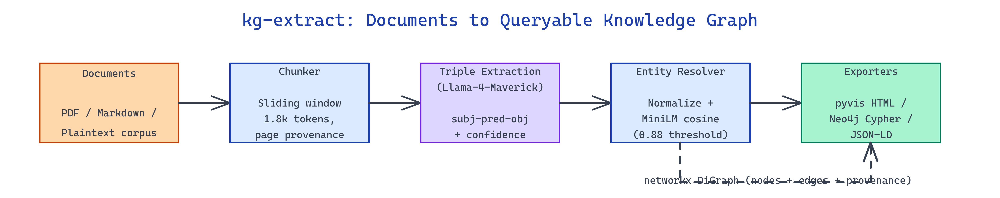

# kg-extract: Build a Queryable Knowledge Graph from Any Document

[](https://github.com/dakshjain-1616/kg-extract)



## The Problem

> Teams sitting on thousands of PDFs and internal docs can't query relationships — "which products shipped with which regulators on which dates?" — without reading everything manually or training a bespoke NER pipeline.

NEO built kg-extract to turn any pile of documents into a queryable knowledge graph using LLM-driven triple extraction and fuzzy entity resolution.

## Multi-Format Ingestion and Chunking

**kg-extract** accepts PDFs via `pdfplumber`, markdown via native parsing, and plain text. Each document is chunked with a sliding window that respects paragraph boundaries and tracks `(document_id, page, char_offset)` metadata on every chunk so the final graph preserves source provenance. Tables inside PDFs are extracted separately and passed through a specialized prompt that flattens cells into `(row_entity, column_predicate, cell_value)` triples.

```python
from kg_extract import Extractor

extractor = Extractor(model="meta-llama/llama-4-maverick")
graph = extractor.ingest([
    "docs/annual_report_2024.pdf",
    "docs/product_specs.md",
    "docs/compliance_notes.txt",
])
```

Chunk size defaults to 1,800 tokens with a 200-token overlap — enough to capture multi-sentence relationships without truncating mid-claim.

## LLM Triple Extraction and Entity Resolution

Each chunk goes to Llama-4-Maverick (via OpenRouter) with a prompt that forces JSON output of `{subject, predicate, object, confidence}` tuples and a short evidence snippet. Triples below a configurable confidence threshold are dropped. The extractor runs calls concurrently with an `asyncio` semaphore tuned to the provider's rate limits.

Raw triples contain duplicate and near-duplicate entities — "OpenAI", "Open AI Inc.", "OpenAI (San Francisco)". kg-extract resolves them with a two-stage fuzzy deduper: character-level normalization and sentence-transformer cosine similarity above a `0.88` threshold, with type-aware grouping so a person named "Apple" doesn't collapse into the company.

| Stage | Technique | Purpose |
|---|---|---|
| Normalize | Lowercase, strip punctuation, collapse whitespace | Catch formatting variance |
| Embed | `all-MiniLM-L6-v2` cosine similarity | Catch semantic variance |
| Cluster | Union-find within entity type | Prevent cross-type merges |

The final graph is stored as a `networkx` DiGraph with edge attributes for predicate, confidence, and source provenance.

## Export to Pyvis, Neo4j, and JSON-LD

Three exporters ship with the project. `pyvis` renders an interactive HTML graph you can pan, zoom, and filter by entity type — useful for exploration with non-technical stakeholders. The Neo4j exporter emits idempotent Cypher `MERGE` statements so re-runs don't duplicate nodes. JSON-LD output conforms to Schema.org vocabulary where possible and falls back to a project-specific namespace otherwise.

```bash
python kg_extract.py \
  --input ./corpus/ \
  --model meta-llama/llama-4-maverick \
  --format pyvis,cypher,jsonld \
  --min-confidence 0.7 \
  --output ./graph_out/
```

Run time on a 50-document corpus lands around 3-5 minutes depending on provider latency; the graph typically contains 2-5k deduplicated entities and 8-15k edges.

## How to Build This with NEO

Open NEO in VS Code or Cursor and describe what you want to build. A good starting prompt for this project:

> "Build a knowledge graph extraction pipeline that ingests PDFs, markdown, and text files, chunks them while preserving page-level provenance, uses Llama-4-Maverick via OpenRouter to extract subject-predicate-object triples with confidence scores, deduplicates entities using sentence-transformer similarity with type-aware clustering, and exports the result as interactive pyvis HTML, Neo4j Cypher, and JSON-LD."

<a href="https://heyneo.com/dashboard?section=new-chat&prompt=Build%20a%20knowledge%20graph%20extraction%20pipeline%20that%20ingests%20PDFs%2C%20markdown%2C%20and%20text%20files%2C%20chunks%20them%20while%20preserving%20page-level%20provenance%2C%20uses%20Llama-4-Maverick%20via%20OpenRouter%20to%20extract%20subject-predicate-object%20triples%20with%20confidence%20scores%2C%20deduplicates%20entities%20using%20sentence-transformer%20similarity%20with%20type-aware%20clustering%2C%20and%20exports%20the%20result%20as%20interactive%20pyvis%20HTML%2C%20Neo4j%20Cypher%2C%20and%20JSON-LD." style="display:inline-block;background:#1e40af;color:#ffffff;padding:10px 22px;border-radius:6px;text-decoration:none;font-weight:600;font-size:14px;">Build with NEO →</a>

NEO generates the project structure and core implementation. From there you iterate — add domain-specific entity types, wire it to a vector DB for hybrid retrieval, or build a Streamlit UI that lets SMEs correct extraction errors. Each request builds on what's already there.

To run the finished project:

```bash
git clone https://github.com/dakshjain-1616/kg-extract
cd kg-extract
pip install -r requirements.txt
python kg_extract.py --input ./examples/ --format pyvis --output ./graph.html
```

Open `graph.html` to explore the extracted entities and relationships; load the Cypher export into Neo4j for structured querying.

NEO built an end-to-end extraction pipeline that transforms unstructured document piles into queryable graphs with verifiable source provenance. See what else NEO ships at [heyneo.com](https://heyneo.com/).

---

## Try NEO in Your IDE

Install the NEO extension to bring AI-powered development directly into your workflow:

- **VS Code**: [NEO in VS Code](https://marketplace.visualstudio.com/items?itemName=NeoResearchInc.heyneo)
- **Cursor**: <a href="cursor://extension/NeoResearchInc.heyneo" style="color:#0066FF;font-weight:bold;">Install NEO for Cursor →</a>

---
