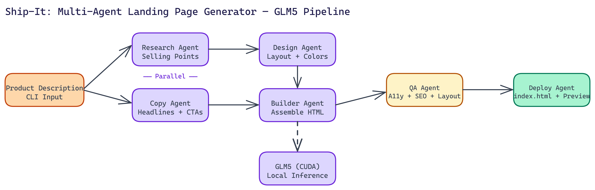

# NEO Built a CLI That Generates Production-Ready Landing Pages Using GLM5

[](https://github.com/dakshjain-1616/GLA5-Landing-Page-tool)



## The Problem

> Most code generation tools produce snippets. They give you a component, a function, a starting point you then spend an hour wiring together. For landing pages specifically, that means wrestling with CSS frameworks, JavaScript dependencies, and responsive layout issues — all before you've validated whether the idea is worth building.

NEO autonomously built Ship-It: one CLI command, one HTML file, live preview at localhost:8080. No assembly required.

## Why GLM5

GLM5 is a GPU-accelerated transformer model well-suited for structured code generation tasks. It produces coherent HTML with embedded CSS and JavaScript in a single pass, without the context fragmentation you get from smaller models. Ship-It runs it locally with CUDA, which means no API calls, no rate limits, and no data leaving your machine.

The model comes in three size configurations. The smallest requires about **512 MB of VRAM**, the medium (default) sits around **1 GB**, and the large variant uses up to **2 GB**. Most development machines with a modern GPU can run the medium configuration without issue. The tool monitors VRAM usage in real time and warns if you're approaching limits.

## The Multi-Agent Architecture

Generating a good landing page isn't a single task. It's a set of distinct tasks that benefit from focused attention. NEO split the work across six specialized agents that run in parallel where possible.

**Research Agent** analyzes the product description and identifies key selling points, target audience characteristics, and competitive context. It runs at the same time as the Copy Agent, which means the generation phase doesn't wait for research to complete sequentially.

**Copy Agent** generates the actual text content: headlines, subheadlines, feature descriptions, social proof copy, and calls to action. Good landing page copy follows specific structural patterns, and the agent is prompted with those patterns explicitly.

**Design Agent** makes layout decisions: section ordering, visual hierarchy, color palette selection, and spacing logic. It outputs a structured design spec that the Builder Agent consumes.

**Builder Agent** assembles the actual HTML. It takes the copy, the design spec, and the research output and produces a single self-contained file. No external CSS frameworks. No JavaScript dependencies. Everything is inline.

**QA Agent** validates the output across four dimensions: design consistency, responsive layout behavior, accessibility, and SEO. It checks for things like missing alt text, inadequate color contrast, and absent meta tags. If validation fails, the Builder Agent gets a correction pass.

**Deploy Agent** writes the final `index.html` and launches the local preview server.

The total output is a standalone file around **30 to 35 KB**. It requires no build process and no dependencies to serve. Drop it anywhere.

## Live Preview and Interactive Editing

Once the initial generation completes, Ship-It launches a preview at localhost:8080 with hot-reload. You can request edits to specific sections without regenerating the entire page. If the hero text doesn't land right, you tell the tool which section to revise and what to change. The other sections stay intact.

This interaction model matters because full-page regeneration takes time and often changes things you didn't want changed. Section-level editing is faster and more predictable.

## The Four-Phase Workflow

The full pipeline runs in four stages:

1. **Parallel generation**: Research and Copy agents run simultaneously, GPU inference handles both.
2. **Assembly**: Builder Agent takes all inputs and constructs the HTML file.
3. **QA validation**: The QA Agent checks design, responsiveness, accessibility, and SEO. Any failures trigger a targeted fix pass.
4. **Deployment**: Final file is written and the preview server starts.

The whole process runs end-to-end in a single CLI invocation. You watch the phases complete in the terminal, and the browser opens automatically when the preview is ready.

## Hardware Requirements

You need Python 3.8 or higher, an NVIDIA GPU with CUDA 11.8 or later, and at least 4 GB of VRAM for the default medium configuration. PyTorch with CUDA support is a dependency. CPU-only execution isn't supported because the inference speed becomes impractical for interactive use.

If you're running on a machine without a GPU, the architecture still makes sense as a reference for how to structure multi-agent code generation workflows, even if Ship-It itself isn't the right tool for your hardware.

## When This Approach Makes Sense

Ship-It is built for situations where you need a functional landing page fast. Early-stage products that need a web presence before the engineering team is ready to build one. A/B testing ideas that don't justify a full design cycle. Marketing campaigns that need a standalone page with a specific message and call to action.

The single-file output makes deployment trivial. Upload to S3, drop it in a CDN, serve it from Nginx. No framework, no build step, no dependency management.

## Code Generation That Ships

The principle behind Ship-It is that good tooling should produce complete, usable artifacts, not starting points. The multi-agent approach with GLM5 gets you there for landing pages. The same architecture applies to other structured code generation tasks where the output needs to meet multiple quality criteria simultaneously.

## How to Build This with NEO

Open NEO in VS Code or Cursor and describe what you want to build. A good starting prompt for this project:

> "Build a Python CLI called Ship-It that generates complete, self-contained landing pages using a local GLM5 model with CUDA inference (no API calls). The pipeline uses six specialized agents: Research (analyzes product description for selling points and competitive context), Copy (generates headlines, subheadlines, feature descriptions, social proof, CTAs), Design (makes layout, color palette, and visual hierarchy decisions and outputs a structured design spec), Builder (assembles the HTML with all CSS and JS inline — no external frameworks or dependencies), QA (validates for design consistency, responsive layout, accessibility including alt text and color contrast, and SEO including meta tags), and Deploy (writes index.html and starts a preview server). Run Research and Copy in parallel. If QA validation fails, give Builder a correction pass. Output a single self-contained HTML file around 30-35 KB. After generation, provide a section-level iteration menu so users can edit specific sections without regenerating the full page. Monitor VRAM usage and warn when approaching limits. Target: GLM5 medium model at ~1 GB VRAM."

<a href="https://heyneo.com/dashboard?section=new-chat&prompt=Build%20a%20Python%20CLI%20called%20Ship-It%20that%20generates%20complete%2C%20self-contained%20landing%20pages%20using%20a%20local%20GLM5%20model%20with%20CUDA%20inference%20%28no%20API%20calls%29.%20The%20pipeline%20uses%20six%20specialized%20agents%3A%20Research%20%28analyzes%20product%20description%20for%20selling%20points%20and%20competitive%20context%29%2C%20Copy%20%28generates%20headlines%2C%20subheadlines%2C%20feature%20descriptions%2C%20social%20proof%2C%20CTAs%29%2C%20Design%20%28makes%20layout%2C%20color%20palette%2C%20and%20visual%20hierarchy%20decisions%20and%20outputs%20a%20structured%20design%20spec%29%2C%20Builder%20%28assembles%20the%20HTML%20with%20all%20CSS%20and%20JS%20inline%20%E2%80%94%20no%20external%20frameworks%20or%20dependencies%29%2C%20QA%20%28validates%20for%20design%20consistency%2C%20responsive%20layout%2C%20accessibility%20including%20alt%20text%20and%20color%20contrast%2C%20and%20SEO%20including%20meta%20tags%29%2C%20and%20Deploy%20%28writes%20index.html%20and%20starts%20a%20preview%20server%29.%20Run%20Research%20and%20Copy%20in%20parallel.%20If%20QA%20validation%20fails%2C%20give%20Builder%20a%20correction%20pass.%20Output%20a%20single%20self-contained%20HTML%20file%20around%2030-35%20KB.%20After%20generation%2C%20provide%20a%20section-level%20iteration%20menu%20so%20users%20can%20edit%20specific%20sections%20without%20regenerating%20the%20full%20page.%20Monitor%20VRAM%20usage%20and%20warn%20when%20approaching%20limits.%20Target%3A%20GLM5%20medium%20model%20at%20~1%20GB%20VRAM." style="display:inline-block;background:#1e40af;color:#ffffff;padding:10px 22px;border-radius:6px;text-decoration:none;font-weight:600;font-size:14px;">Build with NEO →</a>

NEO generates the project structure and core implementation from that. From there you iterate — ask it to add the three GLM5 size configurations (512 MB / 1 GB / 2 GB VRAM) with automatic selection based on available VRAM, add hot-reload in the preview server so section edits appear immediately at localhost:8080, or add a targeted fix pass that re-runs only the QA-failed section through the Builder without touching the rest. Each request builds on what's already there.

To run the finished project:

```bash
git clone https://github.com/dakshjain-1616/GLA5-Landing-Page-tool
cd GLA5-Landing-Page-tool
pip install torch --index-url https://download.pytorch.org/whl/cu118
pip install -r requirements.txt
python3 ship_it.py
```

Enter product name, tagline, description, and hero headline — the six-agent pipeline runs end-to-end and opens a live preview at `http://localhost:8080` with the iteration menu ready for section-level edits.

NEO built a multi-agent landing page generator where a single CLI command produces a complete, self-contained HTML file—validated for accessibility, SEO, and responsive layout—with no assembly required. See what else NEO ships at [heyneo.com](https://heyneo.com/).

---

## Try NEO in Your IDE

Install the NEO extension to bring AI-powered development directly into your workflow:

- **VS Code**: [NEO in VS Code](https://marketplace.visualstudio.com/items?itemName=NeoResearchInc.heyneo)
- **Cursor**: <a href="cursor://extension/NeoResearchInc.heyneo" style="color:#0066FF;font-weight:bold;">Install NEO for Cursor →</a>

---
