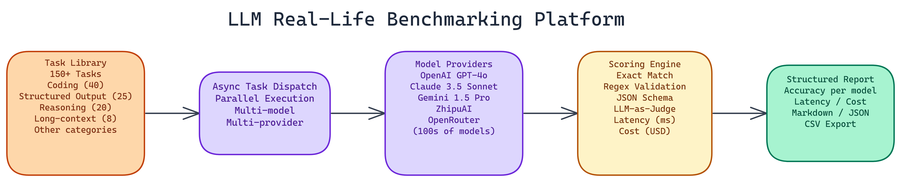

# Benchmarking LLMs on Real Tasks: How We Evaluated 150+ Tasks Across 10 Categories

[](https://github.com/dakshjain-1616/Latest-LLMs-Real-Life-Task-Evaluation)



## The Problem

> Model leaderboards are everywhere. Most of them measure performance on academic benchmarks designed years ago, optimized by training teams to look good, and increasingly disconnected from what actually matters when you're building something real. Teams making production model decisions deserve benchmarks built on the tasks they actually run — not on tasks designed to make models look impressive.

NEO took a different approach. Instead of synthetic academic tasks, NEO built a platform that evaluates models on the kinds of tasks developers and engineers actually give them: writing Flask routes, generating valid JSON schemas, solving multi-step logic problems, and retrieving specific facts buried in 32,000-token documents.

The result is a modular, async benchmarking platform that covers **150+ tasks** across **ten categories**, runs evaluations in parallel, and produces structured reports with accuracy, latency, cost, and per-category breakdowns.

## What Gets Evaluated

The task library is organized into ten categories, but a few deserve particular attention because they reveal model capability differences that don't show up on standard benchmarks.

**Coding** is the largest category at **40 tasks**. The platform focuses on Flask and FastAPI development challenges because they test practical web development knowledge, not just algorithmic problem solving. Can the model write a working authentication middleware? Can it handle a complex route with query parameter validation? Algorithm challenges are also included, but the web framework tasks are where the most differentiation between models shows up.

**Structured output** runs **25 tasks** centered on JSON Schema compliance and format adherence. This matters enormously for production use. An LLM that writes a beautiful explanation but produces invalid JSON is useless in an automated pipeline. The platform tests strict schema compliance, not approximate formatting.

**Reasoning** covers **20 tasks** involving multi-step logic and complex problem-solving. These are constructed to require more than pattern matching. Models that have memorized solutions to common problems struggle when the problem structure is slightly unfamiliar.

**Long-context** is the most technically demanding category at **8 tasks**, but each task is substantial. The platform embeds target facts in documents over **32,000 tokens** and asks models to retrieve specific information accurately. This directly tests real-world use cases like document Q&A, contract analysis, and codebase understanding.

## How Scoring Works

The platform uses four scoring methods, applied based on task type.

**Exact matching** handles factual questions and structured outputs where the correct answer is unambiguous. Either the model produced the right output or it didn't.

**Regex validation** covers format compliance tasks where the structure matters more than the specific content. Does the output match the required pattern?

**JSON Schema compliance** validates structured output tasks against a formal schema definition. This is strict: extra fields, wrong types, and missing required properties all count as failures.

**LLM-as-a-judge** handles open-ended tasks where quality requires interpretation. A separate model evaluates the response against a rubric. This is the slowest evaluation method, but it's the only reliable way to score subjective tasks at scale.

Every task also records latency in milliseconds and computes an estimated USD cost based on token consumption. The cost data is surprisingly useful. Models that seem expensive per-token often win on cost-per-correct-answer once you account for accuracy differences.

## Running Evaluations

The platform is built for flexible execution. You can run a quick 5-task sample to validate your setup, set a custom task limit for targeted evaluation, or run the full 150+ task suite.

```bash
# Quick validation run
python benchmark.py --quick

# Evaluate specific models with custom task limit
python benchmark.py --models gpt-4o claude-3.5-sonnet gemini-1.5-pro --tasks 50

# Full benchmark suite
python benchmark.py --full --output results/
```

Evaluations run in parallel by default, which matters when you're running 150 tasks across five or six models. Sequential execution would take hours. Parallel execution with async task dispatch completes the same workload in a fraction of the time.

Results export to Markdown for human reading, JSON for programmatic analysis, and CSV for spreadsheet work. API keys load through environment variables and are never logged or stored persistently.

## What the Results Actually Show

NEO won't publish a definitive ranking here because model performance changes with every new release. What the results consistently show is that assumptions get challenged.

Models that dominate academic benchmarks don't always win on practical coding tasks. Some models that look expensive per token are actually cheaper per correct answer because their accuracy is higher. Long-context performance varies more dramatically between models than most summary comparisons suggest.

The structured output category is where the most surprising failures appear. Models that perform impressively on reasoning tasks sometimes produce malformed JSON on straightforward schema compliance tasks. If you're building systems that depend on reliable structured output, test specifically for it.

## Providers Supported

The platform covers OpenAI, Anthropic, Google, ZhipuAI, and OpenRouter. OpenRouter alone adds hundreds of models through a single API key, including open-source models and variants from providers not directly integrated.

Provider switching is configured through environment variables. You can run the same task set across all providers and get directly comparable results.

## Why Run Your Own Benchmarks

Third-party benchmarks tell you how models performed on someone else's tasks, evaluated by someone else's criteria, at a point in time that may be months in the past. Your application has specific requirements, specific input distributions, and specific failure modes that matter more than general capability scores.

Running your own benchmark on your own task distribution gives you data that's actually predictive of how a model will perform in your production environment.

## How to Build This with NEO

Open NEO in VS Code or Cursor and describe what you want to build. A good starting prompt for this project:

> "Build an async Python LLM benchmarking platform that evaluates models across 150+ real-world tasks in ten categories: coding (40 tasks focused on Flask and FastAPI routes, authentication middleware, query parameter validation), structured output (25 tasks testing strict JSON Schema compliance), reasoning (20 multi-step logic tasks), long-context retrieval (8 tasks embedding target facts in 32,000+ token documents), and six more. Use four scoring methods based on task type: exact matching, regex validation, JSON Schema compliance validation, and LLM-as-a-judge. Record latency in milliseconds and compute estimated USD cost per task. Run all tasks in parallel with async dispatch. Support OpenAI, Anthropic, Google, ZhipuAI, and OpenRouter providers, all configured via environment variables. Export results as Markdown with category breakdowns, raw JSON per-task data, and CSV with model/category/task/score/latency/cost columns."

<a href="https://heyneo.com/dashboard?section=new-chat&prompt=Build%20an%20async%20Python%20LLM%20benchmarking%20platform%20that%20evaluates%20models%20across%20150%2B%20real-world%20tasks%20in%20ten%20categories%3A%20coding%20%2840%20tasks%20focused%20on%20Flask%20and%20FastAPI%20routes%2C%20authentication%20middleware%2C%20query%20parameter%20validation%29%2C%20structured%20output%20%2825%20tasks%20testing%20strict%20JSON%20Schema%20compliance%29%2C%20reasoning%20%2820%20multi-step%20logic%20tasks%29%2C%20long-context%20retrieval%20%288%20tasks%20embedding%20target%20facts%20in%2032%2C000%2B%20token%20documents%29%2C%20and%20six%20more.%20Use%20four%20scoring%20methods%20based%20on%20task%20type%3A%20exact%20matching%2C%20regex%20validation%2C%20JSON%20Schema%20compliance%20validation%2C%20and%20LLM-as-a-judge.%20Record%20latency%20in%20milliseconds%20and%20compute%20estimated%20USD%20cost%20per%20task.%20Run%20all%20tasks%20in%20parallel%20with%20async%20dispatch.%20Support%20OpenAI%2C%20Anthropic%2C%20Google%2C%20ZhipuAI%2C%20and%20OpenRouter%20providers%2C%20all%20configured%20via%20environment%20variables.%20Export%20results%20as%20Markdown%20with%20category%20breakdowns%2C%20raw%20JSON%20per-task%20data%2C%20and%20CSV%20with%20model%2Fcategory%2Ftask%2Fscore%2Flatency%2Fcost%20columns." style="display:inline-block;background:#1e40af;color:#ffffff;padding:10px 22px;border-radius:6px;text-decoration:none;font-weight:600;font-size:14px;">Build with NEO →</a>

NEO generates the project structure and core implementation from that. From there you iterate — ask it to add a `--quick` flag for a 5-task validation run, add cost-per-correct-answer as a computed column in the CSV output, or add the `--compare` mode that runs two or more models on the same task set and renders a side-by-side comparison table. Each request builds on what's already there.

To run the finished project:

```bash
git clone https://github.com/dakshjain-1616/Latest-LLMs-Real-Life-Task-Evaluation
cd Latest-LLMs-Real-Life-Task-Evaluation
pip install -r requirements.txt
python benchmark.py --quick
python benchmark.py --models gpt-4o claude-3.5-sonnet --tasks 50 --output results/
```

The full 150+ task suite with parallel async execution completes in 15-30 minutes and produces a CSV where cost-per-correct-answer is the column worth sorting on first.

NEO built an async LLM benchmarking platform where 150+ real-world tasks across coding, structured output, reasoning, and long-context retrieval give teams model performance data that actually predicts production behavior. See what else NEO ships at [heyneo.com](https://heyneo.com/).

---

## Try NEO in Your IDE

Install the NEO extension to bring AI-powered development directly into your workflow:

- **VS Code**: [NEO in VS Code](https://marketplace.visualstudio.com/items?itemName=NeoResearchInc.heyneo)
- **Cursor**: <a href="cursor://extension/NeoResearchInc.heyneo" style="color:#0066FF;font-weight:bold;">Install NEO for Cursor →</a>

---
