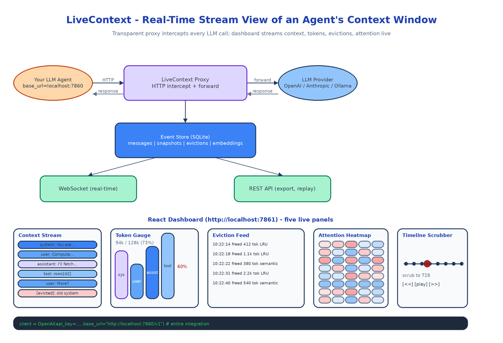

# LiveContext: A Real-Time Stream View of What's Actually in Your Agent's Context Window

[](https://github.com/dakshjain-1616/LiveContext)



## The Problem

> Your agent has a 128k context window. Right now, mid-session, how much of it is full? Which messages got evicted to make room for the last tool result? Is the system prompt still in there or did it get pushed out twenty turns ago? You don't know. The provider gives you a token count after the fact and that's the entire telemetry budget.

LiveContext is the missing instrument. It sits between your agent and the LLM provider as a transparent proxy, intercepts every request and response, and renders the live state of the context window to a dashboard that updates as the conversation unfolds.

ContextTimeMachine (its sibling) is for post-hoc forensics on a finished session. LiveContext is for watching what is happening right now.

## What It Shows

### Live Context Stream

The main panel: every message currently in the window, in order, animated as new ones arrive and old ones get evicted. Each block shows role (user, assistant, system, tool), a content preview, a timestamp, and a status (active, evicted, expired). When the model produces a response, the block lights up. When eviction kicks in, the evicted block fades and slides out.

### Token Gauge with Composition Breakdown

A real-time gauge showing total tokens used against the model's max capacity, with a stacked composition: how much of the window is system prompt, how much is user input, how much is assistant output, how much is tool results. Color-coded by role. When you see the tool-result band swell to 60% of the window in a multi-step agent run, that band is telling you the agent is drowning in its own intermediate output.

### Eviction Feed

A timeline of what got dropped and why. Each entry: timestamp, the first 100 characters of the evicted content, the number of tokens it freed, and the eviction strategy that picked it (LRU, semantic relevance, oldest-first). One click replays the context window state at that moment.

### Attention Density Overlay

A semantic relevance heatmap. The system embeds each message and computes its similarity to the current query, then overlays a heat color on the context stream. Bright red messages are the ones the model is probably attending to. Cold blue messages are "dead" — technically still in context, but semantically irrelevant. When you see the system prompt go cold mid-session, that's the moment to consider whether your system prompt is doing any work.

### Timeline Scrubber

Drag to rewind to any point in the session and re-render the dashboard at that state. Compare two snapshots side-by-side. Export a snapshot as JSON for further analysis or for loading into ContextTimeMachine.

## How the Proxy Works

LiveContext exposes a local HTTP server. You point your agent at `http://localhost:7860/v1` instead of `https://api.openai.com/v1`. The proxy intercepts every request, forwards it to the real provider, captures the response, and emits events to the dashboard.

The provider abstraction handles three families: OpenAI, Anthropic, and Ollama. Each has its own tokenizer (`tiktoken` for OpenAI, the Anthropic SDK's tokenizer for Claude, the Ollama API for local models) so token counts match what the provider would charge, not a rough approximation. Switching providers in your agent is a base-URL change and LiveContext keeps working.

```python
# Before
client = OpenAI(api_key=os.environ["OPENAI_API_KEY"])

# After (one line)
client = OpenAI(api_key=os.environ["OPENAI_API_KEY"], base_url="http://localhost:7860/v1")
```

That's the entire integration. No SDK swap, no callbacks, no decorators.

## Storage and Streaming

Every captured event lands in a local SQLite database: messages, context snapshots (the full window at each turn), evictions, and per-message embeddings for the attention heatmap. The dashboard subscribes via WebSocket so updates arrive within ~200ms of the underlying API call returning. A REST API exposes the same data for export, replay, and session listing.

The choice to embed every message (rather than only when the heatmap is open) is intentional. Embeddings are cheap on CPU with `all-MiniLM-L6-v2`, and computing them eagerly means the attention overlay loads instantly when you open it, which is when you actually need it.

## How to Build This with NEO

Open NEO in VS Code or Cursor:

> "Build a real-time context window monitor for LLM agents. Sit between the agent and the LLM provider as a transparent HTTP proxy supporting OpenAI, Anthropic, and Ollama with provider-correct tokenizers (tiktoken, anthropic SDK tokenizer, Ollama API). Capture every message, count tokens, embed each message locally with sentence-transformers/all-MiniLM-L6-v2, and store everything in SQLite. Expose a WebSocket for real-time dashboard updates and a REST API for session export and replay. Build a React dashboard with five panels: live context stream with animated message blocks, token gauge with role-stacked composition, eviction feed with reason and freed-token count, attention density heatmap from embedding similarity, and a timeline scrubber for replay."

<a href="https://heyneo.com/dashboard?section=new-chat&prompt=Build%20a%20real-time%20context%20window%20monitor%20for%20LLM%20agents.%20Transparent%20HTTP%20proxy%20for%20OpenAI%2C%20Anthropic%2C%20and%20Ollama%20with%20provider-correct%20tokenizers.%20WebSocket%20%2B%20REST%20%2B%20SQLite%20backend.%20React%20dashboard%20with%20live%20context%20stream%2C%20token%20gauge%2C%20eviction%20feed%2C%20attention%20heatmap%2C%20and%20timeline%20scrubber." style="display:inline-block;background:#1e40af;color:#ffffff;padding:10px 22px;border-radius:6px;text-decoration:none;font-weight:600;font-size:14px;">Build with NEO →</a>

NEO scaffolds the proxy with the three provider integrations, the tokenizer abstraction, the SQLite event store, the WebSocket streamer, and the React dashboard with all five panels. From there you add the provider your team actually uses, or a custom eviction strategy if your agent does anything non-standard with context.

```bash
git clone https://github.com/dakshjain-1616/LiveContext
cd LiveContext
pip install -e .

python -m livecontext.cli serve
# proxy on http://localhost:7860, dashboard on http://localhost:7861
```

NEO built the heart monitor for agent context windows: every message, every token, every eviction, visible while the agent is running. See what else NEO ships at [heyneo.com](https://heyneo.com/).

---

## Try NEO in Your IDE

Install the NEO extension to bring AI-powered development directly into your workflow:

- **VS Code**: [NEO in VS Code](https://marketplace.visualstudio.com/items?itemName=NeoResearchInc.heyneo)
- **Cursor**: <a href="cursor://extension/NeoResearchInc.heyneo" style="color:#0066FF;font-weight:bold;">Install NEO for Cursor →</a>

---
