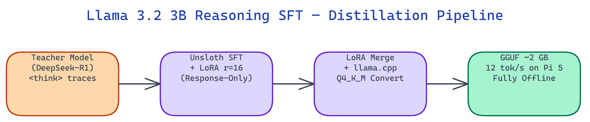

# Llama 3.2 3B Reasoning SFT: On-Device Chain-of-Thought via LoRA Distillation

[](https://github.com/dakshjain-1616/llama-3-2-3b-reasoning-sft)
[](https://huggingface.co/daksh-neo/llama-3-2-3b-reasoning-sft)



## The Problem

> Edge devices like phones and Raspberry Pi cannot run cloud LLMs due to latency or privacy constraints. Existing 3B models produce single-shot answers without structured reasoning, making outputs hard to audit or verify.

NEO built this pipeline to add `<think>` reasoning traces to [Llama 3.2 3B](https://huggingface.co/meta-llama/Llama-3.2-3B-Instruct) via knowledge distillation, then export the result as a 2 GB GGUF that runs locally on any device with 4 GB RAM.

## The Distillation Pipeline

**Response-Only Training** is the central technique. The model trains only on the assistant's response tokens. User prompt tokens are masked with `labels = -100`, so no gradient flows through them.

The label mask looks like this:

```
<|start_header_id|>user<|end_header_id|>     → labels = -100
What is 17 × 24?                             → labels = -100
<|eot_id|>                                   → labels = -100
<|start_header_id|>assistant<|end_header_id|> → labels = -100

<think>                                      → labels = token_id ✅
17 × 24 = 17×20 + 17×4 = 340 + 68           → labels = token_id ✅
</think>                                     → labels = token_id ✅
17 × 24 = **408**                            → labels = token_id ✅
```

This teaches the model how to reason rather than how to echo prompts.

## LoRA Configuration

**Unsloth** handles the LoRA injection. The adapter targets the attention projection layers only:

| Parameter | Value |
|:----------|------:|
| Rank (r) | 16 |
| Alpha | 32 |
| Target modules | q_proj, v_proj, k_proj, o_proj |
| Dropout | 0.05 |
| Max sequence length | 4096 |
| Quantization (training) | 4-bit NF4 |
| Optimizer | AdamW 8-bit |
| Epochs | 3 |

The base model runs in 4-bit NF4 during training, so the full pipeline fits in 8 GB GPU VRAM. The LoRA adapter itself is approximately 80 MB. After training, `merge_and_unload()` merges adapter weights into the base model for export.

## GGUF Export and Quantization

The merged model passes through llama.cpp's converter and quantizer to produce a `Q4_K_M` file:

| Quantization | Size | RAM Needed | Speed |
|:-------------|-----:|-----------:|:------|
| Q4_K_M | ~1.6 GB | 4 GB | ~12 tok/s on Pi 5 |
| Q5_K_M | ~1.96 GB | 4 GB | slightly slower |
| Q8_0 | ~2.89 GB | 6 GB | best quality |

Q4_K_M hits the practical sweet spot. It runs on a Raspberry Pi 5, any Android phone with 4 GB RAM, and Apple M1 Macs.

## What the Reasoning Output Looks Like

```
Input: Why does ice float on water?

<think>
Water molecules form hydrogen bonds. In ice they arrange into a
hexagonal lattice — more space between molecules than liquid water.
Ice density = 0.917 g/cm³ vs liquid water 1.0 g/cm³ → floats.
</think>

Ice floats because it is less dense (0.917 g/cm³) than liquid water
(1.0 g/cm³). The hexagonal hydrogen-bond lattice in ice creates more
space between molecules than the compact liquid structure.
```

The `<think>` block is auditable. You can verify the reasoning steps before trusting the conclusion.

## How to Build This with NEO

Open NEO in VS Code or Cursor and describe what you want to build. A good starting prompt for this project:

> "Build a knowledge distillation pipeline that adds [DeepSeek-R1](https://huggingface.co/deepseek-ai/DeepSeek-R1)-style chain-of-thought reasoning to [Llama 3.2 3B](https://huggingface.co/meta-llama/Llama-3.2-3B-Instruct) using [Unsloth](https://github.com/unslothai/unsloth) and LoRA. Use response-only training: mask all user turn tokens with labels=-100 so gradients only flow through assistant response tokens, which includes the <think> reasoning block. LoRA config: rank 16, alpha 32, target q_proj/v_proj/k_proj/o_proj, dropout 0.05, 4-bit NF4 base model, AdamW 8-bit optimizer, 3 epochs. The full pipeline must fit in 8 GB GPU VRAM. After training, merge the adapter with merge_and_unload() and export to GGUF Q4_K_M targeting ~1.6 GB that runs at 12 tok/s on a Raspberry Pi 5 with 4 GB RAM. Include a demo.py dry run mode that completes in ~0.12s showing config, dataset validation, and GGUF size estimates without downloading any model."

<a href="https://heyneo.com/dashboard?section=new-chat&prompt=Build%20a%20knowledge%20distillation%20pipeline%20that%20adds%20DeepSeek-R1-style%20chain-of-thought%20reasoning%20to%20Llama%203.2%203B%20using%20Unsloth%20and%20LoRA.%20Use%20response-only%20training%3A%20mask%20all%20user%20turn%20tokens%20with%20labels%3D-100%20so%20gradients%20only%20flow%20through%20assistant%20response%20tokens%2C%20which%20includes%20the%20%3Cthink%3E%20reasoning%20block.%20LoRA%20config%3A%20rank%2016%2C%20alpha%2032%2C%20target%20q_proj%2Fv_proj%2Fk_proj%2Fo_proj%2C%20dropout%200.05%2C%204-bit%20NF4%20base%20model%2C%20AdamW%208-bit%20optimizer%2C%203%20epochs.%20The%20full%20pipeline%20must%20fit%20in%208%20GB%20GPU%20VRAM.%20After%20training%2C%20merge%20the%20adapter%20with%20merge_and_unload%28%29%20and%20export%20to%20GGUF%20Q4_K_M%20targeting%20~1.6%20GB%20that%20runs%20at%2012%20tok%2Fs%20on%20a%20Raspberry%20Pi%205%20with%204%20GB%20RAM.%20Include%20a%20demo.py%20dry%20run%20mode%20that%20completes%20in%20~0.12s%20showing%20config%2C%20dataset%20validation%2C%20and%20GGUF%20size%20estimates%20without%20downloading%20any%20model." style="display:inline-block;background:#1e40af;color:#ffffff;padding:10px 22px;border-radius:6px;text-decoration:none;font-weight:600;font-size:14px;">Build with NEO →</a>

NEO generates the project structure and core implementation from that. From there you iterate — ask it to add Q5_K_M and Q8_0 quantization export options with size and RAM requirement tables, add the llama.cpp inference example with the Llama 3.2 chat format prompt showing how to prime the `<think>` block, or add HuggingFace Hub push support configurable via HF_REPO_ID. Each request builds on what's already there.

To use the released model directly, download from HuggingFace and run with llama.cpp:

```bash
pip install huggingface_hub
huggingface-cli download daksh-neo/llama-3-2-3b-reasoning-sft --local-dir ./model
./llama-cli -m model/llama-3-2-3b-reasoning-sft-Q4_K_M.gguf \
  -p "<|start_header_id|>user<|end_header_id|>

Why is the sky blue?<|eot_id|>
<|start_header_id|>assistant<|end_header_id|>

<think>" -n 256
```

The model produces an auditable `<think>` reasoning trace before the final answer, running fully offline on any device with 4 GB RAM.

NEO built a distillation pipeline that gives a 3B model structured reasoning traces while keeping inference under 2 GB and fully offline. See what else NEO ships at [heyneo.com](https://heyneo.com/).

---

## Try NEO in Your IDE

Install the NEO extension to bring AI-powered development directly into your workflow:

- **VS Code**: [NEO in VS Code](https://marketplace.visualstudio.com/items?itemName=NeoResearchInc.heyneo)
- **Cursor**: <a href="cursor://extension/NeoResearchInc.heyneo" style="color:#0066FF;font-weight:bold;">Install NEO for Cursor →</a>

---
