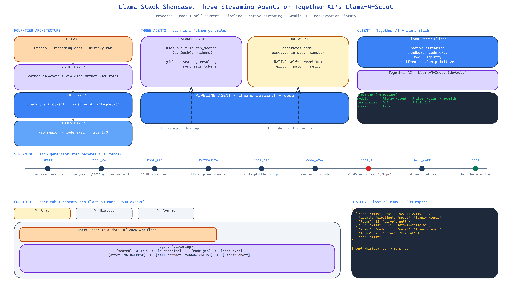

# Llama Stack Showcase: Research, Code, and Pipeline Agents on Meta's Llama Stack + Together AI

[](https://github.com/dakshjain-1616/Llama-Stack-Showcase)



## The Problem

> Meta's Llama Stack is a reasonable abstraction for running agent workflows against Llama models — tool integration, sandboxed code execution, self-correction loops, native streaming, all batteries-included. The problem is that everybody writes their own wrapper for it before realising what the stack already provides. You end up with 400 lines of glue code reimplementing features the stack ships natively.

NEO built this showcase to demonstrate what the stack gives you for free and how much less code you write when you use it properly. Three agents, one streaming UI, conversation history — total shipped code is a fraction of what the equivalent direct-API version would be.

## Three Agents, One Stack

**Research Agent** runs DuckDuckGo searches via Llama Stack's tool integration. It issues queries, consumes results, and synthesises a structured response. The search tool is not a custom wrapper — it is the stack's built-in web search tool, configured and registered through Llama Stack's tool registry. Total glue code: one function.

**Code Agent** generates code and executes it in Llama Stack's sandbox. If execution fails, the stack's self-correction loop runs the error back into the model so it can patch the code and try again. The self-correction is native — no custom retry loop, no manual error parsing.

**Pipeline Agent** chains the Research and Code agents. A user asks a question that requires both reasoning about real-world data and producing code. The Pipeline agent issues a research task, feeds the results to the code agent, and streams the combined output. This demonstrates multi-agent composition inside the stack rather than above it.

## Streaming End-to-End

The whole UI streams. The stack yields steps as they complete — tool calls, tool results, model turns — and Gradio renders them as they arrive. The user watches the agent's reasoning unfold in real time instead of staring at a spinner. This matters for trust: a 20-second streaming response feels faster than a 4-second hidden one, and when something goes wrong the user can see exactly where it stopped.

Implementation-wise the agents are Python generators. They `yield` a structured step per iteration. The Gradio adapter consumes the generator and rewrites the chat bubble each step.

## Four-Tier Architecture

The showcase is explicit about the layering:

- **UI Layer** — Gradio interface with streaming and the conversation history tab.
- **Agent Layer** — the three agents, each a generator-based step yielder.
- **Client Layer** — Together AI integration wrapped through Llama Stack's client.
- **Tools Layer** — web search, code execution, file I/O, all registered through the stack's tool primitives.

This is not over-engineering for a demo; it is the layering you want so that switching from Together AI to a local Llama Stack deployment (or to a different model provider entirely) requires only a Client Layer change.

## Conversation History and Per-Run Configuration

Two features that sound minor and turn out to matter:

- **Conversation History tab** — the last 50 runs are recorded and exportable as JSON. If a user hits a bug, they export history and share it. Debugging becomes possible.
- **Per-Run Configuration** — the UI lets the user pick between three Llama models and adjust temperature (0.0 to 1.5) per run without restarting the app. You iterate on prompt behaviour without rebuilding the container.

## Deployment

Local development:

```bash
git clone https://github.com/dakshjain-1616/Llama-Stack-Showcase
cd Llama-Stack-Showcase
pip install -r requirements.txt
cp .env.example .env   # add TOGETHER_API_KEY
python app.py
```

Cloud: the repo is structured for a one-click HuggingFace Spaces deploy. Push the repo, set `TOGETHER_API_KEY` as a Space secret, and the Gradio UI runs without further configuration.

## How to Build This with NEO

Open NEO in VS Code or Cursor and describe what you want to build. A good starting prompt for this project:

> "Build a three-agent showcase on Meta's Llama Stack using Together AI's Llama-4-Scout model. Research agent runs DuckDuckGo searches via the stack's built-in web search tool and synthesises structured responses. Code agent generates code and runs it in the stack's sandbox, using native self-correction loops to patch errors. Pipeline agent chains the other two — research first, then code generation over the research results. Implement each agent as a Python generator that yields structured steps. Use Gradio for the UI and stream each step into the chat bubble as it arrives. Add a conversation history tab that records the last 50 runs with JSON export. Allow per-run selection of three Llama models and temperature (0.0 to 1.5). Layer the architecture as UI / Agent / Client / Tools so Together AI can be swapped for a local Llama Stack deployment without touching the UI."

<a href="https://heyneo.com/dashboard?section=new-chat&prompt=Build%20a%20three-agent%20showcase%20on%20Meta%27s%20Llama%20Stack%20using%20Together%20AI%27s%20Llama-4-Scout%20model.%20Research%20agent%20runs%20DuckDuckGo%20searches%20via%20the%20stack%27s%20built-in%20web%20search%20tool.%20Code%20agent%20generates%20code%20and%20runs%20it%20in%20the%20stack%27s%20sandbox%20with%20native%20self-correction%20loops.%20Pipeline%20agent%20chains%20the%20other%20two%20-%20research%20first%2C%20then%20code%20generation%20over%20the%20research%20results.%20Implement%20each%20agent%20as%20a%20Python%20generator%20yielding%20structured%20steps.%20Use%20Gradio%20for%20the%20UI%20with%20streaming.%20Add%20a%20conversation%20history%20tab%20with%2050-run%20JSON%20export.%20Allow%20per-run%20model%20and%20temperature%20selection." style="display:inline-block;background:#1e40af;color:#ffffff;padding:10px 22px;border-radius:6px;text-decoration:none;font-weight:600;font-size:14px;">Build with NEO →</a>

NEO scaffolds the stack client, the three generator-based agents, the Gradio streaming adapter, and the history tab. From there you iterate — swap DuckDuckGo for a paid search API, add a fourth agent for document QA, or migrate Together AI to a local Llama Stack deployment.

NEO built a three-agent streaming showcase that uses Llama Stack's native tool integration, sandboxed execution, and self-correction loops instead of reimplementing them. See what else NEO ships at [heyneo.com](https://heyneo.com/).

---

## Try NEO in Your IDE

Install the NEO extension to bring AI-powered development directly into your workflow:

- **VS Code**: [NEO in VS Code](https://marketplace.visualstudio.com/items?itemName=NeoResearchInc.heyneo)
- **Cursor**: <a href="cursor://extension/NeoResearchInc.heyneo" style="color:#0066FF;font-weight:bold;">Install NEO for Cursor →</a>

---
