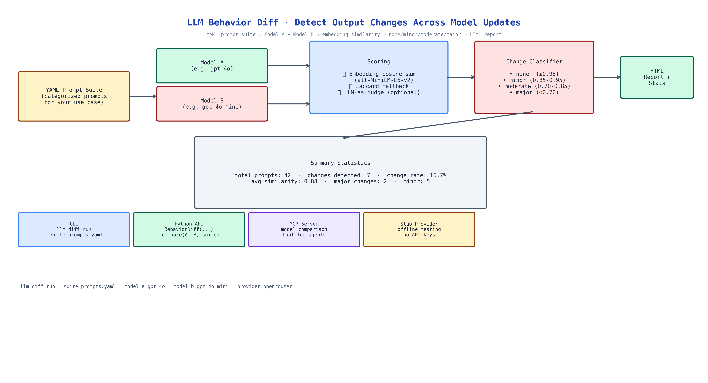

# LLM Behavior Diff: Detect Meaningful Output Changes Across Model Updates

[](https://github.com/dakshjain-1616/-LLM-Behavior-Diff-Model-Update-Detector)



## The Problem

> A model you rely on gets updated. The provider says it's improved. Your logs show no obvious errors. But something feels different — the tone is more cautious, the JSON structure drifted, the reasoning is briefer. You can't prove it and you can't reproduce the old behavior, because you never captured a baseline. By the time you realize the update changed something important, it's been running in production for weeks.

NEO built LLM Behavior Diff to capture what your model actually does on a structured prompt suite, then diff that against what the updated model does — with similarity scores, change classifications, and an HTML report you can share with your team.

## How the Diff Works

The workflow runs in five steps:

1. **Load a YAML prompt suite** — categorized test prompts covering your use case's key behaviors.
2. **Execute both models** — run every prompt through model A and model B using your chosen provider.
3. **Score response pairs** — compare A and B responses using embedding cosine similarity (`all-MiniLM-L6-v2`) and Jaccard string similarity as a fallback.
4. **Classify changes** — bin each prompt result as none / minor / moderate / major based on similarity thresholds.
5. **Generate the report** — an interactive HTML file with the summary table and full response pairs per prompt.

The output tells you exactly how many prompts changed, at what severity, and what the average similarity was across the suite.

## Three Comparison Methods

**Embedding similarity** — `sentence-transformers/all-MiniLM-L6-v2` encodes both responses and computes cosine similarity. This catches semantic drift even when the surface text changes significantly — the model says the same thing differently, which is often fine. Similarity above 0.85 is classified as none or minor; below 0.70 is major.

**Jaccard string similarity** — used as a fallback when embeddings aren't available. Measures token overlap directly. Less nuanced but zero dependencies.

**LLM-as-judge** — optional via OpenRouter. Sends both responses to a judge model with a scoring rubric. Catches nuanced quality changes that similarity scores miss.

## Three Interfaces

**CLI** — run a diff directly from the terminal:

```bash
llm-diff run --suite my-prompts.yaml --model-a gpt-4o --model-b gpt-4o-mini --provider openrouter
llm-diff run --model-a llama3.2:3b --model-b llama3.2:8b --provider ollama
```

**Python API** — integrate into your model validation pipeline:

```python
from llm_behavior_diff import BehaviorDiff

diff = BehaviorDiff(provider="openrouter")
results = diff.compare("gpt-4o", "gpt-4o-mini", suite="my-prompts.yaml")
print(results.change_rate, results.avg_similarity)
```

**MCP server** — expose as a tool to Claude Code and other agents for on-demand model comparison.

## How to Build This with NEO

Open NEO in VS Code or Cursor and describe what you want to build. A good starting prompt for this project:

> "Build a model behavioral diff tool. Load YAML prompt suites with categorized test prompts. Execute each prompt through two models (Model A and Model B) using Ollama, OpenRouter, or a stub provider for offline testing. Score response pairs using sentence-transformers embedding cosine similarity (all-MiniLM-L6-v2) and Jaccard string similarity as fallback. Optionally use an LLM-as-judge via OpenRouter for nuanced assessment. Classify each change as none/minor/moderate/major based on similarity thresholds. Produce an interactive HTML report with summary stats and full response pairs. Ship as CLI, Python API, and MCP server."

<a href="https://heyneo.com/dashboard?section=new-chat&prompt=Build%20a%20model%20behavioral%20diff%20tool.%20Load%20YAML%20prompt%20suites.%20Execute%20prompts%20through%20two%20models%20using%20Ollama%20or%20OpenRouter.%20Score%20response%20pairs%20using%20sentence-transformers%20embedding%20cosine%20similarity%20and%20Jaccard%20fallback.%20Optionally%20use%20LLM-as-judge%20via%20OpenRouter.%20Classify%20changes%20as%20none%2Fminor%2Fmoderate%2Fmajor.%20Produce%20interactive%20HTML%20report.%20Ship%20as%20CLI%2C%20Python%20API%2C%20and%20MCP%20server." style="display:inline-block;background:#1e40af;color:#ffffff;padding:10px 22px;border-radius:6px;text-decoration:none;font-weight:600;font-size:14px;">Build with NEO →</a>

NEO scaffolds the YAML prompt loader, the dual-model runner, the three scoring methods, the change classifier, the HTML report generator, and all three interfaces. From there you iterate — add a time-series tracker that records diffs over successive model versions, integrate the diff into CI so model upgrades require a review step when behavioral change exceeds a threshold, or add custom rubrics for your domain's specific quality dimensions.

To run the finished project:

```bash
git clone https://github.com/dakshjain-1616/-LLM-Behavior-Diff-Model-Update-Detector
cd LLM-Behavior-Diff-Model-Update-Detector
pip install -r requirements.txt

llm-diff run --suite prompts.yaml --model-a llama3.2:3b --model-b llama3.2:8b --provider ollama
llm-diff run --suite prompts.yaml --model-a gpt-4o --model-b gpt-4o-mini --provider openrouter
```

NEO built a behavioral diff tool that detects meaningful output changes across model updates using embedding similarity, change classification, and interactive HTML reports — so you never discover a behavioral regression weeks after it shipped. See what else NEO ships at [heyneo.com](https://heyneo.com/).

---

## Try NEO in Your IDE

Install the NEO extension to bring AI-powered development directly into your workflow:

- **VS Code**: [NEO in VS Code](https://marketplace.visualstudio.com/items?itemName=NeoResearchInc.heyneo)
- **Cursor**: <a href="cursor://extension/NeoResearchInc.heyneo" style="color:#0066FF;font-weight:bold;">Install NEO for Cursor →</a>

---
