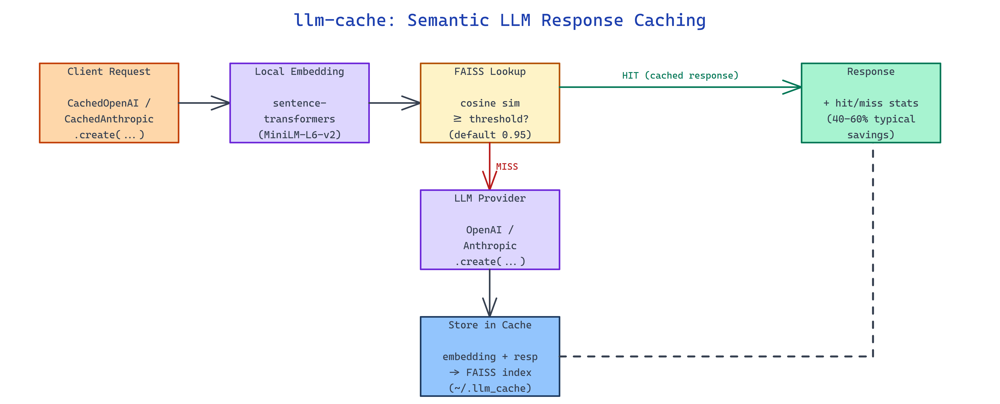

# llm-cache: Semantic Response Caching for OpenAI and Anthropic SDKs

[](https://github.com/dakshjain-1616/llm-cache)



## The Problem

> Production LLM workloads re-ask the same question in a dozen different wordings and pay full token price every time because exact-match caches only fire on identical strings.

NEO built llm-cache to sit in front of the OpenAI and Anthropic SDKs and return a cached response whenever a new prompt is semantically close enough to one it has already answered.

## Drop-In Client Wrappers

llm-cache ships `CachedOpenAI` and `CachedAnthropic` (plus `AsyncCachedOpenAI` and `AsyncCachedAnthropic`) that mirror the upstream SDK surface, so existing call sites keep working. The wrapper intercepts `chat.completions.create`, computes a local embedding for the incoming prompt, and looks it up in a per-client semantic index before deciding whether to hit the provider.

```python
from llm_cache import CachedOpenAI

client = CachedOpenAI(api_key="sk-...", threshold=0.90)

response = client.chat.completions.create(
    model="gpt-4o",
    messages=[{"role": "user", "content": "What is the capital of France?"}]
)

# Paraphrase — served from cache at zero API cost
response2 = client.chat.completions.create(
    model="gpt-4o",
    messages=[{"role": "user", "content": "What city is the capital of France?"}]
)
```

For callers that want the cache without the SDK wrapper, `SemanticCache` exposes `set`, `get`, `get_similar`, `delete`, `clear`, `save`, and `stats` directly.

## Local Embeddings + FAISS Index

Embeddings are computed locally with `sentence-transformers` (default model `all-MiniLM-L6-v2`, ~90 MB) — no external embedding service and no internet required after the first download. Vectors are L2-normalized and indexed in FAISS so lookup is a cosine-similarity search, and the index persists to `~/.llm_cache/` with a checkpoint every 10 writes by default.

| Parameter | Default | Purpose |
|---|---|---|
| `threshold` | `0.95` | Cosine-similarity score required for a cache hit |
| `cache_name` | `"default"` | Namespace; use different names to isolate caches per project |
| `cache_dir` | `~/.llm_cache` | On-disk location for the index and metadata |
| `persist` | `True` | Toggle disk persistence |
| `embedding_model` | `all-MiniLM-L6-v2` | Sentence-transformer used to embed prompts |

The threshold is the main tuning knob. 0.98–1.0 matches near-exact duplicates only, 0.92–0.97 catches clear paraphrases, and 0.88–0.91 is recommended for batch workloads where false positives are cheap. Going below 0.85 risks returning the wrong cached answer.

## Hit-Rate Stats and Cache Management

Every client exposes a rolling stats view so you can see what the cache is actually doing:

```python
stats = client.get_stats()
print(f"Hit rate: {stats['hit_rate']:.1%}  |  Hits: {stats['hits']}  |  Misses: {stats['misses']}")
```

`SemanticCache` adds inspection and maintenance methods — `get_similar(query, k=5)` returns the top-k nearest entries for debugging threshold choices, `delete(entry_id)` removes a single entry, and `clear()` wipes the namespace. Typical savings on repetitive workloads land in the 40–60% range according to the project's own benchmarks.

## Limitations Worth Knowing

- Streaming calls (`stream=True`) are passed through and not cached.
- Tool and function calls bypass the cache.
- The cache is model-agnostic by default — entries are shared across models unless you isolate them with a separate `cache_name`.
- Responses must be pickle-serializable.
- There is no TTL or automatic eviction; the on-disk cache grows until you call `clear()` or manage it yourself.

```bash
pip install faiss-cpu sentence-transformers openai anthropic
pip install -e .
python examples/openai_example.py      # demos run without an API key
```

## How to Build This with NEO

Open NEO in VS Code or Cursor and describe what you want to build. A good starting prompt for this project:

> "Build a Python library that wraps the OpenAI and Anthropic SDKs with a semantic cache. Use sentence-transformers (all-MiniLM-L6-v2) to embed prompts locally and FAISS with L2-normalized vectors for cosine-similarity lookup. Expose CachedOpenAI, CachedAnthropic, AsyncCachedOpenAI, AsyncCachedAnthropic as drop-in replacements, plus a SemanticCache class with set/get/get_similar/delete/clear/save/stats. Persist the index to ~/.llm_cache with periodic checkpoints, make threshold and cache_name configurable, and expose hit/miss counters and hit rate. Pass streaming and tool calls through uncached."

<a href="https://heyneo.com/dashboard?section=new-chat&prompt=Build%20a%20Python%20library%20that%20wraps%20the%20OpenAI%20and%20Anthropic%20SDKs%20with%20a%20semantic%20cache.%20Use%20sentence-transformers%20%28all-MiniLM-L6-v2%29%20to%20embed%20prompts%20locally%20and%20FAISS%20with%20L2-normalized%20vectors%20for%20cosine-similarity%20lookup.%20Expose%20CachedOpenAI%2C%20CachedAnthropic%2C%20AsyncCachedOpenAI%2C%20AsyncCachedAnthropic%20as%20drop-in%20replacements%2C%20plus%20a%20SemanticCache%20class%20with%20set%2Fget%2Fget_similar%2Fdelete%2Fclear%2Fsave%2Fstats.%20Persist%20the%20index%20to%20~%2F.llm_cache%20with%20periodic%20checkpoints%2C%20make%20threshold%20and%20cache_name%20configurable%2C%20and%20expose%20hit%2Fmiss%20counters%20and%20hit%20rate.%20Pass%20streaming%20and%20tool%20calls%20through%20uncached." style="display:inline-block;background:#1e40af;color:#ffffff;padding:10px 22px;border-radius:6px;text-decoration:none;font-weight:600;font-size:14px;">Build with NEO →</a>

NEO generates the package scaffolding, the wrapper classes, and the FAISS-backed cache. From there you iterate — add a TTL and LRU eviction policy, key the cache on `(model, prompt)` so different models don't share entries, plug in a Redis backend for multi-process setups, or expose a `/stats` HTTP endpoint for production dashboards. Each request builds on what's already there.

To run the finished project:

```bash
git clone https://github.com/dakshjain-1616/llm-cache
cd llm-cache
pip install faiss-cpu sentence-transformers openai anthropic
pip install -e .
python examples/openai_example.py
```

See what else NEO ships at [heyneo.com](https://heyneo.com/).

---

## Try NEO in Your IDE

Install the NEO extension to bring AI-powered development directly into your workflow:

- **VS Code**: [NEO in VS Code](https://marketplace.visualstudio.com/items?itemName=NeoResearchInc.heyneo)
- **Cursor**: <a href="cursor://extension/NeoResearchInc.heyneo" style="color:#0066FF;font-weight:bold;">Install NEO for Cursor →</a>

---
