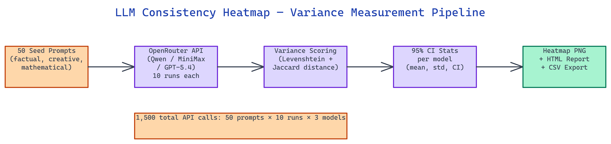

# LLM Consistency Across Minimax, Qwen, and GPT: A Variance Heatmap Tool

[](https://github.com/dakshjain-1616/llm-consistency-across-Minimax-Qwen-and-Gpt-)



## The Problem

> Reproducibility is rarely measured when evaluating LLMs. A model that gives a different answer each time you ask the same question is unreliable in deterministic pipelines: document processing, code generation, structured data extraction, and any application where you need the same input to produce consistent output. Without a systematic measurement, there is no way to know which model is stable enough for your use case.

NEO built this tool to give a one-shot, cross-model stability fingerprint. It sends 50 fixed seed prompts to three frontier LLMs 10 times each (1,500 total API calls), computes normalized Levenshtein distance between every pair of responses for each prompt, and renders the scores as a color-coded heatmap PNG.

## How Variance Is Calculated

The **normalized Levenshtein distance** is the core metric. For each `(model, prompt)` pair with 10 runs, the tool collects all 10 responses and computes the pairwise distance between every combination:

```
d(a, b) = levenshtein(a, b) / max(len(a), len(b))
```

There are C(10, 2) = 45 pairs per (model, prompt) combination. The tool averages all 45 distances to produce a single variance score between 0 and 1. A score of 0.00 means the model returned identical text every time. A score of 0.35 means responses differed by about 35% of characters on average.

Additionally, **Jaccard semantic distance** captures vocabulary-level divergence by computing the token overlap between responses:

```
jaccard_distance = 1 - |tokens_A ∩ tokens_B| / |tokens_A ∪ tokens_B|
```

Both metrics run on every (model, prompt) pair and appear side-by-side in the exported CSV and HTML report.

## The Three Models

All three models run through OpenRouter, which provides a single API key for all of them.

**[Qwen3.5-397B](https://huggingface.co/Qwen/Qwen3.5-397B-A17B)** (Alibaba Cloud) is the most stable model in the benchmark results. Its mean variance across 50 prompts is 0.0258, with a maximum of 0.0599. It never strays far from its first answer, making it the safest choice for deterministic pipelines.

**[MiniMax M2](https://huggingface.co/MiniMaxAI/MiniMax-M2)** sits in the middle tier. Its mean variance is 0.0467 with no outlier prompts above 0.12. Consistent for most production uses, though slightly more variable than Qwen on open-ended prompts.

**GPT-5.4** shows bimodal behavior. Its mean variance is 0.1335, but that average hides a wide distribution: 0.00 on simple factual prompts (capital cities, arithmetic, chemical formulas) and up to 0.2949 on open-ended scientific explanations. The high variance appears only on prompts where multiple correct phrasings exist.

## Variance Thresholds

The tool maps variance scores to four verdict categories:

| Range | Verdict |
|:------|:--------|
| 0.00 to 0.08 | Perfectly stable, safe for deterministic pipelines |
| 0.08 to 0.18 | Acceptable drift, suitable for most production uses |
| 0.18 to 0.35 | Noticeable variance, add sampling guards |
| 0.35 to 1.00 | Unreliable, avoid for reproducibility-critical tasks |

These thresholds are configurable. Setting `TEMPERATURE=0.0` and rerunning gives a determinism floor test: any variance above 0 at zero temperature indicates the model provider is applying server-side sampling or non-deterministic batching.

## Heatmap Output

The heatmap renders as a matplotlib PNG with the YlOrRd colormap. Rows are the 50 seed prompts. Columns are the three models. Cell color encodes variance: yellow for low variance, dark red for high. A single visual scan reveals which prompts cause the most drift and which model is most stable overall.

Additional outputs generated per run include an HTML report with sortable tables and per-model statistics, a CSV for Pandas analysis, and `experiment_meta.json` with 95% confidence intervals per model computed as:

```
CI = mean ± 1.96 × std / √N
```

## How to Build This with NEO

Open NEO in VS Code or Cursor and describe what you want to build. A good starting prompt for this project:

> "Build a Python LLM consistency measurement tool that sends 50 fixed seed prompts to three frontier models ([Qwen3.5-397B](https://huggingface.co/Qwen/Qwen3.5-397B-A17B), MiniMax M2.7, and GPT-5.4) 10 times each via OpenRouter — 1,500 total API calls. For each (model, prompt) pair, compute normalized Levenshtein distance across all C(10,2)=45 response pairs: d(a,b) = levenshtein(a,b) / max(len(a), len(b)), then average to a single variance score 0-1. Also compute Jaccard semantic distance via token overlap. Map variance scores to four verdict tiers: 0-0.08 perfectly stable, 0.08-0.18 acceptable drift, 0.18-0.35 noticeable variance, 0.35+ unreliable. Render results as a matplotlib heatmap PNG using YlOrRd colormap with prompts as rows and models as columns. Also export an HTML report with sortable tables, a CSV for Pandas analysis, and experiment_meta.json with 95% confidence intervals per model. Include a mock demo mode seeded by RANDOM_SEED=42 that generates all outputs locally without API calls."

<a href="https://heyneo.com/dashboard?section=new-chat&prompt=Build%20a%20Python%20LLM%20consistency%20measurement%20tool%20that%20sends%2050%20fixed%20seed%20prompts%20to%20three%20frontier%20models%20%28Qwen3.5-397B%2C%20MiniMax%20M2.7%2C%20and%20GPT-5.4%29%2010%20times%20each%20via%20OpenRouter%20%E2%80%94%201%2C500%20total%20API%20calls.%20For%20each%20%28model%2C%20prompt%29%20pair%2C%20compute%20normalized%20Levenshtein%20distance%20across%20all%20C%2810%2C2%29%3D45%20response%20pairs%3A%20d%28a%2Cb%29%20%3D%20levenshtein%28a%2Cb%29%20%2F%20max%28len%28a%29%2C%20len%28b%29%29%2C%20then%20average%20to%20a%20single%20variance%20score%200-1.%20Also%20compute%20Jaccard%20semantic%20distance%20via%20token%20overlap.%20Map%20variance%20scores%20to%20four%20verdict%20tiers%3A%200-0.08%20perfectly%20stable%2C%200.08-0.18%20acceptable%20drift%2C%200.18-0.35%20noticeable%20variance%2C%200.35%2B%20unreliable.%20Render%20results%20as%20a%20matplotlib%20heatmap%20PNG%20using%20YlOrRd%20colormap%20with%20prompts%20as%20rows%20and%20models%20as%20columns.%20Also%20export%20an%20HTML%20report%20with%20sortable%20tables%2C%20a%20CSV%20for%20Pandas%20analysis%2C%20and%20experiment_meta.json%20with%2095%25%20confidence%20intervals%20per%20model.%20Include%20a%20mock%20demo%20mode%20seeded%20by%20RANDOM_SEED%3D42%20that%20generates%20all%20outputs%20locally%20without%20API%20calls." style="display:inline-block;background:#1e40af;color:#ffffff;padding:10px 22px;border-radius:6px;text-decoration:none;font-weight:600;font-size:14px;">Build with NEO →</a>

NEO generates the project structure and core implementation from that. From there you iterate — ask it to add configurable TEMPERATURE=0.0 support for a determinism floor test to detect server-side non-deterministic batching, add a `generate_heatmap.py` script that regenerates the PNG from existing variance data without re-running the experiment, or add configurable NUM_PROMPTS and NUM_RUNS via .env for faster iteration. Each request builds on what's already there.

To run the finished project:

```bash
git clone https://github.com/dakshjain-1616/llm-consistency-across-Minimax-Qwen-and-Gpt-
cd llm-consistency-across-Minimax-Qwen-and-Gpt-
pip install -r requirements.txt
python scripts/demo.py
```

The demo generates a heatmap PNG, HTML report, CSV, and variance JSON locally using synthetic seeded responses — set `OPENROUTER_API_KEY` and run `python run_experiment.py` for the real 1,500-call measurement.

NEO built this consistency measurement tool to give engineers a concrete stability fingerprint before committing to a model in a production pipeline, using Levenshtein variance and Jaccard distance across 1,500 responses. See what else NEO ships at [heyneo.com](https://heyneo.com/).

---

## Try NEO in Your IDE

Install the NEO extension to bring AI-powered development directly into your workflow:

- **VS Code**: [NEO in VS Code](https://marketplace.visualstudio.com/items?itemName=NeoResearchInc.heyneo)
- **Cursor**: <a href="cursor://extension/NeoResearchInc.heyneo" style="color:#0066FF;font-weight:bold;">Install NEO for Cursor →</a>

---
