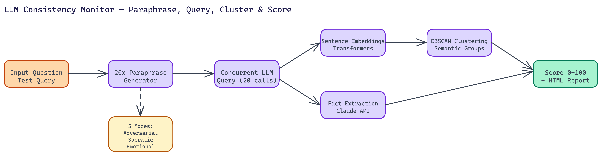

# LLM Consistency Monitor: Testing Whether Your Model Gives the Same Answer Twice

[](https://github.com/Dakshjain1604/LLM-consistency-Monitor)



## The Problem

> LLMs are stochastic systems with real sensitivity to phrasing. The same question, rephrased or reworded, can produce meaningfully different answers. Most teams never test this — they write a set of example prompts, check that the responses look good, and deploy. For factual queries especially, that inconsistency is a reliability problem that only surfaces after users encounter it in production.

NEO built a tool specifically to surface it before you ship.

## What the Consistency Monitor Does

The pipeline runs four steps. First, it takes your question and generates **20 semantically identical paraphrases**. These are questions that ask the same thing but with different vocabulary, sentence structure, and phrasing. Then it sends all 20 variants to the model concurrently and collects every response. Then it analyzes those responses using embeddings and clustering to identify whether they are semantically consistent or whether the model is giving substantively different answers to what is nominally the same question.

The output is a consistency score from **0 to 100**, plus an interactive HTML report with visualizations.

## The Analysis Pipeline

### Embeddings and Clustering

Raw text comparison does not work well for semantic consistency. Two responses can be phrased completely differently and mean the same thing, or can look superficially similar while contradicting each other on key facts.

The monitor uses sentence-transformers to convert all 20 responses into embedding vectors that represent their semantic content. Then it runs DBSCAN clustering on those vectors. DBSCAN is a density-based clustering algorithm that groups responses with similar semantic content together without requiring you to specify the number of clusters upfront. The distribution of clusters tells you a great deal: a well-consistent model should produce one tight cluster. Multiple clusters indicate the model is giving categorically different answers.

### Fact Extraction and Contradiction Detection

Clustering tells you about surface-level semantic consistency. For deeper analysis, the monitor uses the Claude API to extract specific factual claims from each response and flag contradictions.

This catches a class of problem that embedding similarity misses. Two responses might be semantically similar in tone and structure but disagree on a specific fact. The fact extraction step finds that.

### Stress Testing Categories

NEO built five analytical modes that probe different dimensions of consistency:

- **Adversarial prompts**: inputs crafted to push the model toward different responses
- **Socratic questioning**: gradual reframings that approach the same question from different angles
- **Emotionally charged variations**: versions with added emotional framing or urgency
- **Ambiguous phrasing**: versions where the question could be interpreted multiple ways
- **Technical jargon**: versions using domain-specific vocabulary vs. plain language

Running all five gives you a comprehensive picture of where the model's consistency breaks down.

## Multi-Provider Support

The tool works with Claude (Sonnet 4), GPT-4, HuggingFace endpoints, and custom local models via HTTP. The configuration is straightforward: set your API keys in the environment file and specify which model to test.

Batch mode lets you test multiple questions from a JSON file in a single run, which is useful for systematic evaluation before a production release.

## Reading the Results

The HTML report includes a similarity heatmap across all 20 responses, cluster distribution charts, latency analysis, and prompt engineering suggestions based on where inconsistency was detected.

A score of **80% or above** generally indicates the model is consistent enough for production use on that question type. Below that, the report points to which phrasing variants are causing divergence, giving you concrete direction for prompt refinement.

## Who Needs This

Any team running a customer-facing LLM application on factual content. Legal research tools, medical information systems, financial advisories, customer support bots. If your application gives answers that users act on, consistency is not optional.

It is also useful during model evaluation and selection. Before you commit to a particular model or fine-tune for a specific domain, running consistency testing across your target question types tells you whether the model's reliability profile fits your requirements.

The full pipeline runs in **60 to 120 seconds** on typical hardware and uses approximately **2GB of memory**. It is fast enough to run as part of a pre-deployment evaluation workflow.

---

## How to Build This

You need Python 3.9 or later. The embedding step uses `sentence-transformers`, which requires a few hundred MB of disk space for the model weights downloaded on first run. No GPU is required; inference runs on CPU within the 2GB memory budget.

Clone and install:

```bash
git clone https://github.com/Dakshjain1604/LLM-consistency-Monitor
cd LLM-consistency-Monitor
pip install -r requirements.txt
```

Create a `.env` file at the root of the repository with your API credentials:

```bash
ANTHROPIC_API_KEY=sk-ant-...
OPENAI_API_KEY=sk-...
```

Run a consistency check on a single question:

```bash
python monitor.py --question "What is the capital of France?" --model claude-sonnet-4
```

The tool generates 20 paraphrased variants, queries the model concurrently, and runs the embedding and DBSCAN clustering pipeline. The whole run completes in 60 to 120 seconds. When it finishes, it opens an HTML report in your default browser showing a similarity heatmap across all 20 responses, the cluster distribution chart, per-variant latency, and a final consistency score out of 100. A score above 80 means the model is giving essentially the same answer across phrasings. Below that, the report flags which paraphrase groups are diverging and suggests prompt refinements to reduce the instability.

To run batch evaluation across multiple questions from a JSON file:

```bash
python monitor.py --batch questions.json --model gpt-4o --output results/
```

NEO built an LLM consistency monitor where semantic clustering across 20 paraphrased variants exposes answer instability before it reaches users in production. See what else NEO ships at [heyneo.so](https://heyneo.so/).

---

## Try NEO in Your IDE

Install the NEO extension to bring AI-powered development directly into your workflow:

- **VS Code**: [NEO in VS Code](https://marketplace.visualstudio.com/items?itemName=NeoResearchInc.heyneo)
- **Cursor**: <a href="cursor://extension/NeoResearchInc.heyneo" style="color:#0066FF;font-weight:bold;">Install NEO for Cursor →</a>

---
