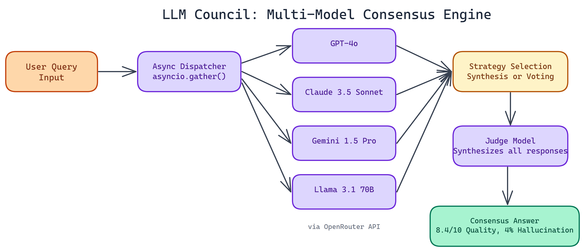

# LLM Council: How NEO Built a Multi-Model Consensus Engine in ~200 Lines of Python

[](https://github.com/abhishekgandhi-neo/llm_council_by_neo)



## The Problem

> Single-model outputs have a ceiling. No matter how good GPT-4 or Claude gets, they still hallucinate, still get overconfident on edge cases, and still reflect biases baked into their training data. The fix isn't always a bigger model — but most teams have no practical way to leverage multiple models together, so they accept the limitations of a single provider.

LLM Council is a minimal, production-usable framework that queries multiple language models concurrently, then synthesizes or votes across their responses to produce a better final answer. The core is roughly 200 lines of Python, and it ships with two consensus strategies depending on your use case.

## Why Multi-Model Consensus Works

Think about how expert panels work. A single doctor can miss a diagnosis. Three doctors reviewing the same case independently, then comparing notes, are much harder to fool. LLMs operate on a similar principle. Each model has different training data, different RLHF tuning, different failure modes. When they agree, you can be more confident. When they diverge, that divergence itself is informative.

NEO's benchmarks confirmed this. Single GPT-4 queries scored **7.2/10** quality with a **12% hallucination rate** across the test set. Running the same queries through the Council's synthesis approach pushed that to **8.4/10** quality with only a **4% hallucination rate**. That's a meaningful improvement without any fine-tuning or prompt hacking.

## The Architecture: Small Core, Serious Capability

The entire framework depends on only two libraries: OpenAI and Pydantic. NEO kept it that way intentionally. Heavy frameworks introduce hidden complexity, and hidden complexity breaks in production.

Under the hood, the framework uses `asyncio.gather()` to fire off all model queries simultaneously. Total latency approximates the slowest model in the council, not the sum of all response times. If you're querying four models and the slowest takes 3 seconds, you wait 3 seconds total, not 12. That makes the Council practical for real applications, not just offline experiments.

The framework integrates with OpenRouter, which gives access to **200+ models** through a single API. You can run a council of GPT-4o, Claude 3.5 Sonnet, Gemini 1.5 Pro, and Llama 3.1 70B in one shot. Mix providers freely.

## Two Consensus Strategies

NEO shipped two approaches because different tasks need different aggregation logic.

**Synthesis** uses a judge model to read all responses and produce a unified answer. The judge understands nuance, can weigh conflicting information, and produces coherent prose. This works best for open-ended questions, complex reasoning, and anything where "correct" isn't a single word or number.

**Voting** takes the most frequent response across models. Simpler and faster. This shines on factual lookups, classification tasks, and objective questions where the right answer is discrete. If five out of seven models say Paris, Paris is almost certainly right.

Both approaches handle failure gracefully. If one model times out or throws an error, the council continues with the remaining responses. Individual failures don't break the whole run.

## Real Use Cases

**Research and analysis:** When you need a thorough answer to a complex question, synthesis across three or four strong models produces outputs that are noticeably more balanced and accurate than any single model alone.

**Fact verification:** Use voting across a large council to check whether a statement is widely agreed upon or contested across models.

**Production AI features:** Applications where hallucinations carry real cost (medical, legal, financial) benefit from the reduced error rate of consensus-based generation.

**Red teaming:** Disagreement across models is a signal. If your council splits 50/50 on an answer, that's a flag worth investigating before shipping.

## Getting Started

Setup is straightforward. You configure your model list and consensus strategy through environment variables or directly in code. The NEO VSCode extension handles virtual environment creation, dependency installation, and running queries without leaving your editor.

```python
council = LLMCouncil(
    models=["openai/gpt-4o", "anthropic/claude-3.5-sonnet", "google/gemini-pro-1.5"],
    strategy="synthesis",
    judge_model="openai/gpt-4o"
)
response = await council.query("Explain the tradeoffs between RLHF and DPO for alignment")
```

Error handling, retries, and timeouts are built in. You don't need to write defensive wrappers around each model call.

## What NEO Learned Building This

The biggest insight was that synthesis quality depends heavily on the judge model. A weak judge that just concatenates responses adds little value. A strong judge explicitly prompted to find agreement, flag conflicts, and synthesize coherently makes a real difference.

Voting, by contrast, degrades gracefully even with weaker models in the mix. Majority signal is robust to outliers.

NEO also found that council size matters less than council diversity. Three models with different architectures and training regimes outperform five models from the same provider family.

## Try It

LLM Council is open source. The core is small enough to read in an afternoon, modify easily, and integrate into any Python project. If you're building applications where answer quality matters and hallucinations carry cost, it's worth adding to your stack.

NEO built a multi-model consensus engine where hallucination reduction and answer quality improvement happen through model diversity, not just bigger models. See what else NEO ships at [heyneo.so](https://heyneo.so/).

---

## Try NEO in Your IDE

Install the NEO extension to bring AI-powered development directly into your workflow:

- **VS Code**: [NEO in VS Code](https://marketplace.visualstudio.com/items?itemName=NeoResearchInc.heyneo)
- **Cursor**: [**Install NEO for Cursor →**](cursor:extension/NeoResearchInc.heyneo)
