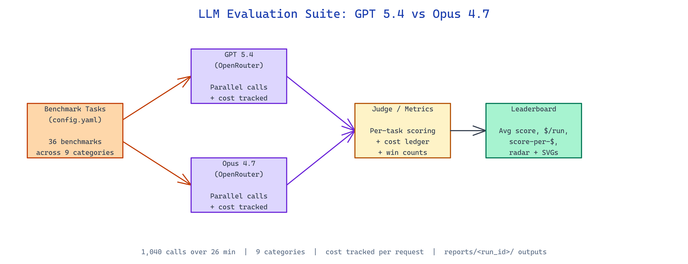

# LLM Evaluation Suite: Head-to-Head GPT 5.4 vs Opus 4.7 Across 36 Benchmarks

[](https://github.com/dakshjain-1616/LLM-Evaluation-Suite)



## The Problem

> Every model release ships with cherry-picked benchmark charts, and nobody publishes the per-task numbers, the cost it took to run them, or enough detail to reproduce the comparison on your own workload.

NEO built LLM Evaluation Suite to run GPT 5.4 and Opus 4.7 through 36 benchmarks side by side via OpenRouter, record every API call, and write a leaderboard with score-per-dollar numbers you can actually audit.

## 36 Benchmarks Across Nine Categories

**LLM Evaluation Suite** fans out a fixed benchmark list across two frontier models and collects per-task scores. The suite covers nine categories so no single strength (or weakness) dominates the summary:

| Category | Benchmarks |
|---|---|
| Math & Formal Reasoning | AIME, MATH-500, FrontierMath, MathVista |
| Code Generation | BigCodeBench, SWE-Bench Pro, LiveCodeBench, HumanEval+ |
| Long-Context | HELMET-Ruler, ZeroScrolls, InfiniteBench, FRAMES |
| Instruction Following | IFEval, WildBench |
| Knowledge & QA | SimpleQA, MedQA, LegalBench |
| RAG & Grounding | MIRAGE |
| Safety & Alignment | StrongREJECT, HarmBench, TruthfulQA |
| Multimodal | DocVQA, VideoMME |
| Agent & Tool Use | TAU-Bench, GAIA, WebArena |

The published reference run fired 1,040 actual OpenRouter calls over 26 minutes — no cached scores, no copy-paste from vendor slides.

## Leaderboard with Cost per Point

Each task produces a raw score and a dollar figure pulled from the OpenRouter response. The top-level report aggregates both into a single score-per-dollar column, which is where the interesting trade-offs surface:

| Model | Avg Score | Total Cost | Score/$ | Wins |
|---|---:|---:|---:|---:|
| Claude Opus 4.7 | 81.3% | $5.54 | 0.147 | 10 |
| GPT 5.4 | 76.9% | $1.89 | 0.407 | 9 |

Category-level deltas tell a different story than the headline average. Opus 4.7 leads safety by roughly 40 percentage points on HarmBench and long-context by 45 percentage points on InfiniteBench, while GPT 5.4 takes instruction-following and runs ~2.9x cheaper overall. A team picking a production model based only on "avg score" would miss both.

## Reproducible Runs with Dry-Run and Subset Modes

The entry point is a single `run_eval.py` script that reads `config.yaml`, dispatches calls to OpenRouter in parallel, and writes everything — raw responses, per-task scores, cost ledger — to `reports/<run_id>/` as JSON plus markdown summaries plus SVG visualizations (benchmark bars, category radar charts, cost-efficiency matrices).

```bash
pip install -r requirements.txt
export OPENROUTER_API_KEY=your_key

python run_eval.py                                              # full 36-benchmark run
python run_eval.py --dry-run                                    # offline smoke test
python run_eval.py --benchmarks math500 frontier_math --sample-size 10  # narrow slice
```

The `--dry-run` flag lets you iterate on pipeline changes without spending a dollar, and `--benchmarks ... --sample-size N` trims the matrix to whatever you actually need to investigate — useful when you only care about the coding subset or want to re-run one benchmark after a config tweak.

## How to Build This with NEO

Open NEO in VS Code or Cursor and describe what you want to build. A good starting prompt for this project:

> "Build an autonomous LLM evaluation framework that runs two models (e.g. GPT 5.4 and Claude Opus 4.7) through 36 benchmarks via OpenRouter across 9 categories (math, code, long-context, instruction following, knowledge QA, RAG, safety, multimodal, agent/tool use). Read benchmarks from a config.yaml, fire calls in parallel, record cost per API call, and write per-task JSON scores, markdown summaries, and SVG visualizations (benchmark bars, category radar, cost-efficiency matrix) to reports/<run_id>/. Include a leaderboard with avg score, total cost, score-per-dollar, and win counts. Support --dry-run, --benchmarks filter, and --sample-size flags."

<a href="https://heyneo.com/dashboard?section=new-chat&prompt=Build%20an%20autonomous%20LLM%20evaluation%20framework%20that%20runs%20two%20models%20%28e.g.%20GPT%205.4%20and%20Claude%20Opus%204.7%29%20through%2036%20benchmarks%20via%20OpenRouter%20across%209%20categories%20%28math%2C%20code%2C%20long-context%2C%20instruction%20following%2C%20knowledge%20QA%2C%20RAG%2C%20safety%2C%20multimodal%2C%20agent%2Ftool%20use%29.%20Read%20benchmarks%20from%20a%20config.yaml%2C%20fire%20calls%20in%20parallel%2C%20record%20cost%20per%20API%20call%2C%20and%20write%20per-task%20JSON%20scores%2C%20markdown%20summaries%2C%20and%20SVG%20visualizations%20%28benchmark%20bars%2C%20category%20radar%2C%20cost-efficiency%20matrix%29%20to%20reports%2F%3Crun_id%3E%2F.%20Include%20a%20leaderboard%20with%20avg%20score%2C%20total%20cost%2C%20score-per-dollar%2C%20and%20win%20counts.%20Support%20--dry-run%2C%20--benchmarks%20filter%2C%20and%20--sample-size%20flags." style="display:inline-block;background:#1e40af;color:#ffffff;padding:10px 22px;border-radius:6px;text-decoration:none;font-weight:600;font-size:14px;">Build with NEO →</a>

NEO generates the project structure and core implementation. From there you iterate — add a third model to the matrix, swap in a stronger judge model for open-ended grading, persist historical runs to a SQLite leaderboard, or plug in a custom benchmark loader for your proprietary eval set. Each request builds on what's already there.

To run the finished project:

```bash
git clone https://github.com/dakshjain-1616/LLM-Evaluation-Suite
cd LLM-Evaluation-Suite
pip install -r requirements.txt
export OPENROUTER_API_KEY=your_key
python run_eval.py --dry-run
```

The dry run walks the full pipeline without spending a cent; drop the flag to execute the real 1,040-call matrix and write the leaderboard, radar charts, and cost-efficiency matrix to `reports/<run_id>/`.

NEO built a reproducible head-to-head for frontier models that tracks cost as a first-class metric, not an afterthought. See what else NEO ships at [heyneo.com](https://heyneo.com/).

---

## Try NEO in Your IDE

Install the NEO extension to bring AI-powered development directly into your workflow:

- **VS Code**: [NEO in VS Code](https://marketplace.visualstudio.com/items?itemName=NeoResearchInc.heyneo)
- **Cursor**: <a href="cursor://extension/NeoResearchInc.heyneo" style="color:#0066FF;font-weight:bold;">Install NEO for Cursor →</a>

---
