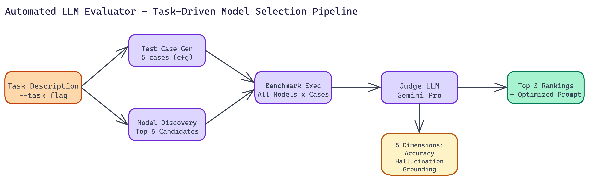

# Automated LLM Evaluation: How NEO Built a Tool to Find the Best Model for Any Task

<a href="https://github.com/gauravvij/llm-evaluator" target="_blank" style="display:flex;align-items:center;gap:14px;padding:16px 20px;border:1px solid #30363d;border-radius:10px;background:#0d1117;color:#e6edf3;text-decoration:none;font-family:-apple-system,BlinkMacSystemFont,'Segoe UI',sans-serif;margin:20px 0;width:fit-content;max-width:480px;transition:border-color 0.2s;">
  <svg width="22" height="22" viewBox="0 0 16 16" fill="#e6edf3" xmlns="http://www.w3.org/2000/svg"><path d="M8 0C3.58 0 0 3.58 0 8c0 3.54 2.29 6.53 5.47 7.59.4.07.55-.17.55-.38 0-.19-.01-.82-.01-1.49-2.01.37-2.53-.49-2.69-.94-.09-.23-.48-.94-.82-1.13-.28-.15-.68-.52-.01-.53.63-.01 1.08.58 1.23.82.72 1.21 1.87.87 2.33.66.07-.52.28-.87.51-1.07-1.78-.2-3.64-.89-3.64-3.95 0-.87.31-1.59.82-2.15-.08-.2-.36-1.02.08-2.12 0 0 .67-.21 2.2.82.64-.18 1.32-.27 2-.27.68 0 1.36.09 2 .27 1.53-1.04 2.2-.82 2.2-.82.44 1.1.16 1.92.08 2.12.51.56.82 1.27.82 2.15 0 3.07-1.87 3.75-3.65 3.95.29.25.54.73.54 1.48 0 1.07-.01 1.93-.01 2.2 0 .21.15.46.55.38A8.013 8.013 0 0016 8c0-4.42-3.58-8-8-8z"/></svg>
  <div>
    <div style="font-weight:600;font-size:14px;color:#e6edf3;">gauravvij/llm-evaluator</div>
    <div style="font-size:12px;color:#8b949e;margin-top:3px;">View on GitHub →</div>
  </div>
</a>



## The Problem

> Choosing the right LLM for a production task is harder than it looks. Leaderboard rankings tell you how models perform on academic benchmarks — they tell you very little about how a model will perform on your specific task, with your input distribution, evaluated against criteria that matter to your use case. The standard workaround is manual testing: pick a few models, write some test prompts, read the outputs, form an opinion. This doesn't scale, and it's too subjective to repeat reliably.

NEO built a tool that answers the actual question: given a task description, which model performs best on that task?

## The Problem with Manual Evaluation

Manual evaluation is slow, subjective, and expensive to repeat when your task requirements change or new models are released.

You also end up with selection bias. Humans evaluate LLM outputs inconsistently, especially across multiple dimensions simultaneously. You might notice factual errors but miss subtle hallucinations. You might prefer a confident-sounding response over an accurate but hedged one.

A systematic, automated evaluation process produces better results and can be re-run cheaply.

## How the Evaluator Works

The pipeline has five steps that run automatically from a single task description.

**Test case generation.** The tool generates tailored test cases for your task. Not generic questions, but inputs designed to probe the specific capabilities and failure modes relevant to what you're building. By default it generates five test cases, configurable via CLI flag.

**Model discovery.** The tool identifies top candidate models to benchmark. Up to six candidates by default. These aren't randomly selected. The discovery step considers which models are likely to perform well given the task characteristics.

**Benchmark execution.** Every candidate model runs every test case. Responses are collected and stored.

**Judge LLM evaluation.** A Judge LLM, using Gemini Pro, evaluates each response across five dimensions: accuracy, hallucination detection, grounding, tool-calling ability, and response clarity. Each dimension is scored independently, so you can inspect the breakdown rather than just a single overall score.

**Ranking and prompt optimization.** The top three models are ranked by performance. The tool also produces an optimized system prompt tailored to your use case and the winning model's characteristics.

## Why a Judge LLM?

Human evaluation is inconsistent. Rule-based evaluation is too rigid for open-ended text. A well-prompted Judge LLM hits a useful middle ground: consistent, multi-dimensional, and flexible enough to evaluate responses that don't have a single right answer.

The key design choice is using a separate, capable model as the judge rather than having each model evaluate itself or its competitors. Self-evaluation produces obvious biases. Cross-model evaluation is cleaner.

Separating judge and candidate also means you can upgrade the judge independently as better models become available, without changing the rest of the pipeline.

## Evaluation Dimensions

The five scoring dimensions capture different aspects of response quality:

**Accuracy** measures whether the response is factually correct relative to ground truth or verifiable facts.

**Hallucination detection** looks at whether the model invents plausible-sounding but false information. This dimension is often the most important for production applications.

**Grounding** assesses whether claims are supported by the provided context or evidence rather than stated without backing.

**Tool-calling ability** matters for agentic applications where the model needs to decide when and how to use tools.

**Response clarity** evaluates whether the answer is well-organized and easy to understand, independent of its accuracy.

Getting a separate score for each dimension lets you make task-specific tradeoffs. For a fact-checking application, accuracy and hallucination scores matter most. For a customer-facing assistant, clarity might rank higher.

## Running the Tool

Setup is quick. Clone the repository, create a virtual environment, install from `requirements.txt`, and set your OpenRouter API key in a `.env` file. Then run:

```
python main.py --task "your task description here"
```

The tool handles everything from there. You get a ranked list of the top three models, per-dimension performance metrics, and an optimized system prompt ready to use.

Optional flags let you adjust the number of test cases (`--test-cases`), the maximum number of candidates (`--max-candidates`), and the output directory (`--output-dir`).

## Real Applications

**Model selection for new projects.** Before committing to a model for a production system, run the evaluator on your actual task. A few minutes of compute time will save hours of debugging later.

**Regression testing after model updates.** When a model provider releases a new version, re-run the evaluation to check whether performance changed on your task before updating.

**Cost-performance analysis.** The ranking combines with pricing information to help you decide whether a cheaper model is close enough in performance to justify the cost savings.

**Prompt engineering.** The optimized system prompt output is a starting point for prompt engineering, grounded in observed model behavior rather than intuition.


## Evaluation is Infrastructure

Good model evaluation is infrastructure, not a one-time activity. The teams that build reliable AI systems treat evaluation as a continuous process. They run it before deploying, after updating, and when their task requirements change.

The goal of this tool is to make continuous evaluation cheap and systematic enough that teams actually do it.

## Build Reliable AI Systems

NEO built an automated LLM evaluator where a Judge LLM scores candidates across five dimensions—accuracy, hallucination, grounding, tool-calling, and clarity—and outputs a ranked shortlist with an optimized system prompt. See what else NEO ships at [heyneo.so](https://heyneo.so/).

---

## Try NEO in Your IDE

Install the NEO extension to bring AI-powered development directly into your workflow:

- **VS Code**: [NEO in VS Code](https://marketplace.visualstudio.com/items?itemName=NeoResearchInc.heyneo)
- **Cursor**: [**Install NEO for Cursor →**](cursor:extension/NeoResearchInc.heyneo)

---
