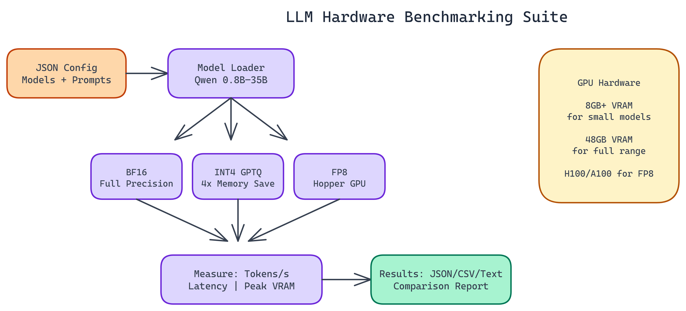

# Benchmarking Qwen 3.5 Models Across Quantization Formats on a Single GPU

[](https://github.com/gauravvij/llm-hardware-benchmarking)



## The Problem

> Everyone has opinions about which quantization format is "best." BF16 preserves quality. INT4 saves memory. FP8 is faster on the right hardware. But these claims are made in the abstract, without reference to specific models, specific hardware, or specific workloads. Choosing the wrong configuration for your GPU is expensive — too much model and you're swapping to CPU or crashing; too little and you're leaving quality on the table.

NEO built a benchmarking suite to produce concrete numbers. Point it at your hardware, configure the models and formats you care about, and get measured throughput, latency, and memory consumption across all combinations.

## What the Suite Measures

Three metrics matter most for production LLM deployments:

**Tokens per second.** How fast does the model generate? This directly determines user-facing latency for interactive applications and throughput for batch processing.

**Latency.** Time-to-first-token and end-to-end response time. Throughput and latency aren't the same thing. A model that generates 100 tokens per second but takes two seconds to produce the first token feels slow in interactive use.

**Memory consumption.** Peak VRAM usage during inference. This determines what fits on your hardware and how much headroom you have for batching.

These three together give you the full picture. You can't optimize all three simultaneously. Knowing the tradeoffs lets you make the right choice for your deployment.

## Six Model Variants, Three Quantization Formats

The suite covers the Qwen 3.5 model family from **0.8B to 35B parameters**. Smaller models fit easily on a single GPU at full precision. Larger models need quantization to fit at all, and the suite makes it easy to see where the quality-memory tradeoff becomes worthwhile.

The three quantization formats each have different requirements:

**BF16.** Full brain float 16 precision. Highest quality. Also highest memory consumption. On a **48GB GPU**, the 35B model sits comfortably in BF16. On an **8GB card**, you're limited to the smaller variants.

**INT4 (GPTQ).** The standard quantization format for consumer and prosumer hardware. GPTQ compresses weights to 4-bit integers with a calibration step that minimizes quantization error. Roughly **4x memory reduction** versus BF16 at a quality cost that varies by model size and task type. Larger models tolerate quantization better. The 7B GPTQ model often produces output indistinguishable from BF16 for most tasks.

**FP8.** 8-bit floating point. Requires Hopper or Ada Lovelace architecture GPUs. On compatible hardware, FP8 offers better throughput than BF16 at similar quality, making it the preferred format for inference at scale on modern NVIDIA hardware.

## Configuration-Driven Design

The entire benchmark is configured via JSON files. You specify which models to test, which prompts to use, and which metrics to collect. Change the config, rerun, and you have new results. No code changes required.

This design matters for how the tool gets used in practice. Benchmarking isn't a one-time activity. GPU hardware changes. New model versions are released. Workload characteristics evolve. A configuration-driven tool can be rerun as those things change without becoming a maintenance burden.

The output goes to JSON, CSV, and human-readable text reports. If you want to compare results over time or build charts from the data, the machine-readable formats are there. If you want to quickly read a summary, the text report works fine.

## Hardware Requirements

The minimum for running the suite at all is 8GB VRAM. At that level, you can benchmark the 0.8B and some 1.5B variants in BF16, or larger models in heavily quantized formats.

48GB VRAM is where you can benchmark the full model range across all formats. An H100 or A100 80GB covers everything comfortably.

For FP8 benchmarking specifically, you need a Hopper (H100) or Ada Lovelace (RTX 40 series) GPU. Older architectures don't support the format.

INT4 GPTQ requires the `auto-gptq` library alongside the standard PyTorch and Transformers stack. The README documents the full dependency list.

## Reading the Results

A few patterns show up consistently across model families when you run this kind of comparison:

At smaller model sizes (sub-3B parameters), quantization hurts more. The model has less redundancy to absorb weight compression errors. BF16 often produces noticeably better output at 0.8B than INT4.

At larger model sizes (7B and above), INT4 GPTQ gets you most of the quality at a fraction of the memory cost. The 7B GPTQ model typically outperforms the 3B BF16 model while using similar VRAM.

FP8 on supported hardware offers the best throughput-to-quality ratio when you have the right GPU. It's the right default for production inference on modern clusters.

Latency improvements don't scale linearly with throughput improvements. A quantized model might generate tokens 30% faster but have similar time-to-first-token compared to BF16, because the first-token latency is dominated by prompt processing rather than generation.

## Why This Matters for Production Deployments

Choosing the wrong model configuration for your hardware is expensive. Too much model for your VRAM and you're either swapping to CPU (slow) or crashing. Too little model and you're leaving quality on the table. The wrong format for your GPU architecture and you're not getting the throughput you paid for.

Benchmarking before you commit to a configuration catches these mistakes before they show up in production. The cost of running the suite is an hour of compute time. The cost of discovering in production that your setup has a 30% throughput gap is much higher.

## GPU Selection and Optimization

## How to Build This with NEO

Open NEO in VS Code or Cursor and describe what you want to build. A good starting prompt for this project:

> "Build a configuration-driven GPU benchmarking suite in Python using PyTorch and Hugging Face Transformers. It should load Qwen model variants (0.8B to 35B) in BF16, GPTQ INT4, and FP8 formats, run configurable warm-up and benchmark iterations, and measure tokens per second, time-to-first-token, and peak VRAM per model-format combination. Results should be written to JSON, CSV, and a ranked human-readable text summary. The entire suite should be driven by a JSON config file with no code changes required to switch models or formats."

<a href="https://heyneo.so/dashboard?section=new-chat&prompt=Build%20a%20configuration-driven%20GPU%20benchmarking%20suite%20in%20Python%20using%20PyTorch%20and%20Hugging%20Face%20Transformers.%20It%20should%20load%20Qwen%20model%20variants%20%280.8B%20to%2035B%29%20in%20BF16%2C%20GPTQ%20INT4%2C%20and%20FP8%20formats%2C%20run%20configurable%20warm-up%20and%20benchmark%20iterations%2C%20and%20measure%20tokens%20per%20second%2C%20time-to-first-token%2C%20and%20peak%20VRAM%20per%20model-format%20combination.%20Results%20should%20be%20written%20to%20JSON%2C%20CSV%2C%20and%20a%20ranked%20human-readable%20text%20summary.%20The%20entire%20suite%20should%20be%20driven%20by%20a%20JSON%20config%20file%20with%20no%20code%20changes%20required%20to%20switch%20models%20or%20formats." style="display:inline-block;background:#1e40af;color:#ffffff;padding:10px 22px;border-radius:6px;text-decoration:none;font-weight:600;font-size:14px;">Build with NEO →</a>

NEO generates the project structure and core implementation. From there you iterate: ask it to add the FP8 format loader with Hopper architecture detection, implement the warm-up and benchmark loop with per-run latency sampling, or build the output formatters that produce ranked tables and CSV. Each follow-up builds on what's already there.

To run the finished project:

```bash
git clone https://github.com/gauravvij/llm-hardware-benchmarking
cd llm-hardware-benchmarking
pip install -r requirements.txt
pip install auto-gptq
python benchmark.py --config config/benchmark_config.json
```

Start with a smaller config targeting just the 7B model in BF16 and GPTQ-INT4 to verify your setup works, then expand to the full model range once you have confirmed the pipeline runs clean on your hardware.

NEO built a GPU benchmarking suite where tokens-per-second, latency, and memory consumption across six Qwen 3.5 variants and three quantization formats give teams the concrete data needed to choose the right configuration for their hardware. See what else NEO ships at [heyneo.so](https://heyneo.so/).

---

## Try NEO in Your IDE

Install the NEO extension to bring AI-powered development directly into your workflow:

- **VS Code**: [NEO in VS Code](https://marketplace.visualstudio.com/items?itemName=NeoResearchInc.heyneo)
- **Cursor**: <a href="cursor://extension/NeoResearchInc.heyneo" style="color:#0066FF;font-weight:bold;">Install NEO for Cursor →</a>

---
