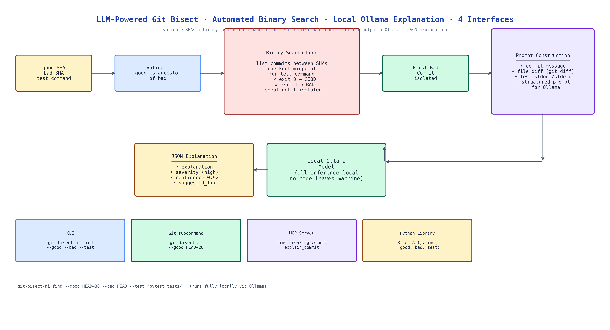

# LLM-Powered Git Bisect: Automated Broken Commit Detection with Local AI Explanation

[](https://github.com/dakshjain-1616/LLM-Powered-Git-Bisect)



## The Problem

> A test fails on main. The last known-good commit was two weeks ago. There are 40 commits between then and now. Running git bisect manually means checking out each commit, running the test, marking good or bad, repeating — six to eight steps for 40 commits, all by hand, all context-switching. And at the end, you have a commit hash and a diff. You still have to figure out why it broke.

NEO built LLM-Powered Git Bisect to automate both steps: the bisection and the explanation. It finds the breaking commit and tells you why it broke in plain English, using only local inference so no code ever leaves your machine.

## Automated Binary Search

The tool validates that the good and bad commits exist and that the good commit is an ancestor of the bad one. Then it runs the binary search:

1. List all commits between the good and bad SHA.
2. Checkout the midpoint commit.
3. Run your test command.
4. Mark the commit good or bad based on exit code.
5. Repeat until the first breaking commit is isolated.

The test command is whatever you pass in — pytest, a shell script, a custom check. The bisector doesn't care about the test framework.

```bash
git-bisect-ai find --good abc1234 --bad HEAD --test "pytest tests/test_auth.py"
```

## LLM Explanation via Local Ollama

Once the breaking commit is found, the tool constructs a detailed prompt from:
- The commit message and metadata
- The full file diff (`git diff parent..breaking`)
- The test output (stdout and stderr)

This goes to a local Ollama model, which returns a structured JSON analysis:

```json
{
  "explanation": "The auth middleware was refactored to use async/await but the session store's read method was not awaited on line 47...",
  "severity": "high",
  "confidence": 0.92,
  "suggested_fix": "Add await before session.read() in middleware.py line 47"
}
```

The explanation renders with color-coded severity and confidence scores. All inference is local — diffs and code never leave the machine.

## Four Interfaces

**CLI tool** — the primary interface:
```bash
git-bisect-ai find --good HEAD~20 --bad HEAD --test "pytest"
git-bisect-ai explain --commit abc1234  # explain a specific commit diff
```

**Git subcommand** — integrates into your git workflow:
```bash
git bisect-ai --good HEAD~20 --bad HEAD --test "make test"
```

**MCP server** — exposes `find_breaking_commit` and `explain_commit` as tools for AI agents. Agents can trigger bisection as part of a debugging workflow.

**Python library** — programmatic integration for custom pipelines:
```python
from git_bisect_ai import BisectAI

bisector = BisectAI(model="llama3.2:8b")
result = bisector.find(good="HEAD~20", bad="HEAD", test="pytest")
print(result.breaking_commit, result.explanation)
```

## How to Build This with NEO

Open NEO in VS Code or Cursor and describe what you want to build. A good starting prompt for this project:

> "Build a tool that automates git bisect and explains the breaking commit using a local Ollama model. Validate that the good commit is an ancestor of the bad one. Binary-search commits by checking them out and running the user's test command, recording pass/fail by exit code. Once the first bad commit is isolated, construct a prompt from commit metadata, file diffs, and test output, and send it to Ollama requesting structured JSON with explanation, severity (critical/high/medium/low), confidence score, and suggested fix. Render results with color-coded severity. Ship as CLI tool, git subcommand, MCP server, and Python library. Run all inference locally — no code leaves the machine."

<a href="https://heyneo.com/dashboard?section=new-chat&prompt=Build%20a%20tool%20that%20automates%20git%20bisect%20and%20explains%20the%20breaking%20commit%20using%20a%20local%20Ollama%20model.%20Binary-search%20commits%20by%20running%20the%20user%27s%20test%20command.%20Once%20the%20first%20bad%20commit%20is%20isolated%2C%20construct%20a%20prompt%20from%20commit%20metadata%2C%20file%20diffs%2C%20and%20test%20output%2C%20and%20send%20to%20Ollama%20requesting%20structured%20JSON%20with%20explanation%2C%20severity%2C%20confidence%2C%20and%20suggested%20fix.%20Ship%20as%20CLI%2C%20git%20subcommand%2C%20MCP%20server%2C%20and%20Python%20library." style="display:inline-block;background:#1e40af;color:#ffffff;padding:10px 22px;border-radius:6px;text-decoration:none;font-weight:600;font-size:14px;">Build with NEO →</a>

NEO scaffolds the bisection engine, the commit validation logic, the Ollama prompt construction, the structured JSON parser, the color-coded renderer, and all four interfaces. From there you iterate — add support for multiple test commands run in sequence, add a `--blame` flag that attributes responsibility to the commit author, or wire the MCP tool into a debugging agent that automatically opens a PR with the suggested fix.

To run the finished project:

```bash
git clone https://github.com/dakshjain-1616/LLM-Powered-Git-Bisect
cd LLM-Powered-Git-Bisect
pip install -r requirements.txt
ollama pull llama3.2:8b  # or any model you prefer

git-bisect-ai find --good HEAD~30 --bad HEAD --test "pytest tests/"
git-bisect-ai explain --commit abc1234  # explain any specific commit
```

NEO built an automated git bisect tool that finds breaking commits via binary search and explains them with local LLM analysis — severity, confidence, and suggested fix, all without sending your code to an API. See what else NEO ships at [heyneo.com](https://heyneo.com/).

---

## Try NEO in Your IDE

Install the NEO extension to bring AI-powered development directly into your workflow:

- **VS Code**: [NEO in VS Code](https://marketplace.visualstudio.com/items?itemName=NeoResearchInc.heyneo)
- **Cursor**: <a href="cursor://extension/NeoResearchInc.heyneo" style="color:#0066FF;font-weight:bold;">Install NEO for Cursor →</a>

---
