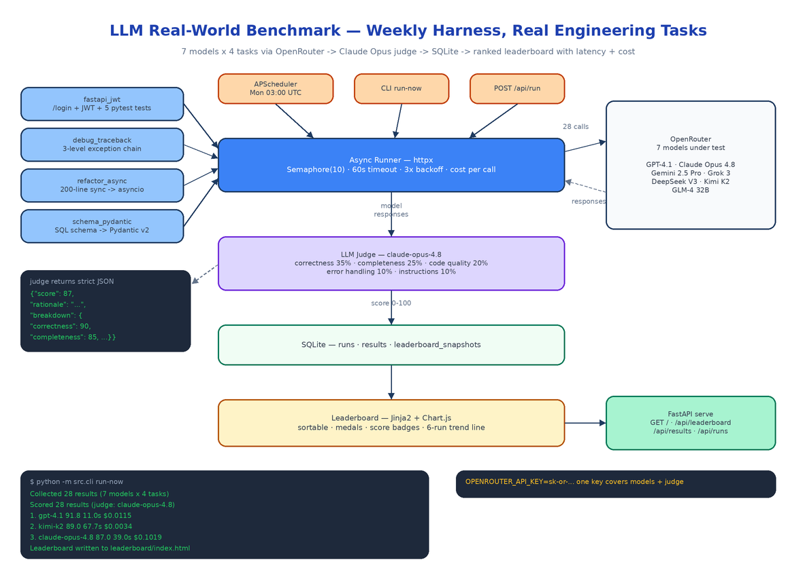

# LLM Real-World Benchmark: A Weekly Harness That Tests Models on Actual Engineering Work

[](https://github.com/dakshjain-1616/LLM-Real-World-Benchmark)



## The Problem

> A new model drops. The launch post says it tops HumanEval. You swap it into your stack, ask it to refactor a 200-line sync class to asyncio, and it deadlocks the event loop on the first try. The public benchmarks measured something — just not the thing you hired the model to do.

Leaderboards built on trivia and toy puzzles tell you almost nothing about whether a model can handle a Tuesday-afternoon ticket: wire up JWT auth with tests, read a gnarly traceback, port legacy code to async, translate a SQL schema into Pydantic v2. LLM Real-World Benchmark is a harness that runs exactly those tasks across 7 frontier models every week, has an independent LLM judge score each response on a strict rubric, and publishes a ranked leaderboard with the two numbers launch posts never include: latency and cost per run.

## Four Tasks That Look Like Real Tickets

Each task in `src/benchmark/tasks.py` is a full prompt with realistic constraints, edge cases, and implicit requirements — the things that separate a working answer from a production-ready one.

**`fastapi_jwt`** — Build a `/login` endpoint that returns a signed JWT and a `/protected` route that validates it, plus at least 5 pytest tests covering happy path, expired token, missing token, and invalid credentials. Models that only generate boilerplate fail the test-coverage requirement.

**`debug_traceback`** — Given a 3-level exception chain (a ValueError raised inside a KeyError handler inside a TypeError handler), identify the root cause, explain Python's exception chaining, and ship fixed code. Plenty of models confidently diagnose the wrong exception in the chain.

**`refactor_async`** — Rewrite a 200-line synchronous class doing file I/O, HTTP calls, and data processing into a proper asyncio implementation with correct `await` placement and retry logic with exponential backoff. The trap is the subtle ordering bugs that appear when everything becomes concurrent.

**`schema_pydantic`** — Convert a 5-table SQL schema with foreign keys, CHECK constraints, and enum columns into Pydantic v2 models with validators and `model_config`. This is a direct probe of whether the model knows v2's breaking changes from v1 (`field_validator`, `Field`, `ConfigDict`) or is still answering from v1 muscle memory.

## The Async Runner

The runner in `src/benchmark/runner.py` fans out every model × task combination concurrently with `httpx.AsyncClient` against the OpenRouter chat completions API. The knobs live in `src/config.py`:

```python
SEMAPHORE_LIMIT: int = 10          # max concurrent calls
REQUEST_TIMEOUT_SECONDS: int = 60  # per-call timeout
MAX_RETRIES: int = 3               # exponential backoff, base 2.0s
JUDGE_MODEL: str = "anthropic/claude-opus-4.8"
```

Every call runs at `temperature 0.3` with a 4096-token cap, and every result records latency in milliseconds, token counts, and finish reason. Cost is computed per call from each model's OpenRouter input/output pricing — the `MODELS` list in config carries `input_price_per_1m` and `output_price_per_1m` for all seven entries (GPT-4.1, Claude Opus 4.8, Gemini 2.5 Pro, Grok 3, DeepSeek V3, Kimi K2, GLM-4 32B). One `OPENROUTER_API_KEY` covers the entire leaderboard, judge included.

## An Independent Judge with a Strict Rubric

Self-grading is a known failure mode, so scoring is a separate pass in `src/benchmark/judge.py`. Claude Opus 4.8 receives each response with the task's weighted criteria and must return bare JSON — no prose, no code fences:

```json
{"score": 87, "rationale": "...", "breakdown": {"correctness": 90,
 "completeness": 85, "code_quality": 88, "error_handling": 80,
 "instructions": 90}}
```

The weights: **correctness 35%, completeness 25%, code quality 20%, error handling 10%, follows instructions 10%**. The judge is prompted to be strict — partial credit exists, but a response that misses the core requirement scores below 50 no matter how clean the code looks. Because judges occasionally wrap output in markdown anyway, `extract_score` tries `json.loads` first and falls back to regex extraction, so a chatty judge does not nuke a run.

## SQLite In, Leaderboard Out

Results land in three SQLite tables — `runs`, `results`, `leaderboard_snapshots` — via `src/db/store.py`. After scoring, `src/leaderboard/builder.py` aggregates per-model averages and renders `leaderboard/index.html` through a Jinja2 template: sortable columns, gold/silver/bronze for the top three, color-coded score badges (green >90, blue >75, yellow >50, red <50), and a Chart.js trend line tracking each model across the last 6 weekly runs. The snapshots table is what makes the trend line possible — every run appends a snapshot instead of overwriting history.

The pipeline fires three ways: APScheduler cron every Monday at 03:00 UTC when the server is up, `python -m src.cli run-now` from a terminal, or `POST /api/run` from anything that can speak HTTP.

## What a Real Run Found

From the live run on 2026-06-09 (4 tasks × 5 models):

| Rank | Model | Score | Avg Latency | Cost/run |
|------|-------|-------|-------------|----------|
| 1 | openai/gpt-4.1 | 91.8 / 100 | 11.0s | $0.0115 |
| 2 | moonshotai/kimi-k2 | 89.0 / 100 | 67.7s | $0.0034 |
| 3 | anthropic/claude-opus-4.8 | 87.0 / 100 | 39.0s | $0.1019 |
| 4 | deepseek/deepseek-chat-v3-0324 | 80.8 / 100 | 45.9s | $0.0012 |
| 5 | google/gemini-2.5-pro | 50.0 / 100 | 38.4s | $0.0415 |

The spread is the point. Kimi K2 lands within 3 points of GPT-4.1 at a third of a cent per run — but takes six times longer. DeepSeek delivers 80+ for a tenth of a cent. And a frontier model can score 50 on tasks another vendor's model aces. None of that is visible on a synthetic leaderboard; all of it matters when you are picking a model for a real workload.

## CLI and API

```bash
python -m src.cli run-now                  # full pipeline: run → judge → leaderboard
python -m src.cli run-now --skip-judge     # collect responses only
python -m src.cli status                   # latest run, per-model result counts
python -m src.cli serve --port 8000        # FastAPI server + scheduler
```

The FastAPI app serves the leaderboard at `/` and exposes `GET /api/runs`, `GET /api/results?run_id=X`, and `GET /api/leaderboard` for downstream tooling. The repo ships 36 tests covering the runner's semaphore/retry/timeout behavior, the judge's JSON extraction and regex fallback, leaderboard aggregation, and every endpoint — `pytest tests/ -v`.

## How to Build This with NEO

Open NEO in VS Code or Cursor and describe what you want to build. A good starting prompt for this project:

> "Build a Python benchmark harness called LLM Real-World Benchmark that tests LLMs on real engineering tasks. Define 4 tasks with full prompts and per-task weighted scoring criteria: a FastAPI JWT auth endpoint with 5+ pytest tests, debugging a 3-level chained Python traceback, refactoring a 200-line sync class to asyncio with retry/backoff, and converting a 5-table SQL schema to Pydantic v2 models. Build an async runner with httpx that fans out every model × task combination across 7 models via OpenRouter, with Semaphore(10) concurrency, 60s timeouts, 3x exponential backoff, and per-call cost tracking from token pricing. Score each response 0–100 with Claude Opus as an independent judge (correctness 35%, completeness 25%, code quality 20%, error handling 10%, instructions 10%), parsing strict JSON with a regex fallback. Persist runs, results, and leaderboard snapshots in SQLite. Render a sortable Jinja2 + Chart.js leaderboard with medals, score badges, and a 6-run trend line. Wire APScheduler for weekly Monday 03:00 UTC runs, a CLI with run-now/status/serve commands, and FastAPI endpoints for runs, results, leaderboard, and manual triggers. Cover it with pytest."

<a href="https://heyneo.com/dashboard?section=new-chat&prompt=Build%20a%20Python%20benchmark%20harness%20that%20tests%20LLMs%20on%204%20real%20engineering%20tasks%20(FastAPI%20JWT%20auth%2C%20traceback%20debugging%2C%20async%20refactor%2C%20Pydantic%20v2%20schemas)%20across%207%20models%20via%20OpenRouter%20with%20an%20async%20httpx%20runner%20(Semaphore(10)%2C%2060s%20timeouts%2C%203x%20backoff%2C%20cost%20tracking)%2C%20score%20responses%200-100%20with%20a%20Claude%20Opus%20judge%20on%20weighted%20criteria%2C%20store%20results%20in%20SQLite%2C%20render%20a%20Jinja2%20%2B%20Chart.js%20leaderboard%2C%20schedule%20weekly%20runs%20with%20APScheduler%2C%20and%20expose%20a%20CLI%20plus%20FastAPI%20endpoints." style="display:inline-block;background:#1e40af;color:#ffffff;padding:10px 22px;border-radius:6px;text-decoration:none;font-weight:600;font-size:14px;">Build with NEO →</a>

NEO scaffolds the task definitions, the async runner, the judge prompt and score extraction, the SQLite layer, the leaderboard template, and the scheduler. From there you swap in your own tasks — the ones that look like your team's actual tickets — add models as OpenRouter ships them, and let the Monday cron tell you whether this week's hot release actually earns a spot in your stack.

NEO built a benchmark that measures what you actually pay for: working code, wall-clock latency, and dollars per run. See what else NEO ships at [heyneo.com](https://heyneo.com/).

---

## Try NEO in Your IDE

Install the NEO extension to bring AI-powered development directly into your workflow:

- **VS Code**: [NEO in VS Code](https://marketplace.visualstudio.com/items?itemName=NeoResearchInc.heyneo)
- **Cursor**: <a href="cursor://extension/NeoResearchInc.heyneo" style="color:#0066FF;font-weight:bold;">Install NEO for Cursor →</a>

---
