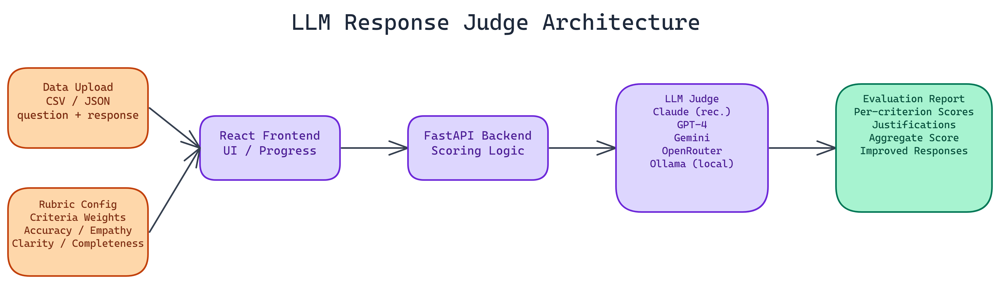

# LLM Response Judge: Automated Quality Evaluation with Customizable Rubrics

[](https://github.com/Dakshjain1604/LLM-response-Judge)



## The Problem

> Manual evaluation of LLM responses does not scale. You might review 50 responses carefully and build a good intuition for quality. But when you have 500, or 5,000, or you want to run evaluation continuously as part of a deployment pipeline, manual review breaks down. The standard alternatives — ROUGE or BLEU scores — measure surface overlap and miss semantic quality entirely, while human annotation pipelines are slow and expensive.

NEO built a better option: an automated evaluation system that uses an LLM as a judge, with customizable weighted rubrics, per-criterion scoring, and justifications you can actually inspect.

## How the Evaluation System Works

The core idea is to evaluate responses against explicit quality criteria rather than comparing them to reference answers. You define what good looks like for your specific use case, weight the criteria by importance, and the judge scores each response against that rubric.

For customer support responses, you might care about accuracy, empathy, clarity, and completeness. For technical documentation, you might weight precision and completeness more heavily than tone. The rubric is yours to configure.

Each criterion gets an individual score with a written justification explaining why that score was assigned. This is the part that makes the system actionable. An aggregate score of 6.2 out of 10 does not tell you what to fix. A breakdown showing that accuracy scored 8 and empathy scored 4, with a note explaining what was missing, gives you a concrete direction.

## The Architecture

The stack is a React frontend with a FastAPI backend. The frontend handles file uploads, rubric configuration, and report display. The backend handles LLM calls, scoring logic, and result formatting.

NEO built it with Docker from the start, so deployment is straightforward in containerized environments.

### Model Provider Flexibility

The system supports **Anthropic Claude** (recommended for evaluation tasks due to its instruction-following reliability), **OpenAI GPT-4**, **Google Gemini**, **OpenRouter** for access to a wider model selection, and local **Ollama** deployments for teams that need fully on-premises evaluation.

Provider selection happens in the interface. You can switch models mid-experiment to compare how different judges score the same responses, which is useful for understanding judge reliability.

### Input Format

The application accepts CSV and JSON files. Required fields are `question` and `response`. An optional `category` field lets you tag responses by type and filter analysis by category, which is useful when your dataset spans multiple task types with different quality requirements.

## Getting Started

Demo mode starts in **under a minute** without any API keys. It uses mock scores to demonstrate the interface and report format. Full setup with real evaluation takes about **three minutes** once you have API credentials.

The interface walks you through uploading your data, configuring the rubric weights, selecting a model, and running the evaluation. Progress tracking is real-time. A batch of **100 responses** processes in roughly **three minutes** depending on the provider and rate limits.

## Security Considerations

API keys are stored client-side only. Nothing is persisted on the server. CORS protection, rate limiting, and input validation are in place across all backend endpoints.

For teams with strict data governance requirements, the Ollama integration means you can run the entire system on your own infrastructure with no data leaving your environment.

## AI-Powered Response Improvement

Beyond scoring, the system can generate improved versions of low-scoring responses. This is not a generic rewrite. It uses the rubric scores and per-criterion justifications as input, so the improvement targets the specific dimensions that scored poorly.

For teams running continuous evaluation, this creates a feedback loop. Evaluate a batch of responses, identify the worst performers, generate improved versions, and use those to refine your prompts or fine-tuning data.

## Use Cases

Customer support quality assurance is the primary use case NEO designed around. You have agents and responses, and you want to know if the quality meets your standards across the full distribution. This handles that at scale.

It also fits well into model evaluation workflows. Before deploying a new model or fine-tune, run your evaluation dataset through the judge and compare the score distributions against your current production model.

Content moderation and compliance review are adjacent uses. Configure the rubric to evaluate for specific compliance criteria and you have an automated screening layer.

---

## How to Build This with NEO

Open NEO in VS Code or Cursor and describe what you want to build. A good starting prompt for this project:

> "Build a full-stack LLM response evaluation app with a React frontend and FastAPI backend, deployable via Docker. The app should accept CSV or JSON uploads with question and response columns, let users configure a weighted rubric of custom criteria, then use a configurable judge model (Anthropic Claude, OpenAI, Gemini, OpenRouter, or local Ollama) to score each response per criterion with a written justification. Output a report showing aggregate score, per-criterion breakdown, and written justifications per response, with a demo mode using mock scores that works without any API key."

<a href="https://heyneo.com/dashboard?section=new-chat&prompt=Build%20a%20full-stack%20LLM%20response%20evaluation%20app%20with%20a%20React%20frontend%20and%20FastAPI%20backend%2C%20deployable%20via%20Docker.%20The%20app%20should%20accept%20CSV%20or%20JSON%20uploads%20with%20question%20and%20response%20columns%2C%20let%20users%20configure%20a%20weighted%20rubric%20of%20custom%20criteria%2C%20then%20use%20a%20configurable%20judge%20model%20%28Anthropic%20Claude%2C%20OpenAI%2C%20Gemini%2C%20OpenRouter%2C%20or%20local%20Ollama%29%20to%20score%20each%20response%20per%20criterion%20with%20a%20written%20justification.%20Output%20a%20report%20showing%20aggregate%20score%2C%20per-criterion%20breakdown%2C%20and%20written%20justifications%20per%20response%2C%20with%20a%20demo%20mode%20using%20mock%20scores%20that%20works%20without%20any%20API%20key." style="display:inline-block;background:#1e40af;color:#ffffff;padding:10px 22px;border-radius:6px;text-decoration:none;font-weight:600;font-size:14px;">Build with NEO →</a>

NEO generates the project structure and core implementation. From there you iterate: ask it to add the per-criterion justification prompt engineering so the judge explains each score, implement the response improvement generator that targets low-scoring dimensions specifically, or wire in the Ollama integration for on-premises evaluation with no data leaving the environment. Each follow-up builds on what's already there.

To run the finished project:

```bash
git clone https://github.com/Dakshjain1604/LLM-response-Judge
cd LLM-response-Judge
docker-compose up --build
```

Open `http://localhost:3000`. The app starts in demo mode with mock scores so you can explore the report format immediately. Add your API key in the settings panel when ready to run real evaluations.

NEO built an LLM response judge where customizable weighted rubrics and per-criterion justifications make automated quality evaluation actionable, not just a score. See what else NEO ships at [heyneo.com](https://heyneo.com/).

---

## Try NEO in Your IDE

Install the NEO extension to bring AI-powered development directly into your workflow:

- **VS Code**: [NEO in VS Code](https://marketplace.visualstudio.com/items?itemName=NeoResearchInc.heyneo)
- **Cursor**: <a href="cursor://extension/NeoResearchInc.heyneo" style="color:#0066FF;font-weight:bold;">Install NEO for Cursor →</a>

---
