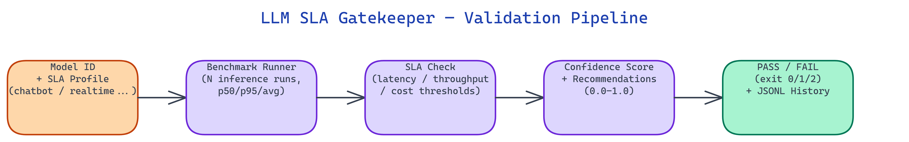

# LLM SLA Gatekeeper: Automated Deployment Gating for Language Models

[](https://github.com/dakshjain-1616/llm-sla-gatekeeper)



## The Problem

> Teams swap LLM versions, adjust hardware, or change quantization levels and have no automated check to confirm the new configuration meets latency and throughput requirements before traffic hits it. Manual spot-checks miss edge cases and are not reproducible.

NEO built LLM SLA Gatekeeper to run repeatable benchmarks against configurable SLA targets and return a deterministic PASS or FAIL with structured output and CI/CD-compatible exit codes.

## The Validation Pipeline

**LLM SLA Gatekeeper** runs a straightforward four-step process:

1. **Input** — provide a Hugging Face model ID or local path plus an SLA config with `max_latency_ms`, `min_throughput_tokens_per_sec`, and `max_cost_per_token`.
2. **Benchmark** — run `N` inference passes (default 5), collect per-token latency samples, compute p50, p95, average latency, and throughput.
3. **SLA Check** — compare results against thresholds: average latency, p95 latency (using a configurable multiplier), and throughput.
4. **Verdict** — emit PASS (exit 0) or FAIL (exit 1), with a confidence score, recommendations, and results appended to a JSONL history file.

The exit codes integrate directly with CI/CD: `0` is PASS, `1` is FAIL, `2` is ERROR.

## Built-in SLA Profiles

Five named profiles cover the common LLM deployment scenarios:

| Profile | Max Latency | Min Throughput | Use Case |
|:--------|------------:|---------------:|:---------|
| `chatbot` | 150 ms | 10 tok/s | Interactive chat, customer support |
| `realtime` | 50 ms | 50 tok/s | Streaming, voice assistants |
| `batch` | 2000 ms | 1 tok/s | Document processing, summarization |
| `edge` | 500 ms | 2 tok/s | IoT, on-device inference |
| `dev` | 5000 ms | — | CI/CD dry runs, local development |

Every threshold is overridable via environment variable, so you can tune `SLA_PROFILE_CHATBOT_LATENCY_MS` without touching the code.

## Confidence Scoring

Every result includes a `confidence_score` between 0.0 and 1.0 that reflects how trustworthy the verdict is:

```
run_score   = min(n / 20.0, 1.0)
var_score   = max(0.0, 1.0 - (std / mean) × 2)
mode_factor = 1.0 (real hardware) | 0.75 (simulation)
confidence  = min(1.0, (run_score × 0.5 + var_score × 0.5) × mode_factor)
```

Simulation mode caps confidence at 0.75 because synthetic latency figures are estimates. Increase `--runs` to raise confidence on real hardware.

## Simulation Mode

When no GPU is available, simulation mode generates synthetic benchmark data using a linear formula:

```
latency_ms = 5 × model_size_in_B + 15
```

A 7B model yields 50 ms simulated latency. A 1.7B model yields 23.5 ms. This makes the tool practical for CI/CD pipelines on CPU-only runners.

## How to Build This with NEO

Open NEO in VS Code or Cursor and describe what you want to build. A good starting prompt for this project:

> "Build a Python LLM deployment gating tool that benchmarks a given Hugging Face model ID against configurable SLA profiles (chatbot, realtime, batch, edge, dev). The tool should run N inference passes, compute p50 and p95 latency plus throughput, compare results against thresholds, and return a PASS or FAIL verdict with a confidence score, exit code 0 or 1 for CI/CD integration, and a JSONL history file that accumulates results across runs. Include a simulation mode that uses a linear formula based on model size when no GPU is available."

<a href="https://heyneo.so/dashboard?section=new-chat&prompt=Build%20a%20Python%20LLM%20deployment%20gating%20tool%20that%20benchmarks%20a%20given%20Hugging%20Face%20model%20ID%20against%20configurable%20SLA%20profiles%20%28chatbot%2C%20realtime%2C%20batch%2C%20edge%2C%20dev%29.%20The%20tool%20should%20run%20N%20inference%20passes%2C%20compute%20p50%20and%20p95%20latency%20plus%20throughput%2C%20compare%20results%20against%20thresholds%2C%20and%20return%20a%20PASS%20or%20FAIL%20verdict%20with%20a%20confidence%20score%2C%20exit%20code%200%20or%201%20for%20CI%2FCD%20integration%2C%20and%20a%20JSONL%20history%20file%20that%20accumulates%20results%20across%20runs.%20Include%20a%20simulation%20mode%20that%20uses%20a%20linear%20formula%20based%20on%20model%20size%20when%20no%20GPU%20is%20available." style="display:inline-block;background:#1e40af;color:#ffffff;padding:10px 22px;border-radius:6px;text-decoration:none;font-weight:600;font-size:14px;">Build with NEO →</a>

NEO generates the project structure and core implementation. From there you iterate: ask it to implement the confidence scoring formula that combines run count and variance, add the five named SLA profiles with environment variable overrides for each threshold, or build the Gradio UI with Validate, Compare, History, and About tabs. Each follow-up builds on what's already there.

To run the finished project:

```bash
git clone https://github.com/dakshjain-1616/llm-sla-gatekeeper
cd llm-sla-gatekeeper
pip install -r requirements.txt
python run_validation.py --model=Qwen/Qwen3-8B --profile=chatbot --simulate
```

Add the GitHub Actions snippet from the README to your CI pipeline so that exit code 1 automatically blocks merges when a model swap fails the latency gate.

NEO built a deployment gate that gives LLM teams a repeatable, CI-compatible answer to the question "is this model fast enough to ship." See what else NEO ships at [heyneo.so](https://heyneo.so/).

---

## Try NEO in Your IDE

Install the NEO extension to bring AI-powered development directly into your workflow:

- **VS Code**: [NEO in VS Code](https://marketplace.visualstudio.com/items?itemName=NeoResearchInc.heyneo)
- **Cursor**: <a href="cursor://extension/NeoResearchInc.heyneo" style="color:#0066FF;font-weight:bold;">Install NEO for Cursor →</a>

---
