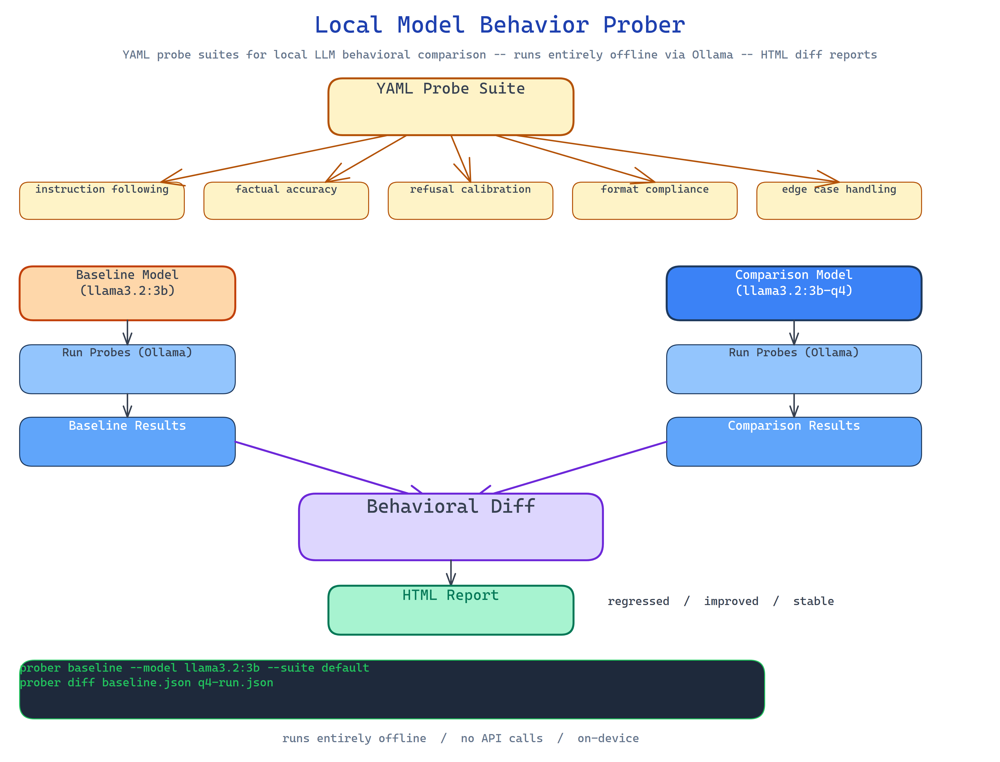

# Local Model Behavior Prober: Systematic Behavioral Testing for Local LLMs

[](https://github.com/dakshjain-1616/Local-Model-Behavior-Prober)



## The Problem

> You download a new model, run a few prompts, and it feels good. You swap the quantization level, run the same prompts, and it still feels good. But "feels good" is not a regression test. When you need to pick between four local model variants for a production use case, different sizes, different quantization levels, different fine-tunes, you need a repeatable, structured behavioral comparison, not a vibe check.

NEO built Local Model Behavior Prober to give local model evaluation the same rigor you'd apply to software testing: structured probe suites, captured baselines, and diff-style regression reports you can run entirely on-device.

## Structured Probe Suites

The prober runs models through categorized probe sets that test specific behavioral dimensions:

- **Instruction following**: does the model do what it's told, in the format requested?
- **Factual accuracy**: does it get basic facts right on your domain?
- **Refusal calibration**: does it refuse the right things and not over-refuse?
- **Format compliance**: JSON output, markdown, structured lists: does the format hold?
- **Edge case handling**: empty inputs, ambiguous requests, very long contexts.

Each probe is a YAML-defined prompt with expected properties (not exact outputs, properties). The scorer checks properties: does the output contain valid JSON? Does it mention the requested format? Did the model follow the instruction?

## Baseline Capture and Regression Diff

The first run establishes a behavioral baseline for a given model. Subsequent runs produce a diff, which probes regressed, which improved, which are stable. This is the workflow for:

- Comparing a 4-bit quantization against the full-precision baseline
- Checking whether a fine-tune improved the target domain without breaking general capability
- Validating that a model update from the same family preserved expected behaviors

```bash
prober baseline --model llama3.2:3b --suite default
prober run --model llama3.2:3b-q4 --suite default --compare baseline
prober diff baseline.json q4-run.json
```

## Python Library Integration

The prober is a pip-installable Python package, usable in test suites and CI pipelines:

```python
from local_model_prober import Prober, Suite

prober = Prober(model="llama3.2:3b", backend="ollama")
suite = Suite.load("default")
results = prober.run(suite)
print(results.summary())
```

This makes behavioral testing a first-class step in your model evaluation pipeline, not a manual step you do when something breaks.

## How to Build This with NEO

Open NEO in VS Code or Cursor and describe what you want to build. A good starting prompt for this project:

> "Build a Python package for probing local LLM behavior. Define probe suites in YAML with categorized prompts for instruction following, factual accuracy, refusal calibration, format compliance, and edge case handling. Score responses against behavioral properties (not exact outputs). Capture baselines per model and produce diff-style regression reports comparing two runs. Support Ollama as the backend. Package as pip-installable with both a CLI and a Python library interface. Support custom probe suites via YAML. Run entirely offline with no external API calls."

<a href="https://heyneo.com/dashboard?section=new-chat&prompt=Build%20a%20Python%20package%20for%20probing%20local%20LLM%20behavior.%20Define%20probe%20suites%20in%20YAML%20with%20categorized%20prompts%20for%20instruction%20following%2C%20factual%20accuracy%2C%20refusal%20calibration%2C%20format%20compliance%2C%20and%20edge%20cases.%20Score%20responses%20against%20behavioral%20properties.%20Capture%20baselines%20and%20produce%20diff-style%20regression%20reports.%20Support%20Ollama%20as%20backend.%20Package%20as%20pip-installable%20with%20CLI%20and%20Python%20library%20interface.%20Run%20entirely%20offline." style="display:inline-block;background:#1e40af;color:#ffffff;padding:10px 22px;border-radius:6px;text-decoration:none;font-weight:600;font-size:14px;">Build with NEO →</a>

NEO scaffolds the YAML probe format, the property-based scorer, the baseline capture and diff logic, the Ollama backend integration, and the pip package structure. From there you iterate: add a new probe category for your specific use case, wire the prober into GitHub Actions so every model PR gets a behavioral regression check, or extend the scorer to use an LLM judge for harder-to-specify properties.

To run the finished project:

```bash
git clone https://github.com/dakshjain-1616/Local-Model-Behavior-Prober
cd Local-Model-Behavior-Prober
pip install -e .

prober baseline --model llama3.2:3b --suite default
prober run --model llama3.2:3b-q4 --suite default --compare baseline
prober diff baseline.json latest-run.json
```

NEO built a structured behavioral testing framework for local LLMs with YAML probe suites, property-based scoring, baseline capture, and regression diffs, all running on-device without API calls. See what else NEO ships at [heyneo.com](https://heyneo.com/).

---

## Try NEO in Your IDE

Install the NEO extension to bring AI-powered development directly into your workflow:

- **VS Code**: [NEO in VS Code](https://marketplace.visualstudio.com/items?itemName=NeoResearchInc.heyneo)
- **Cursor**: <a href="cursor://extension/NeoResearchInc.heyneo" style="color:#0066FF;font-weight:bold;">Install NEO for Cursor →</a>

---
