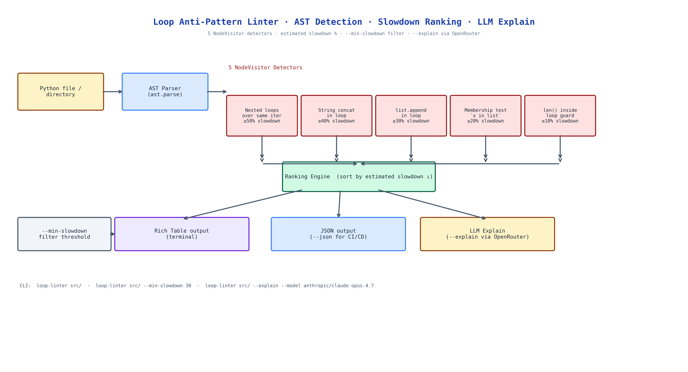

# Loop Anti-Pattern Linter: Quantified Performance Analysis for Python Loops

[](https://github.com/dakshjain-1616/Loop-Anti-Pattern-Linter)



## The Problem

> Every Python codebase has loops that are quietly slow. The developer who wrote them knew it, or didn't. The reviewer didn't catch it. The profiler would catch it, but you only run the profiler when something is already on fire. And when you do get a list of slow loops, the list has no priority order — "fix all of these" is not a plan. You need to know which ones to fix first and by how much.

NEO built Loop Anti-Pattern Linter to turn loop performance debt from a vague concern into a ranked list of concrete fixes, each with an estimated slowdown percentage derived from algorithmic analysis rather than a gut feeling.

## Five Anti-Patterns, Five Detectors

The linter uses AST-based `NodeVisitor` subclasses — one per pattern. Each detector is deterministic and produces a slowdown estimate you can sort on:

- **Nested loops over identical iterables** — O(n²) where a set-based lookup would be O(n). Estimated slowdown: ≥50%.
- **String concatenation in loops** — `s += x` inside a loop creates O(n²) string allocations. Estimated slowdown: ≥40%.
- **`list.append` inside a loop with a known-size output** — missing a list comprehension or pre-allocation. Estimated slowdown: ≥30%.
- **Inefficient membership tests** — `x in list` inside a loop when a `set` would be O(1). Estimated slowdown: ≥20%.
- **`len()` called inside a loop guard** — the length doesn't change; the call does. Estimated slowdown: ≥10%.

Each finding includes the file, line number, pattern name, estimated slowdown, and a one-line suggestion.

## Priority-Ranked Output

The tool sorts findings by estimated slowdown, descending. When you run it across a large codebase the top three findings are almost always the ones worth spending time on. The rest are optional. This is the difference between a linter and a guide — the guide tells you what matters most.

Output is a rich table by default, JSON if you need CI/CD integration:

```bash
loop-linter path/to/project/          # rich table, sorted by impact
loop-linter path/to/file.py --json    # JSON for CI
loop-linter . --min-slowdown 30       # only findings ≥30% slowdown
```

## AI Explanations via `--explain`

The `--explain` flag enriches each finding with a natural-language explanation generated via OpenRouter. It covers why the pattern is slow, what the idiomatic fix looks like, and an estimate of the post-fix complexity. The flag is optional — the linter works and produces actionable output without it. The LLM layer adds context for developers who want to understand the root cause, not just apply a fix blindly.

```bash
loop-linter src/ --explain --model anthropic/claude-opus-4.7
```

## How to Build This with NEO

Open NEO in VS Code or Cursor and describe what you want to build. A good starting prompt for this project:

> "Build a Python static analyzer that uses AST NodeVisitor subclasses to detect five loop anti-patterns: nested loops over identical iterables, string concatenation in loops, list.append in loops with known output size, inefficient membership tests using list instead of set, and len() called inside a loop guard. Assign each pattern an estimated slowdown percentage (50%, 40%, 30%, 20%, 10%) derived from algorithmic complexity. Sort findings by estimated slowdown descending. Output a rich table by default and JSON with --json. Add --min-slowdown to filter by threshold. Add --explain to enrich findings with natural-language explanations via OpenRouter, selecting the model with --model. Support scanning single files or directories recursively."

<a href="https://heyneo.com/dashboard?section=new-chat&prompt=Build%20a%20Python%20static%20analyzer%20that%20uses%20AST%20NodeVisitor%20subclasses%20to%20detect%20five%20loop%20anti-patterns%3A%20nested%20loops%20over%20identical%20iterables%2C%20string%20concatenation%20in%20loops%2C%20list.append%20in%20loops%2C%20inefficient%20membership%20tests%2C%20and%20len()%20called%20inside%20a%20loop%20guard.%20Assign%20each%20pattern%20an%20estimated%20slowdown%20percentage%20derived%20from%20algorithmic%20complexity.%20Sort%20findings%20by%20estimated%20slowdown%20descending.%20Output%20rich%20table%20by%20default%20and%20JSON%20with%20--json.%20Add%20--min-slowdown%20filter%20and%20--explain%20flag%20for%20LLM%20explanations%20via%20OpenRouter." style="display:inline-block;background:#1e40af;color:#ffffff;padding:10px 22px;border-radius:6px;text-decoration:none;font-weight:600;font-size:14px;">Build with NEO →</a>

NEO scaffolds the five AST detectors, the ranking logic, the rich table renderer, and the OpenRouter explain integration. From there you iterate — add a sixth detector for your codebase's specific patterns, pipe the JSON output into a pre-commit hook, or connect the findings to your team's issue tracker automatically.

To run the finished project:

```bash
git clone https://github.com/dakshjain-1616/Loop-Anti-Pattern-Linter
cd Loop-Anti-Pattern-Linter
pip install -r requirements.txt

loop-linter src/                         # scan a directory
loop-linter src/ --min-slowdown 30       # filter by impact
loop-linter src/ --explain               # add LLM explanations
loop-linter src/ --json > findings.json  # CI/CD integration
```

NEO built a priority-ranked loop performance linter that turns vague slowness into a sorted list of concrete fixes with estimated impact percentages. See what else NEO ships at [heyneo.com](https://heyneo.com/).

---

## Try NEO in Your IDE

Install the NEO extension to bring AI-powered development directly into your workflow:

- **VS Code**: [NEO in VS Code](https://marketplace.visualstudio.com/items?itemName=NeoResearchInc.heyneo)
- **Cursor**: <a href="cursor://extension/NeoResearchInc.heyneo" style="color:#0066FF;font-weight:bold;">Install NEO for Cursor →</a>

---
