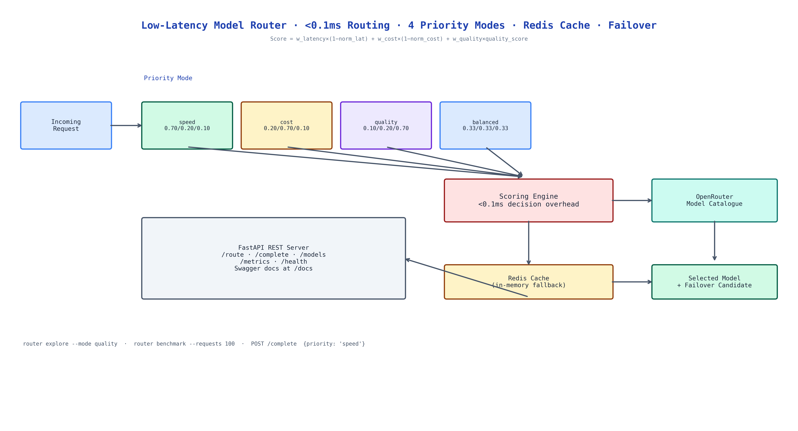

# Low-Latency Model Router: Sub-Millisecond LLM Selection Across OpenRouter

[](https://github.com/dakshjain-1616/low-Latency-Model-Router)



## The Problem

> You hardcode a model. It works. Then the model gets slow, or expensive, or goes offline, and your application breaks. Or you need the cheapest model for bulk jobs and the best model for user-facing queries, but that's two different API calls to manage. Or you want to experiment with newer models without redeploying. Hardcoded model selection is a decision that keeps costing you.

NEO built a router that makes model selection a function of your current priorities, resolved at request time in under 0.1ms, with automatic failover and caching built in.

## The Scoring Formula

Every model in OpenRouter's catalogue gets a score per request:

```
Score = w_latency × (1 - normalized_latency)
      + w_cost    × (1 - normalized_cost)
      + w_quality × quality_score
```

The weights shift based on your priority mode:

| Mode | Latency weight | Cost weight | Quality weight |
|------|---------------|-------------|----------------|
| `speed` | 0.70 | 0.20 | 0.10 |
| `cost` | 0.20 | 0.70 | 0.10 |
| `quality` | 0.10 | 0.20 | 0.70 |
| `balanced` | 0.33 | 0.33 | 0.33 |

The router selects the highest-scoring available model and routes to it. If that model fails, it retries with the next candidate automatically — no retry logic in your application code.

## Redis Caching with In-Memory Fallback

Repeated requests with the same routing decision don't re-score the model catalogue. Redis caches routing decisions keyed by priority mode and request profile. If Redis is unavailable the router falls back to in-memory caching transparently — the application never sees a cache miss as an error.

Cache metrics (hit rate, decision latency, usage by model) are exposed on `/metrics`.

## FastAPI REST Server

The router runs as a FastAPI service with auto-generated Swagger docs at `/docs`:

```bash
POST /route          # get the optimal model for your priority
POST /complete       # route + complete in one call
GET  /models         # current catalogue with scores
GET  /metrics        # latency percentiles, cache hits, usage by model
GET  /health         # readiness probe
```

The CLI tools let you explore the catalogue and benchmark routing decisions without writing code:

```bash
router explore --mode speed     # see ranked models for speed priority
router benchmark --requests 100 # measure routing overhead at scale
```

## How to Build This with NEO

Open NEO in VS Code or Cursor and describe what you want to build. A good starting prompt for this project:

> "Build an LLM router that selects the optimal model from OpenRouter's catalogue for each request in under 0.1ms. Score each model using weighted latency, cost, and quality dimensions. Support four priority modes: speed (latency 0.70, cost 0.20, quality 0.10), cost (0.20, 0.70, 0.10), quality (0.10, 0.20, 0.70), and balanced (equal weights). Add automatic failover to the next-best model when the primary fails. Cache routing decisions in Redis with in-memory fallback. Expose the router as a FastAPI service with /route, /complete, /models, /metrics, and /health endpoints. Include a CLI for catalogue exploration and benchmarking."

<a href="https://heyneo.com/dashboard?section=new-chat&prompt=Build%20an%20LLM%20router%20that%20selects%20the%20optimal%20model%20from%20OpenRouter%27s%20catalogue%20for%20each%20request%20in%20under%200.1ms.%20Score%20each%20model%20using%20weighted%20latency%2C%20cost%2C%20and%20quality%20dimensions.%20Support%20four%20priority%20modes%3A%20speed%2C%20cost%2C%20quality%2C%20and%20balanced.%20Add%20automatic%20failover.%20Cache%20routing%20decisions%20in%20Redis%20with%20in-memory%20fallback.%20Expose%20as%20FastAPI%20service%20with%20route%2C%20complete%2C%20models%2C%20metrics%2C%20and%20health%20endpoints." style="display:inline-block;background:#1e40af;color:#ffffff;padding:10px 22px;border-radius:6px;text-decoration:none;font-weight:600;font-size:14px;">Build with NEO →</a>

NEO scaffolds the scoring engine, the priority mode configurations, the Redis caching layer, the failover logic, and the FastAPI server. From there you iterate — add a fifth priority mode tuned for your workload's specific cost/quality tradeoff, plug in real p50/p99 latency data from your own request history, or add a budget cap that stops routing to expensive models once you hit a daily spend limit.

To run the finished project:

```bash
git clone https://github.com/dakshjain-1616/low-Latency-Model-Router
cd low-Latency-Model-Router
pip install -r requirements.txt
echo "OPENROUTER_API_KEY=sk-or-v1-..." > .env

python server.py                      # start FastAPI server
router explore --mode quality         # browse models by quality score
router benchmark --requests 100       # measure routing overhead
```

NEO built a sub-millisecond model router with weighted scoring, four priority modes, automatic failover, and Redis caching — so you never hardcode a model again. See what else NEO ships at [heyneo.com](https://heyneo.com/).

---

## Try NEO in Your IDE

Install the NEO extension to bring AI-powered development directly into your workflow:

- **VS Code**: [NEO in VS Code](https://marketplace.visualstudio.com/items?itemName=NeoResearchInc.heyneo)
- **Cursor**: <a href="cursor://extension/NeoResearchInc.heyneo" style="color:#0066FF;font-weight:bold;">Install NEO for Cursor →</a>

---
