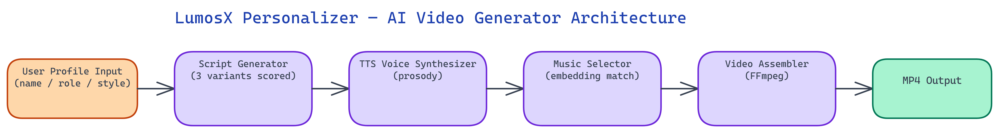

# LumosX Personalizer: AI-Generated Intro Videos at Scale

[](https://github.com/dakshjain-1616/lumosx-personalizer)



## The Problem

> Every professional wants a polished personal brand video, but producing one requires a videographer, a scriptwriter, a voice actor, and a music licensor — a process that costs thousands of dollars and takes weeks. For platforms that need to generate profile videos at scale — recruiting sites, professional networks, course creators — manual production is simply not viable. The gap between "no video" and "a good video" has historically required human creative labor that doesn't scale.

NEO built LumosX Personalizer, an AI pipeline that takes user data — name, role, achievements, style preferences — and produces a 30-60 second personalized intro video fully automatically. The pipeline generates the script, narrates it with voice synthesis, selects and mixes background music, and assembles the final video without any human creative involvement.

## Pipeline Overview

LumosX Personalizer is a sequential AI pipeline with five distinct stages, each powered by specialized models and services. The design is intentionally modular — each stage can be swapped or upgraded independently as better models become available.

The pipeline accepts a structured user profile as input: a JSON object containing name, professional role, key achievements (as a list), industry, preferred tone (professional, casual, energetic, calm), target audience, and optional style keywords. From this input alone, it produces a complete MP4 file ready for distribution.

## Stage 1: Script Generation

The script generation stage uses an instruction-tuned LLM with a specialized prompt template designed for short-form personal introduction scripts. The template enforces a three-act structure suited to 30-60 second videos: a hook that establishes who the person is, a body that highlights their most compelling achievement, and a call to action appropriate for their target audience.

NEO invested significant prompt engineering effort in this stage because script quality propagates through the entire pipeline. A bad script produces a bad video regardless of how good the downstream components are. The prompt template includes constraints on sentence length (shorter sentences work better with TTS), forbidden phrase patterns (corporate jargon that sounds hollow when spoken aloud), and pacing markers that cue the downstream voice synthesis stage about intended delivery speed.

The system generates three script variants per user and scores them on estimated speaking duration (targeting the specified length bracket), keyword density from the user's profile data, and an originality metric that penalizes formulaic phrasing. The highest-scoring variant advances to the narration stage.

## Stage 2: Voice Synthesis

LumosX Personalizer uses a neural TTS model to narrate the script. The voice selection system maps the user's preferred tone to a voice profile from a library of 24 pre-characterized voices, chosen for naturalness, clarity, and appropriate demographic representation.

The TTS stage does more than produce raw audio. NEO added a prosody adjustment layer that processes the marked-up script and applies pacing, emphasis, and pause insertion based on punctuation and explicit pacing markers from the script generation stage. This prevents the robotic flat delivery that characterizes naive TTS integration — the synthesized narration includes natural breathing pauses at sentence boundaries, slight emphasis on key achievement nouns, and a measured pace that avoids both rushed and plodding delivery.

Audio post-processing applies a gentle EQ curve that boosts mid-range frequencies (the vocal presence band at 2-4kHz) and rolls off low-end rumble. A de-esser reduces harsh sibilance that TTS voices occasionally produce. The final narration audio is normalized to -16 LUFS, the standard loudness target for digital video narration.

## Stage 3: Background Music Selection

Music selection is handled by a matching algorithm that scores a licensed music library against the user's tone and industry profile. The library contains 320 tracks across 12 mood categories, all licensed for commercial use.

The matching algorithm uses embeddings trained on music metadata — tempo, key, energy level, instrument composition, and mood labels — to find tracks that complement the voice tone and professional context. An energetic startup founder in technology gets a different soundtrack than a calm academic in healthcare, even if both select "professional" as their tone preference.

Track length is a key constraint. The selected track is either trimmed or extended (using a looping seam detection algorithm that finds musically coherent loop points) to match the narration duration plus a configurable intro and outro buffer. The music is then ducked under the narration using automated gain control that follows the narration volume envelope, ensuring the voice always sits clearly above the music.

## Stage 4: Visual Assembly

The visual layer composites a sequence of slides behind the narration. Each slide corresponds to a paragraph or major beat of the script and uses a template system that places the user's name, role, and relevant achievement text against a branded background.

Background visuals are selected from a categorized stock library using the same embedding-based matching as the music stage. Industry keywords from the user profile — "healthcare," "fintech," "education" — map to visual categories that produce contextually appropriate backgrounds without requiring manual curation per user.

Transitions between slides use smooth crossfades timed to the narration pacing markers. NEO implemented an audio-reactive timing system that adjusts transition timing to avoid cutting mid-syllable, which produces a more polished final output than frame-count-based transitions.

## Stage 5: Final Assembly and Rendering

The final stage composites audio and video, burns in captions (generated from the script with synchronized timing), applies a color grade, and renders to H.264 MP4 at 1080p. The rendering pipeline uses FFmpeg with hardware acceleration, producing a finished file in approximately 45 seconds on a modern machine — fast enough to be practical for batch generation.

At scale, the pipeline supports batch processing with a queue system. A deployment generating 1,000 personalized videos processes them at roughly 80 videos per hour on a single GPU machine, making large-scale rollouts feasible without exotic infrastructure.

## How to Build This with NEO

Open NEO in VS Code or Cursor and describe what you want to build. A good starting prompt for this project:

> "Build a Python video personalization pipeline that takes a JSON user profile (name, role, achievements, industry, tone, target audience) and produces a 1080p H.264 MP4 intro video. The pipeline should have five stages: LLM script generation with three variant scoring on speaking duration and originality, neural TTS narration with prosody adjustment and -16 LUFS normalization, embedding-based background music selection from a licensed library with automated ducking, visual slide assembly with crossfades timed to narration pacing, and final FFmpeg rendering. Support batch processing via a queue for directories of profile JSON files."

<a href="https://heyneo.com/dashboard?section=new-chat&prompt=Build%20a%20Python%20video%20personalization%20pipeline%20that%20takes%20a%20JSON%20user%20profile%20%28name%2C%20role%2C%20achievements%2C%20industry%2C%20tone%2C%20target%20audience%29%20and%20produces%20a%201080p%20H.264%20MP4%20intro%20video.%20The%20pipeline%20should%20have%20five%20stages%3A%20LLM%20script%20generation%20with%20three%20variant%20scoring%20on%20speaking%20duration%20and%20originality%2C%20neural%20TTS%20narration%20with%20prosody%20adjustment%20and%20-16%20LUFS%20normalization%2C%20embedding-based%20background%20music%20selection%20from%20a%20licensed%20library%20with%20automated%20ducking%2C%20visual%20slide%20assembly%20with%20crossfades%20timed%20to%20narration%20pacing%2C%20and%20final%20FFmpeg%20rendering.%20Support%20batch%20processing%20via%20a%20queue%20for%20directories%20of%20profile%20JSON%20files." style="display:inline-block;background:#1e40af;color:#ffffff;padding:10px 22px;border-radius:6px;text-decoration:none;font-weight:600;font-size:14px;">Build with NEO →</a>

NEO generates the project structure and core implementation. From there you iterate: ask it to implement the three-variant script scorer that penalizes formulaic phrasing and targets the specified duration bracket, add the embedding-based music matching that maps tone and industry to track mood categories, or build the audio-reactive slide transition timing that avoids cutting mid-syllable. Each follow-up builds on what's already there.

To run the finished project:

```bash
git clone https://github.com/dakshjain-1616/lumosx-personalizer
cd lumosx-personalizer
pip install -r requirements.txt
export OPENAI_API_KEY=sk-...
export TTS_API_KEY=...
python generate.py --profile profiles/sample.json --output videos/
```

The pipeline completes in roughly two to three minutes per video. Pass a directory of profile JSON files to `--profile` to run batch generation with the built-in queue.

NEO built a fully automated video personalization pipeline that delivers professional-quality intro videos at the speed and cost of software rather than production. See what else NEO ships at [heyneo.com](https://heyneo.com/).

---

## Try NEO in Your IDE

Install the NEO extension to bring AI-powered development directly into your workflow:

- **VS Code**: [NEO in VS Code](https://marketplace.visualstudio.com/items?itemName=NeoResearchInc.heyneo)
- **Cursor**: <a href="cursor://extension/NeoResearchInc.heyneo" style="color:#0066FF;font-weight:bold;">Install NEO for Cursor →</a>

---
