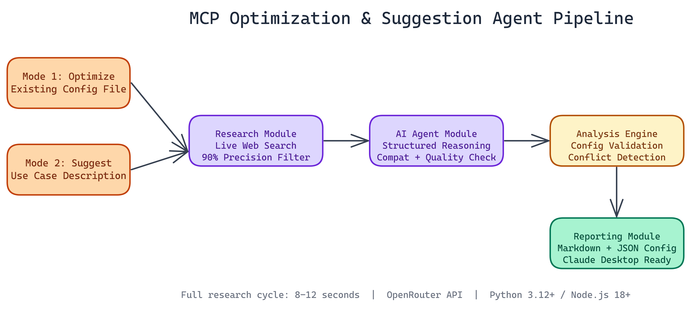

# Automating MCP Server Discovery: The NEO Optimization and Suggestion Agent

[](https://github.com/abhishekgandhi-neo/MCP_Optimization_Suggestion_Agent_By_NEO)



## The Problem

> If you've spent time configuring Model Context Protocol servers, you know the routine: search GitHub, filter through dozens of repos of varying quality, read each README, figure out if the tool actually fits your use case, edit JSON by hand, break something, fix it, repeat. It's tedious work that takes 30+ minutes per setup — and the MCP ecosystem changes fast enough that any static list of recommendations goes stale within weeks.

NEO automated it. The MCP Optimization and Suggestion Agent does what you'd normally spend **30+ minutes** doing: it researches available MCP servers across the web, reasons about which ones fit your needs, and either generates a tailored configuration from scratch or analyzes and improves your existing setup. The whole research cycle completes in **8 to 12 seconds**.

## What the Agent Actually Does

There are two modes, each solving a different problem.

**Mode 1: Optimize what you have.** Point the agent at your existing MCP configuration file. It reads your current setup, identifies gaps and redundancies, then suggests improvements with specific configuration snippets. It creates a backup before touching anything, so you can always roll back.

**Mode 2: Start fresh from a use case.** Describe what you're trying to accomplish in plain text. The agent performs live web research, identifies relevant MCP servers, reasons about fit, and produces a full markdown report with recommended configurations, rationale, and implementation guidance.

Both modes produce structured, usable outputs. Not vague suggestions. Actual JSON configuration files and documentation you can act on immediately.

## The Technical Architecture

NEO built this on four distinct modules that chain together cleanly.

The **research module** handles web filtering. It queries live sources, not a static database, so it finds recently published servers that wouldn't appear in a hardcoded list. It applies filtering logic to suppress false positives, achieving roughly **90% precision** in relevance filtering. When you ask for MCP servers that handle database access, you get database tools, not a random assortment.

The **AI agent module** takes the raw research and applies structured reasoning. It evaluates server quality, checks compatibility, and weighs tradeoffs between options. Raw search results are noise; the agent layer turns them into prioritized recommendations.

The **analysis engine** handles validation and optimization. It checks configuration syntax, identifies conflicts between servers, and verifies that suggested setups will actually work with Claude Desktop's expected format.

The **reporting module** produces the final outputs: markdown reports with full rationale, JSON configs ready to copy, and raw research data if you want to dig deeper.

The stack is Python 3.12+, Node.js 18+, and OpenRouter for model access. No proprietary infrastructure required.

## Why This Matters for MCP Users

MCP is still early. The ecosystem is growing fast, which means new servers appear constantly and the best options for any given workflow change over time. A static list of "recommended MCP servers" goes stale within weeks.

An agent that researches live is different. It finds things published last month. It catches deprecated packages. It notices when a popular server has been forked into something better.

This is especially useful for teams with multiple people configuring Claude Desktop. Instead of everyone independently googling and arriving at different setups, you run the agent once per use case and get a consistent, documented baseline configuration.

## What the Output Looks Like

For Mode 2, you get a markdown report organized by capability area. Each recommended server gets a section covering what it does, why it was selected over alternatives, the exact JSON configuration block, and any dependencies or setup steps needed.

For Mode 1, you get a diff-style view of your current configuration with specific improvement suggestions. The agent flags unused servers, recommends replacements for outdated tools, and suggests additions based on what your current setup implies about your workflow.

## Configuration and Integration

API setup requires a free key from openrouter.ai. After that, the CLI walks you through both modes. Generated configurations drop directly into Claude Desktop's expected directory structure.

```bash
# Analyze and optimize existing config
python agent.py --mode optimize --config ~/Library/Application\ Support/Claude/claude_desktop_config.json

# Generate recommendations for a use case
python agent.py --mode suggest --task "I need MCP servers for web scraping, database queries, and file management"
```

The NEO VSCode extension integrates with the agent as well, letting you trigger configuration updates from within your editor without context switching.

## Practical Applications

This agent is useful any time you're setting up a new Claude Desktop environment, onboarding someone to an MCP-heavy workflow, auditing an existing configuration that has grown organically over time, or exploring capabilities you haven't yet set up.

It's also a concrete example of what an agentic research pipeline looks like in practice: live data retrieval, structured reasoning, validated output generation, and clean integration with existing tooling. No magic, just a well-designed pipeline.

## How to Build This with NEO

Open NEO in VS Code or Cursor and describe what you want to build. A good starting prompt for this project:

> "Build a Python and Node.js agent that automates MCP server discovery and configuration for Claude Desktop. It should support two modes: a suggest mode that takes a plain-text use case description, queries live web sources for recently published MCP servers, filters results to about 90% precision, applies AI reasoning to rank options, and outputs a markdown report with per-server JSON configuration blocks; and an optimize mode that reads an existing claude_desktop_config.json, backs it up, and produces a diff-style improvement report with replacement recommendations and ready-to-copy config snippets."

<a href="https://heyneo.so/dashboard?section=new-chat&prompt=Build%20a%20Python%20and%20Node.js%20agent%20that%20automates%20MCP%20server%20discovery%20and%20configuration%20for%20Claude%20Desktop.%20It%20should%20support%20two%20modes%3A%20a%20suggest%20mode%20that%20takes%20a%20plain-text%20use%20case%20description%2C%20queries%20live%20web%20sources%20for%20recently%20published%20MCP%20servers%2C%20filters%20results%20to%20about%2090%25%20precision%2C%20applies%20AI%20reasoning%20to%20rank%20options%2C%20and%20outputs%20a%20markdown%20report%20with%20per-server%20JSON%20configuration%20blocks%3B%20and%20an%20optimize%20mode%20that%20reads%20an%20existing%20claude_desktop_config.json%2C%20backs%20it%20up%2C%20and%20produces%20a%20diff-style%20improvement%20report%20with%20replacement%20recommendations%20and%20ready-to-copy%20config%20snippets." style="display:inline-block;background:#1e40af;color:#ffffff;padding:10px 22px;border-radius:6px;text-decoration:none;font-weight:600;font-size:14px;">Build with NEO →</a>

NEO generates the project structure and core implementation. From there you iterate: ask it to implement the live web research module with relevance filtering to suppress false positives, add the AI reasoning layer that evaluates server quality and compatibility, or build the reporting module that produces both markdown reports and ready-to-use JSON configs. Each follow-up builds on what's already there.

To run the finished project:

```bash
git clone https://github.com/abhishekgandhi-neo/MCP_Optimization_Suggestion_Agent_By_NEO
cd MCP_Optimization_Suggestion_Agent_By_NEO
pip install -r requirements.txt
npm install
export OPENROUTER_API_KEY=sk-or-...
python agent.py --mode suggest --task "I need MCP servers for web scraping, database queries, and file management"
```

Run suggest mode first to see the full discovery-to-configuration output, then try optimize mode against your own Claude Desktop config to see what the agent flags for improvement.

NEO built an MCP optimization agent where live web research and structured AI reasoning replace manual GitHub searches and JSON editing, completing the full discovery-to-configuration cycle in under 12 seconds. See what else NEO ships at [heyneo.so](https://heyneo.so/).

---

## Try NEO in Your IDE

Install the NEO extension to bring AI-powered development directly into your workflow:

- **VS Code**: [NEO in VS Code](https://marketplace.visualstudio.com/items?itemName=NeoResearchInc.heyneo)
- **Cursor**: <a href="cursor://extension/NeoResearchInc.heyneo" style="color:#0066FF;font-weight:bold;">Install NEO for Cursor →</a>
