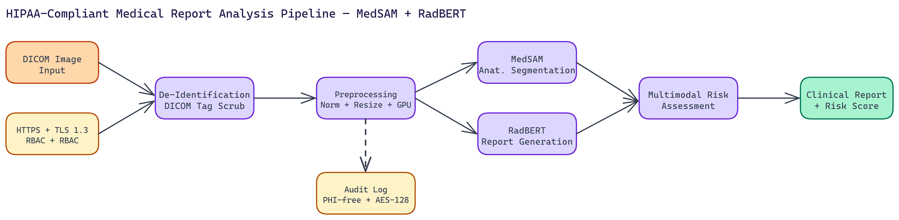

# HIPAA-Compliant Medical Report Analysis Pipeline with MedSAM and RadBERT

[](https://github.com/dakshjain-1616/Medical-Report-Analysis-Pipeline)



## The Problem

> Medical AI is a different category of engineering problem. The technical challenges are real, but compliance and security requirements add a layer of complexity that doesn't exist in most other ML domains. You're not just building a system that works — you're building one that maintains the privacy and security guarantees patient data requires, with audit trails that satisfy regulators and HIPAA controls that must be enforced server-side, not just in the UI.

NEO built this as a research and educational implementation of a medical imaging analysis pipeline. It is not FDA-approved for clinical diagnosis and should not be used as such in clinical settings. What it is, is a careful demonstration of how to build this kind of system correctly from a security and architecture standpoint.

## Security Architecture First

NEO designed the security architecture before writing a line of model code. In healthcare AI, this is the right order of operations.

The system runs as a FastAPI HTTPS server with TLS 1.3 for all in-transit communication. At-rest data uses AES-128 encryption in CBC mode with HMAC via Fernet. DICOM images undergo tag scrubbing to remove patient identifiers, and any pixel-level text embedded in images gets masked before data reaches the model inference stages.

Access is controlled through a multi-tier role-based system (RBAC) with automatic session timeouts. Every action against the system gets written to tamper-proof audit logs that don't expose protected health information (PHI). This audit trail is what makes compliance review possible.

The combination of these controls establishes a HIPAA-compliant posture: end-to-end encryption, de-identification, RBAC, and comprehensive audit logging.

## Processing Pipeline

Once a study enters the system, it goes through a defined sequence of stages.

### Ingestion and Preprocessing

DICOM files are the standard format for medical imaging. The pipeline ingests them through a process that first strips identifying metadata, then normalizes pixel values, resizes images to the target resolution, and applies windowing appropriate to the imaging modality (different window levels matter for bone vs. soft tissue in CT scans, for example).

GPU acceleration (tested on Tesla V100 hardware) is available for this stage when throughput is a priority.

### Anatomical Segmentation with MedSAM

[MedSAM](https://huggingface.co/wanglab/medsam-vit-base) handles the segmentation task. This is a medical-domain adaptation of the Segment Anything Model, fine-tuned specifically on medical imaging data. It identifies and delineates anatomical structures in the image, producing segmentation masks that define which pixels belong to which anatomical regions.

Good segmentation is the foundation for everything downstream. The quality of the report generation and risk assessment both depend on accurate structural identification.

### Report Generation with RadBERT

[RadBERT](https://huggingface.co/StanfordAIMI/RadBERT) is a BERT-based language model fine-tuned on radiology reports. It takes the segmentation output and image features as input and generates structured clinical text describing the findings.

The generated reports follow the format radiologists use: structured sections for technique, findings, and impression. The language is domain-appropriate, not generic NLP output.

### Multimodal Risk Assessment

The final stage fuses imaging analysis with available patient history data to produce a risk assessment. This multimodal fusion is where the pipeline goes beyond pure image analysis and incorporates clinical context.

End-to-end processing time for a typical study runs between **33 and 97 seconds** depending on study volume and complexity.

## What HIPAA Compliance Actually Requires in Practice

There's a difference between claiming HIPAA compliance and architecting a system to support it. A few specific implementation details matter:

The audit logging system needs to record enough information to reconstruct what happened to any piece of data, but not so much that the logs themselves become a PHI exposure risk. The system logs access events, processing events, and export events with user identifiers and timestamps, but not the patient data itself.

De-identification needs to cover both metadata and pixel content. DICOM tags are the obvious target, but medical images sometimes have patient information burned into the pixel data (printed on the image by the modality). Pixel-level text masking catches this.

Session timeouts and RBAC must be enforced server-side, not just client-side. Client-side controls can be bypassed.

## Deployment

Single-command setup via `./run_pipeline.sh` handles environment setup, server initialization, and compliance verification. Docker containerization supports local deployment, and the system is designed for Kubernetes orchestration on cloud platforms including AWS EKS and Azure AKS for production-scale deployments.

## The Research and Educational Context

The scope of this system is worth being explicit about. It demonstrates correct architecture and security practices for medical AI. It shows how to integrate MedSAM and RadBERT into a compliant pipeline. But clinical deployment requires prospective validation on real patient populations, institutional review board oversight, and regulatory clearance from bodies like the FDA.

The value of this pipeline is as a starting point for organizations exploring what a compliant medical AI system looks like, and as a learning resource for ML engineers entering the healthcare AI space.

## Where Healthcare AI Is Heading

The models themselves are advancing rapidly. MedSAM represents a significant jump in general-purpose medical image segmentation. RadBERT-class models are producing report language that's increasingly difficult to distinguish from what radiologists write.

The bottleneck now is compliance and validation infrastructure. Systems that get this right early have a real advantage.

---

## How to Build This with NEO

Open NEO in VS Code or Cursor and describe what you want to build. A good starting prompt for this project:

> "Build a HIPAA-compliant medical imaging analysis pipeline as a FastAPI HTTPS server with TLS 1.3. The pipeline should ingest DICOM files, scrub identifying metadata and mask pixel-level text, run [MedSAM](https://huggingface.co/wanglab/medsam-vit-base) for anatomical segmentation, pass segmentation output to [RadBERT](https://huggingface.co/StanfordAIMI/RadBERT) for structured radiology report generation in findings-and-impression format, and produce a multimodal risk assessment that fuses imaging analysis with patient history. All data at rest should use AES-128 Fernet encryption. Every API call must be written to a tamper-proof audit log recording user, action, timestamp, and study ID without including PHI. Implement role-based access control with server-side enforcement and automatic session timeouts."

<a href="https://heyneo.so/dashboard?section=new-chat&prompt=Build%20a%20HIPAA-compliant%20medical%20imaging%20analysis%20pipeline%20as%20a%20FastAPI%20HTTPS%20server%20with%20TLS%201.3.%20The%20pipeline%20should%20ingest%20DICOM%20files%2C%20scrub%20identifying%20metadata%20and%20mask%20pixel-level%20text%2C%20run%20MedSAM%20for%20anatomical%20segmentation%2C%20pass%20segmentation%20output%20to%20RadBERT%20for%20structured%20radiology%20report%20generation%20in%20findings-and-impression%20format%2C%20and%20produce%20a%20multimodal%20risk%20assessment%20that%20fuses%20imaging%20analysis%20with%20patient%20history.%20All%20data%20at%20rest%20should%20use%20AES-128%20Fernet%20encryption.%20Every%20API%20call%20must%20be%20written%20to%20a%20tamper-proof%20audit%20log%20recording%20user%2C%20action%2C%20timestamp%2C%20and%20study%20ID%20without%20including%20PHI.%20Implement%20role-based%20access%20control%20with%20server-side%20enforcement%20and%20automatic%20session%20timeouts." style="display:inline-block;background:#1e40af;color:#ffffff;padding:10px 22px;border-radius:6px;text-decoration:none;font-weight:600;font-size:14px;">Build with NEO →</a>

NEO generates the project structure and core implementation. From there you iterate: ask it to implement the DICOM ingestion stage with pixel-level text masking alongside tag scrubbing, wire up the MedSAM segmentation stage with optional GPU acceleration, or build the tamper-proof audit logging system that captures PHI-free event records. Each follow-up builds on what's already there.

To run the finished project:

```bash
git clone https://github.com/dakshjain-1616/Medical-Report-Analysis-Pipeline
cd Medical-Report-Analysis-Pipeline
./run_pipeline.sh
```

Start with a sample DICOM file from the `samples/` directory to verify the full pipeline runs end-to-end, then review `logs/audit.log` to confirm that PHI-free event records are being written correctly for every API call.

NEO built a HIPAA-compliant medical imaging pipeline where MedSAM segmentation, RadBERT report generation, end-to-end encryption, and tamper-proof audit logging are architectural requirements, not optional add-ons. See what else NEO ships at [heyneo.so](https://heyneo.so/).

---

## Try NEO in Your IDE

Install the NEO extension to bring AI-powered development directly into your workflow:

- **VS Code**: [NEO in VS Code](https://marketplace.visualstudio.com/items?itemName=NeoResearchInc.heyneo)
- **Cursor**: <a href="cursor://extension/NeoResearchInc.heyneo" style="color:#0066FF;font-weight:bold;">Install NEO for Cursor →</a>

---
