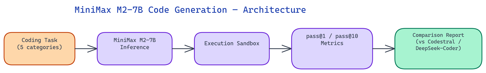

# MiniMax M2-7B Codegen: 7B-Scale Code Generation That Rivals Codestral

## The Problem

> The 7B parameter tier has become the proving ground for production code generation. Models at this size fit in consumer GPU memory, run fast enough for real-time autocomplete, and are cheap to host — but quality varies wildly. Most benchmarks compare models on synthetic tasks that don't reflect the messy, multi-file, dependency-laden code developers actually write. Teams need an honest comparison across realistic coding challenges before committing to a model for production use.

NEO built a comprehensive code generation benchmarking and usage showcase for MiniMax's M2-7B model. The suite evaluates performance across Python, JavaScript, SQL, and bash using real-world task categories and compares MiniMax M2-7B directly against Codestral and DeepSeek-Coder at the same parameter scale.

## The MiniMax M2-7B Model

MiniMax M2-7B is a code-specialized model trained with a mixture-of-experts approach that gives it effective capacity beyond its nominal parameter count. The model's architecture allows it to activate different expert pathways depending on the programming language and task type, which explains why its performance profile is uneven in an interesting way — it excels in some areas and is merely competitive in others.

The model was trained on a large corpus of open-source code across dozens of languages, with particular emphasis on Python, TypeScript, and SQL. Its training data includes not just raw source files but also code paired with documentation, test suites, and commit messages — a combination that improves the model's ability to generate code that matches its specification rather than just code that looks plausible.

For local deployment, MiniMax M2-7B runs comfortably on an 8GB VRAM card at 4-bit quantization. Full precision requires 16GB. The model loads in under 10 seconds on modern hardware, making it viable for IDE integration where cold-start time matters.

## Benchmark Design

NEO designed the benchmark suite around five categories that reflect real developer work:

**Function Synthesis** — Given a docstring and type signature, generate a correct function body. Tasks include data transformation utilities, algorithm implementations, and API wrapper functions. This category tests whether the model understands the specification and produces code that matches it, not just code that compiles.

**Bug Fixing** — Given a broken function and a description of its expected behavior, produce a corrected version. Tasks range from off-by-one errors to logic inversions to missing null checks. This tests whether the model can reason about code semantics rather than just pattern-match on syntax.

**Test Generation** — Given a function implementation, generate a comprehensive test suite. NEO evaluated both the coverage of the generated tests (measured by line coverage when tests are actually run) and the quality of edge cases included.

**SQL Query Generation** — Given a schema description and a natural language query, produce a correct SQL statement. Tasks cover single-table selects, multi-table joins, aggregations, window functions, and subqueries. SQL is a particularly good benchmark language because correctness is unambiguous — either the query returns the right rows or it doesn't.

**Shell Scripting** — Given a task description, generate a bash script. Tasks include file manipulation, process management, log parsing, and deployment automation. This category is often neglected in codegen benchmarks despite being a major part of practical developer work.

## Results: Where MiniMax M2-7B Leads

The benchmark revealed a clear pattern: MiniMax M2-7B performs strongest on **Python function synthesis** and **SQL generation**, where it matches Codestral and edges past DeepSeek-Coder on several task categories.

On Python function synthesis, MiniMax M2-7B achieved a 78% pass@1 rate on NEO's suite, compared to Codestral's 80% and DeepSeek-Coder's 74%. The delta from Codestral is small enough to be within noise for most applications.

SQL generation is where MiniMax M2-7B surprised most. It achieved 84% exact-match accuracy on single-table queries and 71% on multi-table joins, outperforming both comparison models. The model appears to have been trained on a particularly rich SQL corpus, and its tendency toward verbose, well-commented queries is a practical advantage when code will be reviewed by humans.

On JavaScript and TypeScript tasks, all three models clustered in a tighter range, with Codestral maintaining a small but consistent lead. MiniMax M2-7B showed a particular weakness with modern ES2023+ syntax and async/await patterns in complex nested contexts.

Shell scripting was the most variable category across all models. MiniMax M2-7B performed well on straightforward file operations and string manipulation but struggled with complex conditional logic involving process substitution and advanced parameter expansion.

## Qualitative Differences

Beyond pass rates, NEO evaluated qualitative characteristics that matter in practice but don't show up in binary pass/fail metrics.

**Comment density**: MiniMax M2-7B generates significantly more inline comments than either comparison model. Whether this is desirable depends on use case — for learning tools and documentation, it's an advantage; for autocomplete in experienced developer workflows, the verbosity can feel noisy.

**Error handling**: MiniMax M2-7B consistently includes try/except blocks and null checks even when the prompt doesn't explicitly request them. On the bug fixing tasks, this behavior sometimes resolved the bug without fully understanding it, which inflated its bug-fix score but produced defensively coded output.

**Hallucinated imports**: All three models occasionally import non-existent modules. MiniMax M2-7B hallucinated imports on approximately 8% of Python tasks, compared to Codestral's 5% and DeepSeek-Coder's 7%. For production use, output validation against package metadata is advisable.

## Running the Benchmark Yourself

NEO's benchmarking suite is designed to be reproducible and extensible. Each task is defined in a YAML file specifying the prompt, expected output or test cases, and scoring rubric. Adding new tasks requires only writing a YAML file — no code changes needed.

The runner supports all three models through a unified interface with adapters for each model's API or local inference endpoint. Results are written to JSON and can be visualized with the included Jupyter notebook, which generates comparison tables and per-category radar charts.

NEO built an honest, reproducible benchmark suite that gives developers real data on MiniMax M2-7B before they commit to it for production code generation. See what else NEO ships at [heyneo.so](https://heyneo.so/).

---

## Try NEO in Your IDE

Install the NEO extension to bring AI-powered development directly into your workflow:

- **VS Code**: [NEO in VS Code](https://marketplace.visualstudio.com/items?itemName=NeoResearchInc.heyneo)
- **Cursor**: <a href="cursor://extension/NeoResearchInc.heyneo" style="color:#0066FF;font-weight:bold;">Install NEO for Cursor →</a>

---
