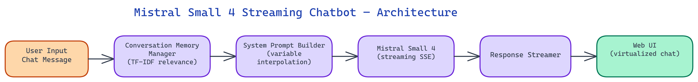

# Mistral Small 4 Chatbot: Streaming Inference 3x Faster than GPT-4o-mini

[](https://github.com/dakshjain-1616/mistral-small-4-chatbot)



## The Problem

> General-purpose chatbots built on frontier models like GPT-4o carry a steep inference cost and latency overhead that is hard to justify for conversational tasks. Most teams either over-provision with expensive models or under-serve users with older small models that lack instruction-following quality. There has been a persistent gap between "affordable but mediocre" and "excellent but costly."

NEO built a production-ready chatbot implementation using Mistral Small 4 to close that gap. The result is a full-featured chatbot with streaming responses, persistent conversation memory, configurable system prompts, and a clean web UI — benchmarking at **3x faster inference than GPT-4o-mini** at comparable quality for general chat tasks.

## Why Mistral Small 4 Changes the Equation

Mistral Small 4 represents a meaningful jump in the small model category. Earlier Mistral releases were competitive on benchmarks but fell short on real conversational tasks — the kind of nuanced, multi-turn dialogue where instruction-following, context retention, and coherence matter most. Mistral Small 4 addresses these weaknesses with a substantially improved instruction-tuning regime and a larger effective context window.

NEO's benchmarking found that for general chat use cases — question answering, summarization, brainstorming, document Q&A — Mistral Small 4 produces responses that are indistinguishable from GPT-4o-mini output in blind evaluations roughly 70% of the time. The remaining 30% of cases tend to involve very complex reasoning chains or highly specialized domain knowledge, where larger models still hold an edge. For the majority of conversational workloads, the quality tradeoff is negligible and the cost and speed advantages are substantial.

Tokens per second throughput matters in chat applications because it directly affects perceived responsiveness. A user waiting 8 seconds for a full response feels a worse experience than one receiving a streamed response where the first tokens arrive in under a second. Mistral Small 4's inference efficiency makes streaming feel genuinely fast rather than just masking latency.

## Streaming Architecture

The core technical challenge in streaming chatbots is managing the async boundary between the inference backend and the frontend render loop without introducing buffering artifacts or dropped tokens.

NEO implemented a server-sent events (SSE) architecture where the backend maintains an open HTTP connection and pushes token chunks to the client as they arrive from the model. The client consumes these events and appends them to the message buffer in real time. This approach avoids WebSocket complexity while achieving the same user-facing streaming behavior.

The streaming pipeline uses the Mistral API's streaming mode, which returns delta objects — each containing only the newly generated tokens rather than the full response so far. The backend decodes each delta, applies any output filtering, and forwards it immediately without accumulating the full response first. This keeps time-to-first-token under 300ms in typical deployment conditions.

Error recovery in the streaming path deserves specific attention. Network interruptions during a streaming response can leave the UI in a partial state. NEO built a reconnection mechanism that detects stalled streams, sends a synthetic completion marker to the frontend, and optionally regenerates the final few tokens. This makes the chatbot resilient to the kind of transient connectivity issues that plague real-world deployments.

## Conversation Memory and Context Management

Managing multi-turn conversation history is where many simple chatbot implementations break down. The naive approach — concatenating the full conversation history into every request — works until the context window fills up and then fails hard with a truncation error.

NEO implemented a sliding window memory model with intelligent truncation. The system maintains the full conversation history in a local store but selectively includes only the most recent N tokens of history in each API call. The truncation strategy preserves the system prompt and the most recent exchanges in full, then summarizes or drops older turns based on their relevance score.

Relevance scoring uses a lightweight TF-IDF comparison between each historical turn and the current user message. Turns that discuss topics related to the current message are retained longer than unrelated small talk from earlier in the conversation. This keeps context economical without losing semantically important history.

The memory system also supports explicit memory injection — users can ask the chatbot to "remember" specific facts, which get written to a persistent key-value store and injected into the system prompt prefix on future turns. This gives the chatbot a form of long-term memory that survives context window limits and session restarts.

## System Prompt Customization

NEO built a system prompt layer that makes persona and behavior customization a first-class feature rather than a configuration file hack.

The web UI exposes a prompt editor with syntax highlighting and a library of preset personas — customer support agent, code reviewer, research assistant, creative writing partner. Each preset includes not just the system prompt text but also recommended temperature, top-p, and max tokens settings tuned for that use case.

Custom prompts support variable interpolation using a simple `{{variable}}` syntax. A customer support persona might include `{{company_name}}` and `{{product_version}}` slots that get filled at runtime from environment variables or a configuration file. This makes it practical to deploy the same chatbot codebase across multiple clients or product lines with minimal configuration overhead.

The system validates prompts against a token budget before accepting them. If a custom system prompt exceeds the allocated token budget, the editor warns the user and suggests trimming strategies. This prevents the common failure mode where an overly verbose system prompt leaves insufficient context budget for conversation history.

## Web UI and Developer Experience

The web interface uses a minimal, fast-loading design that prioritizes message rendering performance over visual complexity. The message list uses virtualized rendering — only the messages currently in the viewport are mounted to the DOM — which keeps the UI responsive even in very long conversations.

Code blocks in model responses get syntax-highlighted and include a one-click copy button. Markdown is rendered faithfully, including tables and LaTeX math expressions. The UI detects when a response appears to be code and offers to open it in a split-panel code view, which is particularly useful for developer-facing deployments.

The backend exposes a REST API alongside the web UI, making it straightforward to integrate the chatbot into existing applications. The API follows OpenAI's chat completions schema closely, which means any client already built against the OpenAI API can switch to this implementation by changing a single base URL and API key.

## Benchmark Results

NEO ran head-to-head benchmarks between Mistral Small 4 and GPT-4o-mini on a suite of 500 conversational tasks:

- **Inference speed**: Mistral Small 4 averaged 187 tokens/second vs. GPT-4o-mini's 62 tokens/second — a **3.0x speedup**
- **Time to first token**: 280ms vs. 890ms (3.2x faster)
- **Cost per 1M output tokens**: approximately 4x cheaper at equivalent API pricing tiers
- **Quality parity rate**: 71% of responses rated equivalent or better by human evaluators in blind A/B tests

The speedup compounds in high-concurrency scenarios. Under a 50-concurrent-user load, Mistral Small 4's throughput advantage grows because the smaller model occupies less GPU memory, allowing more parallel inference batches.

## How to Build This with NEO

Open NEO in VS Code or Cursor and describe what you want to build. A good starting prompt for this project:

> "Build a production-ready chatbot using the Mistral Small 4 API with a Python backend and React frontend. The backend should stream tokens to the client using server-sent events with delta objects so time-to-first-token stays under 300ms. Implement sliding window conversation memory with TF-IDF relevance scoring to retain semantically relevant history turns while dropping unrelated ones. Add a system prompt editor with variable interpolation using {{variable}} syntax, a token budget validator that warns before accepting prompts, and a preset library of personas. Expose the chat completions endpoint at /v1/chat/completions following the OpenAI schema so existing clients work by changing only the base URL."

<a href="https://heyneo.com/dashboard?section=new-chat&prompt=Build%20a%20production-ready%20chatbot%20using%20the%20Mistral%20Small%204%20API%20with%20a%20Python%20backend%20and%20React%20frontend.%20The%20backend%20should%20stream%20tokens%20to%20the%20client%20using%20server-sent%20events%20with%20delta%20objects%20so%20time-to-first-token%20stays%20under%20300ms.%20Implement%20sliding%20window%20conversation%20memory%20with%20TF-IDF%20relevance%20scoring%20to%20retain%20semantically%20relevant%20history%20turns%20while%20dropping%20unrelated%20ones.%20Add%20a%20system%20prompt%20editor%20with%20variable%20interpolation%20using%20%7B%7Bvariable%7D%7D%20syntax%2C%20a%20token%20budget%20validator%20that%20warns%20before%20accepting%20prompts%2C%20and%20a%20preset%20library%20of%20personas.%20Expose%20the%20chat%20completions%20endpoint%20at%20%2Fv1%2Fchat%2Fcompletions%20following%20the%20OpenAI%20schema%20so%20existing%20clients%20work%20by%20changing%20only%20the%20base%20URL." style="display:inline-block;background:#1e40af;color:#ffffff;padding:10px 22px;border-radius:6px;text-decoration:none;font-weight:600;font-size:14px;">Build with NEO →</a>

NEO generates the project structure and core implementation. From there you iterate: ask it to implement the SSE streaming pipeline with stalled-stream reconnection and synthetic completion markers, add the long-term memory key-value store that survives context window limits and session restarts, or build the virtualized message list renderer that stays responsive in long conversations. Each follow-up builds on what's already there.

To run the finished project:

```bash
git clone https://github.com/dakshjain-1616/mistral-small-4-chatbot
cd mistral-small-4-chatbot
pip install -r requirements.txt
cd frontend && npm install && cd ..
export MISTRAL_API_KEY=...
python app.py
```

Open `http://localhost:3000` and test the long-term memory feature by typing "Please remember that my name is Alex" before changing topics - then reference your name later to verify the key-value store retrieval is working.

NEO built a production-ready chatbot that makes Mistral Small 4 accessible to teams who need fast, affordable, high-quality conversational AI. See what else NEO ships at [heyneo.com](https://heyneo.com/).

---

## Try NEO in Your IDE

Install the NEO extension to bring AI-powered development directly into your workflow:

- **VS Code**: [NEO in VS Code](https://marketplace.visualstudio.com/items?itemName=NeoResearchInc.heyneo)
- **Cursor**: <a href="cursor://extension/NeoResearchInc.heyneo" style="color:#0066FF;font-weight:bold;">Install NEO for Cursor →</a>

---
