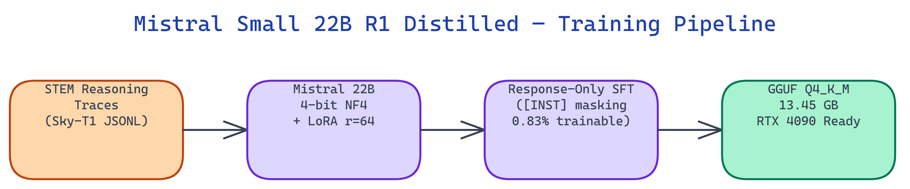

# Mistral Small 22B R1 Distilled: STEM Reasoning via LoRA r=64 and GGUF Q4_K_M

[](https://github.com/dakshjain-1616/mistral-small-r1-distilled)
[](https://huggingface.co/daksh-neo/mistral-small-3-1-22b-r1-distilled)



## The Problem

> Applying reasoning distillation to 20B+ models requires solving four problems at once: correct chat format handling, response-only gradient flow, fitting training into a single GPU, and compressing the result enough for practical inference. Getting any one of these wrong breaks the whole pipeline.

NEO built this distillation pipeline for [Mistral Small 3.1](https://huggingface.co/mistralai/Mistral-Small-3.1-24B-Instruct-2503), wiring all four together with a `DRY_RUN=1` mode that makes CI pass without GPU hardware.

## The Four Engineering Problems

**Chat format** is the first constraint. Mistral uses `[INST]`/`[/INST]` delimiters, not the `<|im_start|>` format Qwen uses or the Llama header format. Using the wrong template produces malformed training examples.

**Response-Only Training** is the second. Without masking `[INST]` tokens, the model wastes training capacity memorizing user prompts instead of learning reasoning patterns. The pipeline automatically masks all tokens between `[INST]` and `[/INST]`, setting them to `labels = -100`.

```
[INST] Solve 3x² - 11x + 6 = 0 [/INST]   →  labels = -100

<think>                                     →  labels = token_id ✅
Step 1: identify coefficients...            →  labels = token_id ✅
Step 2: apply quadratic formula...          →  labels = token_id ✅
</think>                                    →  labels = token_id ✅

FINAL ANSWER: x = 3 or x = 2/3            →  labels = token_id ✅
```

**LoRA efficiency** is the third. Full fine-tuning of 22B parameters requires multiple A100 80 GB GPUs. LoRA r=64 reduces the trainable parameter count to 0.83% of the full model, fitting training onto a single RTX 4090.

**GGUF quantization** is the fourth. The merged 22B model at fp16 is 44 GB, too large for most inference setups. Q4_K_M quantization brings this to 13.45 GB, fitting comfortably in the 24 GB VRAM of an RTX 4090.

## LoRA Configuration

| Parameter | Value |
|:----------|------:|
| Rank (r) | 64 |
| Alpha | 128 |
| Target modules | q_proj, k_proj, v_proj, o_proj, gate_proj, up_proj, down_proj |
| Trainable overhead | ~0.83% of 22B |
| Max sequence length | 8192 |
| Quantization (training) | 4-bit NF4 |

The higher rank (64 vs 16 for smaller models) is appropriate here. A 22B model has more capacity to absorb reasoning patterns, and the feed-forward layers (`gate_proj`, `up_proj`, `down_proj`) are included alongside attention projections.

## GGUF Size Reference

| Quantization | Size | VRAM Needed |
|:-------------|-----:|:------------|
| Q4_K_M | 13.45 GB | 24 GB (RTX 4090) |
| Q5_K_M | 15.74 GB | 24 GB |
| Q6_K | 18.22 GB | 24 GB |
| Q8_0 | 23.56 GB | 32 GB |
| F16 | 44.35 GB | 2x A100 80 GB |

## What the Reasoning Output Looks Like

Math example:

```
[INST] Solve the quadratic equation: 3x² - 11x + 6 = 0. Show all steps. [/INST]
<think>
Step 1: Identify coefficients: a=3, b=-11, c=6
Step 2: Apply quadratic formula: x = (11 ± √(121 - 72)) / 6
Step 3: Simplify: x = (11 ± √49) / 6 = (11 ± 7) / 6
Step 4: x₁ = 18/6 = 3, x₂ = 4/6 = 2/3
Step 5: Verify both solutions satisfy original equation ✓
</think>

FINAL ANSWER: x = 3 or x = 2/3
```

Physics example:

```
[INST] Train A leaves Station A at 60 mph. Train B (300 miles away) heads toward A at 90 mph. When do they meet? [/INST]
<think>
Step 1: Let t = time in hours until trains meet.
Step 2: Train A travels 60t miles, Train B travels 90t miles.
Step 3: 60t + 90t = 300 → 150t = 300 → t = 2 hours
Step 4: Verification: 120 + 180 = 300 ✓
</think>

FINAL ANSWER: The trains meet after 2 hours.
```

## Reasoning Quality Evaluation

The `ReasoningQualityEvaluator` measures depth scores (0.4–1.0) and step counts per domain:

```
Total samples  : 10
Avg depth      : 0.6152  (range: 0.4680–1.0000)
Avg steps      : 6.3     (range: 4–11)
math           count=3   avg_depth=0.5220  avg_steps=5.0
physics        count=4   avg_depth=0.5375  avg_steps=5.8
coding         count=3   avg_depth=0.8120  avg_steps=8.3
```

Coding samples score highest on depth, reflecting the more structured step-by-step nature of algorithm problems.

## How to Build This with NEO

Open NEO in VS Code or Cursor and describe what you want to build. A good starting prompt for this project:

> "Build a [DeepSeek-R1](https://huggingface.co/deepseek-ai/DeepSeek-R1)-style reasoning distillation pipeline for [Mistral Small 3.1 22B](https://huggingface.co/mistralai/Mistral-Small-3.1-24B-Instruct-2503) using [Unsloth](https://github.com/unslothai/unsloth) and LoRA r=64. The pipeline should handle Mistral's [INST]/[/INST] chat format correctly, automatically mask all instruction tokens to labels=-100 so training is response-only, configure LoRA on q_proj/k_proj/v_proj/o_proj/gate_proj/up_proj/down_proj with rank 64 and alpha 128, train in 4-bit NF4 to fit a single RTX 4090, then export the merged model to GGUF Q4_K_M targeting 13.5 GB. Include a DRY_RUN=1 mode that validates config, masking stats, and GGUF size estimates without GPU hardware."

<a href="https://heyneo.so/dashboard?section=new-chat&prompt=Build%20a%20DeepSeek-R1-style%20reasoning%20distillation%20pipeline%20for%20Mistral%20Small%203.1%2022B%20using%20Unsloth%20and%20LoRA%20r%3D64.%20The%20pipeline%20should%20handle%20Mistral%27s%20%5BINST%5D%2F%5B%2FINST%5D%20chat%20format%20correctly%2C%20automatically%20mask%20all%20instruction%20tokens%20to%20labels%3D-100%20so%20training%20is%20response-only%2C%20configure%20LoRA%20on%20q_proj%2Fk_proj%2Fv_proj%2Fo_proj%2Fgate_proj%2Fup_proj%2Fdown_proj%20with%20rank%2064%20and%20alpha%20128%2C%20train%20in%204-bit%20NF4%20to%20fit%20a%20single%20RTX%204090%2C%20then%20export%20the%20merged%20model%20to%20GGUF%20Q4_K_M%20targeting%2013.5%20GB.%20Include%20a%20DRY_RUN%3D1%20mode%20that%20validates%20config%2C%20masking%20stats%2C%20and%20GGUF%20size%20estimates%20without%20GPU%20hardware." style="display:inline-block;background:#1e40af;color:#ffffff;padding:10px 22px;border-radius:6px;text-decoration:none;font-weight:600;font-size:14px;">Build with NEO →</a>

NEO generates the project structure and core implementation. From there you iterate: ask it to implement the token masking logic with labels=-100 assignment for instruction spans, add the GGUF export command with Q4_K_M quantization and Hub push support, or build the ReasoningQualityEvaluator that measures depth scores and step counts per domain. Each follow-up builds on what's already there.

To train yourself (RTX 4090 or A100 required), or use the released model directly:

**To run training yourself**, clone the repo and install:

```bash
git clone https://github.com/dakshjain-1616/mistral-small-r1-distilled
cd mistral-small-r1-distilled
pip install -r requirements.txt
pip install "unsloth[colab-new] @ git+https://github.com/unslothai/unsloth.git"
```

Set your HuggingFace token and run training (RTX 4090 or A100 required):

```bash
export HF_TOKEN=hf_your_token_here
python -m mistral_r1_distill train
```

Export to GGUF and push to Hub:

```bash
export HF_REPO_ID=your-username/Mistral-Small-3.1-22B-R1-Distilled
python -m mistral_r1_distill export
python -m mistral_r1_distill push
```

**To use the released model directly**, pull it from HuggingFace:

```bash
pip install huggingface_hub transformers
huggingface-cli download daksh-neo/mistral-small-3-1-22b-r1-distilled --local-dir ./model
```

Load and run inference:

```python
from transformers import AutoModelForCausalLM, AutoTokenizer

model = AutoModelForCausalLM.from_pretrained("daksh-neo/mistral-small-3-1-22b-r1-distilled")
tokenizer = AutoTokenizer.from_pretrained("daksh-neo/mistral-small-3-1-22b-r1-distilled")
inputs = tokenizer("[INST] Solve step by step: What is 15% of 240? [/INST] <think>", return_tensors="pt")
outputs = model.generate(**inputs, max_new_tokens=256)
print(tokenizer.decode(outputs[0]))
```

Or load the GGUF directly with llama.cpp:

```python
from llama_cpp import Llama

llm = Llama(model_path="outputs/gguf/model-q4_k_m.gguf", n_ctx=8192, n_gpu_layers=-1)
output = llm("[INST] Why does ice float? [/INST] <think>", max_tokens=1024, stop=["</s>"])
print(output["choices"][0]["text"])
```

Run `python demo.py` first to validate the full pipeline config and masking stats in under a second with no GPU required.

NEO built a complete reasoning distillation pipeline for Mistral 22B that fits training on a single RTX 4090 and inference on the same card. See what else NEO ships at [heyneo.so](https://heyneo.so/).

---

## Try NEO in Your IDE

Install the NEO extension to bring AI-powered development directly into your workflow:

- **VS Code**: [NEO in VS Code](https://marketplace.visualstudio.com/items?itemName=NeoResearchInc.heyneo)
- **Cursor**: <a href="cursor://extension/NeoResearchInc.heyneo" style="color:#0066FF;font-weight:bold;">Install NEO for Cursor →</a>

---
