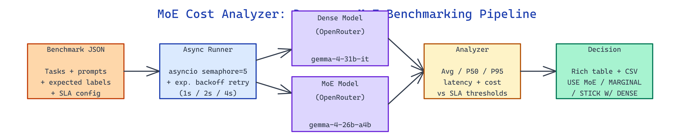

# MoE Cost Analyzer: Benchmarking Dense vs Mixture-of-Experts Models on Your Own Workload

[](https://github.com/dakshjain-1616/MoE-Cost-Analyzer)



## The Problem

> Everyone claims Mixture-of-Experts models are cheaper and faster than dense models of comparable quality — but nobody tells you whether those claims hold on your prompts, your latency SLA, and your production traffic shape.

NEO built MoE Cost Analyzer to run hard numbers against OpenRouter — real latency, real tokens, real dollars — on a benchmark you define, then recommend whether switching is worth it.

## Live API Benchmarking Against Your Own Prompts

**MoE Cost Analyzer** takes a JSON benchmark file describing the prompts you actually run in production and fires them through both a dense and a MoE model on OpenRouter concurrently. The included reference benchmark uses 100 sentiment-analysis tasks comparing `google/gemma-4-31b-it` (dense) against `google/gemma-4-26b-a4b-it` (MoE).

The benchmark file format is intentionally minimal — an id, the prompt, and optional expected labels for correctness checks:

```json
{
  "name": "My Production Benchmark",
  "tasks": [
    {
      "id": "task_001",
      "prompt": "Extract all dates mentioned in this support ticket: ...",
      "expected_labels": ["2026-01-15", "2026-02-03"]
    },
    {
      "id": "task_002",
      "prompt": "Classify the urgency of this message as Low / Medium / High: ...",
      "expected_labels": ["High"]
    }
  ]
}
```

The runner uses `asyncio.gather` with a semaphore capped at 5 concurrent requests to stay inside OpenRouter rate limits, and wraps each call in a retry loop that handles 429s and 5xx errors with exponential backoff (1s, 2s, 4s). A `--dry-run` flag simulates calls for local iteration without spending real tokens.

## Latency, Cost, and SLA Decision Matrix

After the run, `analyzer.py` computes per-model statistics — average, P50, and P95 latency; total and per-query cost; total tokens; error rate — and assembles a decision matrix. Token cost is computed from a `ModelPricing` dataclass keyed on the OpenRouter rate card, with separate input and output per-million prices.

On the published 100-task reference run, the MoE variant beat the dense model on every dimension without sacrificing output quality:

| Metric | Dense gemma-4-31b-it | MoE gemma-4-26b-a4b-it | Delta |
|---|---:|---:|---:|
| Avg Latency | 1,721 ms | 1,283 ms | -25.5% |
| P50 Latency | 833 ms | 605 ms | -27.3% |
| P95 Latency | 6,748 ms | 5,879 ms | -12.9% |
| Cost per Query | $0.00000494 | $0.00000395 | -20.0% |
| Total Tokens | 4,939 | 4,939 | 0.0% |
| Error Rate | 0.0% | 0.0% | — |

The `recommend()` function compares both models against configurable SLAs and emits one of three decisions: `USE MoE` (meets both latency and cost caps), `MARGINAL` (meets one), or `STICK WITH DENSE` (fails both). The P95 narrowing is a deliberate warning — MoE wins the median but its tail is closer, which matters for latency-sensitive traffic.

## Rich Terminal Output and CSV Export

Results render as a Rich-formatted table with a coloured recommendation line, and every raw data point is written to CSV for downstream analysis.

```bash
python analyze.py my_benchmark.json \
  --sla-latency-ms 1500 \
  --sla-cost-per-1k 0.005 \
  --output my_results.csv
```

The CSV has one row per (task_id, model_id) pair with latency_ms, prompt_tokens, completion_tokens, total_tokens, cost_usd, and error columns — a shape that drops straight into pandas for per-prompt regression analysis, outlier hunting, or extrapolation to production volume. On a 1M-query/day workload the reference delta projects to roughly $30/month in savings; at 100M queries/day it extrapolates to almost $3K/month.

## How to Build This with NEO

Open NEO in VS Code or Cursor and describe what you want to build. A good starting prompt for this project:

> "Build an async benchmarking tool that takes a JSON file of prompts, sends each through both a dense and a MoE model on OpenRouter with a semaphore-limited concurrency of 5 and retry with exponential backoff, computes avg/P50/P95 latency and per-query cost from a pricing dataclass, exports results to CSV, and prints a Rich-formatted decision matrix with a USE MoE / MARGINAL / STICK WITH DENSE recommendation against configurable SLA thresholds."

<a href="https://heyneo.com/dashboard?section=new-chat&prompt=Build%20an%20async%20benchmarking%20tool%20that%20takes%20a%20JSON%20file%20of%20prompts%2C%20sends%20each%20through%20both%20a%20dense%20and%20a%20MoE%20model%20on%20OpenRouter%20with%20a%20semaphore-limited%20concurrency%20of%205%20and%20retry%20with%20exponential%20backoff%2C%20computes%20avg%2FP50%2FP95%20latency%20and%20per-query%20cost%20from%20a%20pricing%20dataclass%2C%20exports%20results%20to%20CSV%2C%20and%20prints%20a%20Rich-formatted%20decision%20matrix%20with%20a%20USE%20MoE%20%2F%20MARGINAL%20%2F%20STICK%20WITH%20DENSE%20recommendation%20against%20configurable%20SLA%20thresholds." style="display:inline-block;background:#1e40af;color:#ffffff;padding:10px 22px;border-radius:6px;text-decoration:none;font-weight:600;font-size:14px;">Build with NEO →</a>

NEO generates the project structure and core implementation. From there you iterate — ask it to add a dry-run mode that simulates OpenRouter responses for offline testing, extend the analyzer with a correctness scorer that compares completions against `expected_labels`, or add monthly-cost extrapolation across configurable daily query volumes. Each request builds on what's already there.

To run the finished project:

```bash
git clone https://github.com/dakshjain-1616/MoE-Cost-Analyzer
cd MoE-Cost-Analyzer
pip install -r requirements.txt
python analyze.py benchmark.json --sla-latency-ms 2000 --sla-cost-per-1k 0.01
```

The terminal prints the decision matrix with the coloured recommendation, and `results.csv` holds every measurement for pandas-side analysis.

NEO built a benchmarking harness that turns the "should we switch to MoE" debate into hard numbers measured on your own workload, with SLA-aware recommendations. See what else NEO ships at [heyneo.com](https://heyneo.com/).

---

## Try NEO in Your IDE

Install the NEO extension to bring AI-powered development directly into your workflow:

- **VS Code**: [NEO in VS Code](https://marketplace.visualstudio.com/items?itemName=NeoResearchInc.heyneo)
- **Cursor**: <a href="cursor://extension/NeoResearchInc.heyneo" style="color:#0066FF;font-weight:bold;">Install NEO for Cursor →</a>

---
