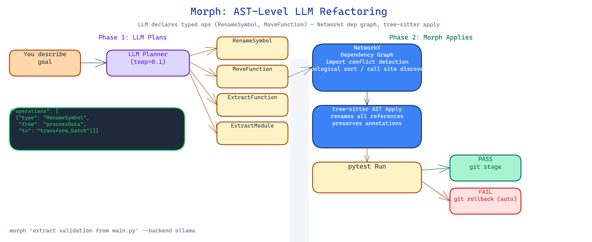

# Morph: AST-Level LLM Refactoring Where the Model Plans, Not Codes

[](https://github.com/dakshjain-1616/Morph)



## The Problem

> You ask an LLM to refactor a module. It generates a new version of the file. The new version looks plausible. You apply it. Two days later you find a subtle bug: the LLM quietly renamed a variable that was referenced from three other files it didn't see. The diff looked fine because the change was locally coherent. The problem was cross-file, and the LLM was operating on a single-file view.

NEO built Morph to give LLM refactoring a structural foundation: the model doesn't write code, it declares typed operations. Morph validates those operations against the actual codebase before applying a single character.

## Typed Operations Instead of Source Code

When you describe a refactoring goal to Morph, the LLM (at low temperature for consistency) returns a typed plan:

```json
{
  "operations": [
    {"type": "RenameSymbol", "from": "processData", "to": "transform_batch", "scope": "src/pipeline/"},
    {"type": "ExtractFunction", "source_file": "src/main.py", "lines": [45, 67], "new_name": "validate_input"},
    {"type": "MoveFunction", "function": "format_output", "from": "src/utils.py", "to": "src/formatters.py"}
  ]
}
```

This is the LLM's job: *declare intent*. Not write Python. Not manage imports. Not track call sites.

Morph's engine handles everything else.

## Dependency Validation Before Execution

Before applying any operation, Morph builds a NetworkX dependency graph of the codebase:

- **Import conflict detection**: does moving a function create a circular import?
- **Topological sort**: operations that depend on each other are ordered correctly.
- **Call site discovery**: every reference to a renamed symbol is found across all files, not just the one the LLM saw.
- **Scope boundary checking**: operations that cross module boundaries are flagged for review.

If the plan has conflicts, Morph reports them before touching a file. You fix the plan, not the code.

## tree-sitter AST Manipulation

Morph applies operations via tree-sitter, not text replacement. This means:

- Renames update all references, not just the definition
- Function extractions preserve type annotations and docstrings
- Module moves update all import statements across the codebase
- The resulting code is syntactically valid by construction

Text-replacement refactoring breaks on edge cases (same string in a comment, partial match). AST manipulation doesn't.

## Automatic Test Verification and Rollback

After applying the operation plan, Morph runs pytest. If tests pass, it stages the changes via git. If tests fail, it rolls back to the pre-refactoring state automatically and reports which test failed and which operation likely caused it.

This means the workspace is always either fully refactored and passing, or unchanged. There is no intermediate broken state to clean up.

## Multi-Model Support

Morph supports Ollama (local, no API cost), OpenAI, Anthropic, and OpenRouter. The planner temperature is set to 0.1 by default, you want the operation plan to be deterministic and literal, not creative. Higher temperature is counterproductive when the model is declaring structured operations.

## How to Build This with NEO

Open NEO in VS Code or Cursor and describe what you want to build. A good starting prompt for this project:

> "Build a code refactoring CLI that uses LLMs to generate typed transformation plans (RenameSymbol, MoveFunction, ExtractFunction, ExtractModule) rather than source code. Build a NetworkX dependency graph of the codebase to detect import conflicts, sort operations in dependency order, and find all call sites for renamed symbols. Apply operations via tree-sitter AST manipulation, not text replacement. After applying the plan, run pytest, if tests pass, stage with git; if they fail, roll back automatically. Support Ollama, OpenAI, Anthropic, and OpenRouter as backends. Use temperature 0.1 for the planner."

<a href="https://heyneo.com/dashboard?section=new-chat&prompt=Build%20a%20code%20refactoring%20CLI%20that%20uses%20LLMs%20to%20generate%20typed%20transformation%20plans%20(RenameSymbol%2C%20MoveFunction%2C%20ExtractFunction%2C%20ExtractModule)%20rather%20than%20source%20code.%20Build%20a%20NetworkX%20dependency%20graph%20to%20detect%20import%20conflicts%20and%20sort%20operations.%20Apply%20via%20tree-sitter%20AST%20manipulation.%20Run%20pytest%20after%20applying%3B%20if%20tests%20fail%2C%20roll%20back%20automatically.%20Support%20Ollama%2C%20OpenAI%2C%20Anthropic%2C%20OpenRouter." style="display:inline-block;background:#1e40af;color:#ffffff;padding:10px 22px;border-radius:6px;text-decoration:none;font-weight:600;font-size:14px;">Build with NEO →</a>

NEO scaffolds the operation schema, the LLM planner prompt, the NetworkX graph builder, the tree-sitter operation applier, the pytest runner, and the git rollback logic. From there you iterate: add a `--dry-run` flag that shows the full operation plan and conflict report without making changes, add a `--interactive` mode that requires human approval per operation, or extend the operation types with `InlineFunction` and `SplitModule`.

To run the finished project:

```bash
git clone https://github.com/dakshjain-1616/Morph
cd Morph
pip install -r requirements.txt

morph "extract the validation logic from main.py into its own module" --backend ollama
morph "rename processData to transform_batch everywhere" --backend openrouter
morph --plan-only "move format_output to formatters.py"  # show plan without applying
```

NEO built a refactoring engine where the LLM declares intent as typed operations, Morph validates against the full dependency graph, tree-sitter applies changes structurally, and pytest + git rollback guarantee a clean workspace. See what else NEO ships at [heyneo.com](https://heyneo.com/).

---

## Try NEO in Your IDE

Install the NEO extension to bring AI-powered development directly into your workflow:

- **VS Code**: [NEO in VS Code](https://marketplace.visualstudio.com/items?itemName=NeoResearchInc.heyneo)
- **Cursor**: <a href="cursor://extension/NeoResearchInc.heyneo" style="color:#0066FF;font-weight:bold;">Install NEO for Cursor →</a>

---
