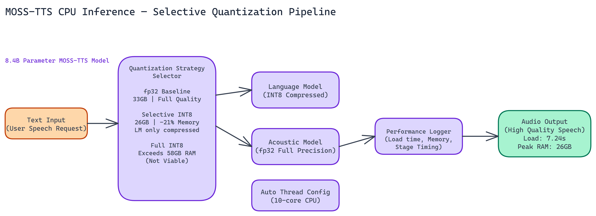

# Running an 8.4B Parameter TTS Model on CPU: How We Optimized MOSS-TTS Without a GPU

[](https://github.com/dakshjain-1616/MOSS-TTS-CPU-Optimized-Inference-Pipeline)



## The Problem

> GPU access is expensive. For organizations running inference on-premises, or teams prototyping before committing to cloud GPU costs, the ability to run large models on CPU hardware can be the difference between shipping something and waiting for budget approval. MOSS-TTS is an 8.4-billion-parameter text-to-speech model — most production TTS deployments assume GPU acceleration, and no off-the-shelf approach existed for CPU deployment with acceptable memory usage.

NEO set out to determine whether it was possible to run [MOSS-TTS](https://huggingface.co/OpenMOSS-Team/MOSS-TTS) on CPU hardware at all, and if so, which quantization strategy produced the best tradeoff between memory usage, load time, and audio quality.

The short answer: yes, it runs on CPU, and selective quantization is the right approach.

## The Three Approaches NEO Tested

NEO ran experiments across three inference configurations on a 10-core CPU with 58GB of available RAM.

**Standard fp32** loads the model at full 32-bit floating point precision. No compression, no approximation. This is the baseline for audio quality, and it delivered the highest fidelity output in testing. The cost is memory: **33GB peak usage**. Load time was also the longest of the three approaches. For environments where audio quality is the primary constraint and memory is available, fp32 is the reliable choice.

**Selective quantization** applies INT8 compression only to the language model component of the architecture, leaving the acoustic components at higher precision. This is where things got interesting. Memory dropped to approximately **26GB peak**, a **21% reduction** compared to fp32. Load time came in at **7.24 seconds**. Audio quality remained essentially indistinguishable from fp32 in NEO's evaluations. The LM component handles text processing, where slight numerical approximations matter less. The acoustic generation components, where quantization artifacts are more audible, stay at full precision.

**Full INT8 quantization** applies compression across the entire model. NEO attempted this, but it exceeded available memory during the weight transformation process. The transformation itself requires holding both the original and quantized weights in memory simultaneously, pushing peak usage beyond what the test hardware could support. Full INT8 is not viable for this model on standard hardware configurations.

## Why Selective Quantization Is the Right Call

The 21% memory reduction from selective quantization is real and useful. On a server with 32GB of RAM, the difference between 26GB and 33GB peak usage can determine whether the model fits at all. On systems running multiple services, the freed memory matters for overall stability.

The audio quality preservation is what makes this practical. Full INT8 quantization can introduce perceptible artifacts in speech output because quantization errors compound across the generation process. Selective quantization avoids this by protecting the parts of the model where precision matters most.

Load time at 7.24 seconds is acceptable for most deployment patterns. If you're loading the model once at server startup and serving requests against the loaded model, the initialization cost is a one-time expense.

## Architecture and Design Decisions

The pipeline is built with modularity as a core principle. The inference component and the benchmarking component are separate, meaning you can swap in different quantization strategies or model variants without rewriting the benchmarking logic.

Thread configuration is set automatically based on detected CPU core count. On the 10-core test system, this produced efficient utilization without manual tuning. The system forces Float32 precision at the framework level for the components where fp32 is required, working around compatibility issues that arise when running large multi-component models outside their expected GPU environment.

Comprehensive logging is built in throughout. Performance measurements are captured at each stage of the pipeline, giving you visibility into where time is actually spent during inference. You can't optimize what you can't measure.

## Practical Deployment Considerations

CPU inference for large TTS models is slower than GPU inference. That's an unavoidable tradeoff. The question is whether the throughput is sufficient for your use case.

For batch processing workloads, offline audio generation, and lower-traffic applications, CPU inference at this quality level is entirely viable. You're trading inference speed for hardware cost and accessibility.

For real-time, latency-sensitive applications, benchmark carefully against your specific latency requirements before committing to CPU deployment. The model loads in about 7 seconds and processes text at a rate that depends on input length and hardware configuration.

The pipeline works on any server meeting the memory requirements. No special hardware, no proprietary drivers, no CUDA dependencies. This makes it straightforward to deploy in environments where GPU access is restricted or unavailable.

## Memory Planning

If you're planning a deployment, budget based on the 26GB figure for selective quantization with headroom for the operating system and other services. On a 32GB machine, you'll be tight. On a 64GB machine, you have comfortable headroom.

The fp32 option at 33GB makes sense when you have abundant memory and audio quality is paramount. The selective quantization option at 26GB is the right choice for most production CPU deployments where memory is a real constraint.

Full INT8 requires more than 58GB of RAM during the transformation phase, so it's not practical without enterprise-grade memory configurations.

## What This Demonstrates

Running 8.4B parameter TTS models on CPU hardware is possible with the right quantization strategy. The selective approach, compressing only the components that tolerate precision reduction well, preserves output quality while meaningfully reducing memory requirements.

This principle applies beyond MOSS-TTS. Any multi-component model architecture with distinct processing stages can potentially benefit from component-selective quantization. The key is identifying which components are sensitive to numerical precision and protecting those while compressing the rest.

## How to Build This with NEO

Open NEO in VS Code or Cursor and describe what you want to build. A good starting prompt for this project:

> "Build a CPU-only inference pipeline for the [MOSS-TTS](https://huggingface.co/OpenMOSS-Team/MOSS-TTS) 8.4B parameter text-to-speech model. Implement three inference modes: fp32 (full precision, highest quality), selective INT8 (quantize only the language model component, leave acoustic components at full precision, targeting 21% memory reduction vs fp32), and full INT8 (apply INT8 across the entire model). Auto-configure thread count from detected CPU core count, force Float32 at the framework level for components that require it, and log performance measurements at each pipeline stage. Include a benchmark script that measures peak RAM and load time per mode and writes a comparison report."

<a href="https://heyneo.com/dashboard?section=new-chat&prompt=Build%20a%20CPU-only%20inference%20pipeline%20for%20the%20MOSS-TTS%208.4B%20parameter%20text-to-speech%20model.%20Implement%20three%20inference%20modes%3A%20fp32%20%28full%20precision%2C%20highest%20quality%29%2C%20selective%20INT8%20%28quantize%20only%20the%20language%20model%20component%2C%20leave%20acoustic%20components%20at%20full%20precision%2C%20targeting%2021%25%20memory%20reduction%20vs%20fp32%29%2C%20and%20full%20INT8%20%28apply%20INT8%20across%20the%20entire%20model%29.%20Auto-configure%20thread%20count%20from%20detected%20CPU%20core%20count%2C%20force%20Float32%20at%20the%20framework%20level%20for%20components%20that%20require%20it%2C%20and%20log%20performance%20measurements%20at%20each%20pipeline%20stage.%20Include%20a%20benchmark%20script%20that%20measures%20peak%20RAM%20and%20load%20time%20per%20mode%20and%20writes%20a%20comparison%20report." style="display:inline-block;background:#1e40af;color:#ffffff;padding:10px 22px;border-radius:6px;text-decoration:none;font-weight:600;font-size:14px;">Build with NEO →</a>

NEO generates the project structure and core implementation. From there you iterate: ask it to implement the selective quantization logic that identifies and compresses only the LM component while leaving acoustic modules at full precision, add the audio normalization to -16 LUFS for output WAV files, or build the benchmark runner that logs per-mode peak RAM and load time. Each follow-up builds on what's already there.

To run the finished project (requires 32GB+ RAM, no GPU needed):

```bash
git clone https://github.com/dakshjain-1616/MOSS-TTS-CPU-Optimized-Inference-Pipeline
cd MOSS-TTS-CPU-Optimized-Inference-Pipeline
pip install -r requirements.txt
python infer.py --text "The quick brown fox jumps over the lazy dog." --mode selective_int8 --output audio/output.wav
```

Run `python benchmark.py` after your first inference to get peak RAM and load time numbers for each mode on your specific hardware configuration.

NEO built a CPU-optimized inference pipeline for MOSS-TTS where selective INT8 quantization delivers a 21% memory reduction while preserving audio quality, making an 8.4B parameter TTS model practical without GPU hardware. See what else NEO ships at [heyneo.com](https://heyneo.com/).

---

## Try NEO in Your IDE

Install the NEO extension to bring AI-powered development directly into your workflow:

- **VS Code**: [NEO in VS Code](https://marketplace.visualstudio.com/items?itemName=NeoResearchInc.heyneo)
- **Cursor**: <a href="cursor://extension/NeoResearchInc.heyneo" style="color:#0066FF;font-weight:bold;">Install NEO for Cursor →</a>

---
