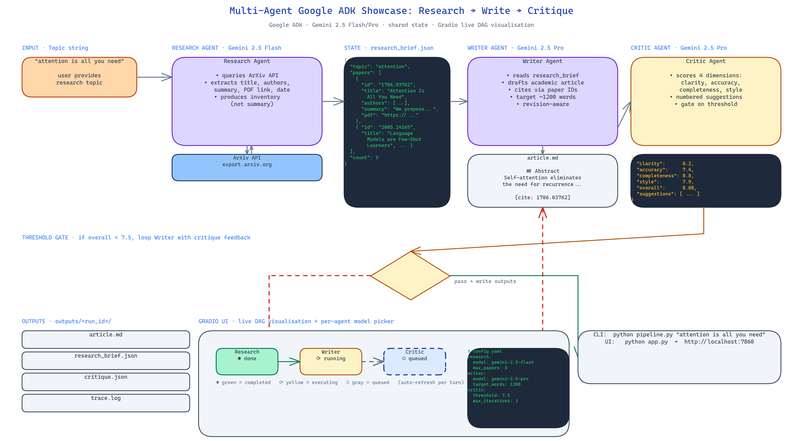

# Multi-Agent Google ADK Showcase: Research → Write → Critique with Live DAG Visualisation

[](https://github.com/dakshjain-1616/-Multi-Agent-Google-ADK-Showcase)



## The Problem

> Google's Agent Development Kit comes with a reference counter example and not much else. If you want to build a real multi-agent pipeline — agents that pass structured state, gate each other on thresholds, route between specialised roles — you are on your own. The official docs tell you what the primitives are. They do not tell you what a production pipeline looks like.

NEO built this showcase to close that gap. A three-agent research pipeline that takes a topic and produces a cited article, a structured research brief, a quality critique, and full execution logs — all orchestrated through ADK's native primitives.

## Three Agents, One Shared State

The pipeline implements a **gather → generate → critique → revise** pattern. Each agent has a single responsibility and a strict output contract:

**Research Agent** queries ArXiv for the topic, pulls metadata — titles, authors, summaries, PDF links, publication dates — and condenses them into a structured research brief (JSON). It does not summarise the field. It produces an inventory that the Writer can cite against.

**Writer Agent** consumes the research brief and drafts an academic article. Citations reference the brief's paper IDs directly, so there is a hard mapping from claim to source. Length and style are configurable.

**Critic Agent** evaluates the draft across four dimensions: clarity, accuracy, completeness, and style. It produces a score per dimension and a numbered list of actionable improvements — not free-form commentary.

If the critique score drops below the configured threshold, the Writer runs again with the critique fed in as revision context. If the score passes, the pipeline exits and writes final artifacts to `outputs/`.

## Live DAG Visualisation

The Gradio UI renders the agent DAG as it executes. Nodes light up as they start. Edges highlight as state passes between them. Failed nodes render in red. This sounds cosmetic — it is not. When you are debugging a multi-agent system, knowing which agent is running *right now* and what state it received is the difference between "this hangs for 60 seconds" and "the Research Agent is waiting on ArXiv, here is the query it sent".

The UI also exposes per-agent model selection. You might run the Research Agent on a cheap model (it is mostly formatting ArXiv responses), the Writer on a stronger model, and the Critic on an even stronger model. Cost scales to the task, not to the worst-case agent.

## State Passing Without Information Loss

ADK's primitive for inter-agent communication is shared state. The showcase uses this directly — no custom serialisation layer, no homegrown message bus. The research brief lands in state. The Writer reads it from state. The draft lands in state. The Critic reads it from state. This matters because it means any agent can be swapped out without touching the others; the contract is the shape of the state keys, not a bespoke API.

## Configuration

Everything lives in `config.yaml`:

```yaml
research:
  model: "gemini-2.5-flash"
  max_papers: 5

writer:
  model: "gemini-2.5-pro"
  target_words: 1200

critic:
  model: "gemini-2.5-pro"
  threshold: 7.5
  max_iterations: 3
```

Two entry points:

```bash
python pipeline.py "attention is all you need"   # CLI
python app.py                                     # Gradio UI at localhost:7860
```

Outputs land in `outputs/<run_id>/`: `article.md`, `research_brief.json`, `critique.json`, `trace.log`.

## How to Build This with NEO

Open NEO in VS Code or Cursor and describe what you want to build. A good starting prompt for this project:

> "Build a three-agent research pipeline on Google's Agent Development Kit. Agent one queries ArXiv and produces a structured research brief as JSON. Agent two drafts an academic article citing the brief. Agent three critiques the draft on clarity, accuracy, completeness, and style with numbered improvement suggestions. Gate the pipeline on a critique threshold and loop the Writer if below threshold. Support per-agent model selection via config.yaml. Render the agent DAG live in Gradio so node activation and state passing are visible during execution. Write artifacts to outputs/: article.md, research_brief.json, critique.json."

<a href="https://heyneo.com/dashboard?section=new-chat&prompt=Build%20a%20three-agent%20research%20pipeline%20on%20Google%27s%20Agent%20Development%20Kit.%20Agent%20one%20queries%20ArXiv%20and%20produces%20a%20structured%20research%20brief%20as%20JSON.%20Agent%20two%20drafts%20an%20academic%20article%20citing%20the%20brief.%20Agent%20three%20critiques%20the%20draft%20on%20clarity%2C%20accuracy%2C%20completeness%2C%20and%20style%20with%20numbered%20improvement%20suggestions.%20Gate%20the%20pipeline%20on%20a%20critique%20threshold%20and%20loop%20the%20Writer%20if%20below%20threshold.%20Support%20per-agent%20model%20selection%20via%20config.yaml.%20Render%20the%20agent%20DAG%20live%20in%20Gradio%20so%20node%20activation%20and%20state%20passing%20are%20visible%20during%20execution." style="display:inline-block;background:#1e40af;color:#ffffff;padding:10px 22px;border-radius:6px;text-decoration:none;font-weight:600;font-size:14px;">Build with NEO →</a>

NEO scaffolds the ADK agent definitions, the Gradio UI, and the config loader. From there you iterate — swap ArXiv for Semantic Scholar, add a fourth agent for fact-checking, or extend the critic with a domain-specific rubric.

NEO built a working Google ADK multi-agent pipeline with live DAG visualisation, structured state passing, and threshold-gated revision loops. See what else NEO ships at [heyneo.com](https://heyneo.com/).

---

## Try NEO in Your IDE

Install the NEO extension to bring AI-powered development directly into your workflow:

- **VS Code**: [NEO in VS Code](https://marketplace.visualstudio.com/items?itemName=NeoResearchInc.heyneo)
- **Cursor**: <a href="cursor://extension/NeoResearchInc.heyneo" style="color:#0066FF;font-weight:bold;">Install NEO for Cursor →</a>

---
