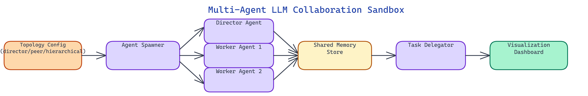

# Multi-Agent LLM Collaboration Sandbox: Experimenting With Agent Topologies at Scale

[](https://github.com/dakshjain-1616/-Multi-Agent-LLM-Collaboration-Sandbox)



## The Problem

> Multi-agent LLM research moves fast, but testing new collaboration patterns is slow. Setting up isolated agent environments, wiring message buses, implementing shared memory, and building visualization tooling takes days of scaffolding before any actual experimentation begins. Most teams end up with one-off scripts that are hard to modify or compare, making it nearly impossible to run controlled experiments across different agent topologies.

NEO built the Multi-Agent LLM Collaboration Sandbox to change that — a batteries-included environment that implements the three canonical multi-agent topologies out of the box, with built-in message passing, shared memory, and real-time communication visualization.

## The Three Topologies

The sandbox ships with three topology implementations, each representing a fundamentally different model of how agents relate to and communicate with each other.

**Director-Worker** is the most common production pattern. A single director agent receives a high-level task, decomposes it into subtasks, and dispatches each subtask to a pool of worker agents. Workers execute in parallel, report results back to the director, and the director synthesizes a final response. The director is stateful across the workflow; workers are typically stateless and interchangeable. This topology excels at tasks with natural decomposition: research pipelines, code review across multiple files, parallel data extraction jobs.

**Peer-to-Peer** topology removes the hierarchy entirely. Each agent in the network can send messages to any other agent and may respond to messages from any peer. Agents form emergent consensus by iterative exchange rather than top-down coordination. This topology is appropriate for tasks where no single agent should have privileged authority — debate, multi-perspective analysis, or distributed reasoning problems where you want to stress-test a conclusion across multiple independent reasoners.

**Hierarchical** topology generalizes the director-worker pattern to multiple levels. A root orchestrator delegates to mid-level coordinators, each of which manages its own pool of specialist workers. Sub-problems that require specialized domain knowledge go to the appropriate branch of the hierarchy. Deep research tasks, complex software engineering workflows, and enterprise automation pipelines often require this structure because no single agent has the context or capability to handle every subtask.

## Message Passing and Communication Infrastructure

Every agent in the sandbox communicates through a structured message bus rather than direct function calls. Messages carry a typed envelope: sender ID, recipient ID or broadcast target, message type (task, result, query, acknowledgement, error), payload, and a correlation ID for tracing request-response chains.

The message bus supports three delivery modes. Unicast delivers a message to a single named agent. Broadcast delivers to all agents in a topology group. Topic-based pubsub delivers to all agents subscribed to a named channel — useful for shared observation of system state without tight coupling between agents.

Message ordering is preserved per sender-receiver pair. If agent A sends three messages to agent B, they arrive in order. Across different senders, ordering is not guaranteed, which mirrors real distributed systems behavior and forces agent designs to be robust to out-of-order arrivals.

The sandbox includes a message inspector that logs every message with its full envelope and payload, indexed by correlation ID. Reconstructing the complete conversation history of a multi-agent run is a one-liner: query by task ID and all exchanges unfold in chronological order.

## Shared Memory Architecture

Agents in multi-agent systems need varying degrees of memory sharing. The sandbox implements three memory tiers.

**Private memory** is per-agent and invisible to other agents. Each agent maintains its own conversation buffer, tool outputs, and working notes. This tier handles agent-local state that should not be exposed to the broader system.

**Shared working memory** is a key-value store accessible to all agents within a topology instance. Agents read and write named slots. A coordinator can post a decomposed task plan to shared memory; workers read their assigned subtasks from it. This avoids the overhead of including the full plan in every task message and keeps agents synchronized on the current world state.

**Persistent memory** uses a vector store backend. Agents can write embeddings of important findings, retrieved facts, or intermediate conclusions and later query the store by semantic similarity. This is the mechanism that enables long-horizon multi-agent workflows where later agents need to build on the work of earlier ones without the full history fitting in a context window.

## Real-Time Visualization

The sandbox renders agent communication as a live animated graph. Each agent appears as a node. Messages in flight appear as animated edges between nodes. Node color encodes agent state: idle (gray), processing (blue), waiting for response (yellow), error (red), complete (green).

The timeline at the bottom of the visualization shows the temporal structure of message exchange. Each agent's activity appears as a horizontal bar with message send and receive events marked as ticks. Clicking any tick shows the full message content. This makes it immediately obvious where bottlenecks occur, which agents are idle while others are saturated, and where error cascades originate.

The visualization is not just for debugging. It is the primary way to understand whether a new topology design has the collaboration structure you intended. Run it once and the communication graph either matches your mental model or it reveals a flaw in the agent instructions.

## Running Experiments

The sandbox is configured via YAML. You specify the topology type, the agent count per role, the LLM backend for each agent role, the task, and the memory configuration. Running two experiments with different topologies against the same task is as simple as changing the `topology:` field and rerunning.

The results logger records the final output, total token usage per agent, wall-clock time, message count, and any errors. For systematic comparisons, a batch runner accepts a list of experiment configurations and runs them sequentially, writing a CSV of results. This is how you answer questions like: does a three-level hierarchy outperform a flat director-worker setup on this class of task, and does the answer change when you use a weaker model for the worker tier?

## How to Build This with NEO

Open NEO in VS Code or Cursor and describe what you want to build. A good starting prompt for this project:

> "Build a Python multi-agent LLM sandbox with three topology implementations: director-worker (director decomposes tasks, dispatches to parallel workers, synthesizes results), peer-to-peer (agents communicate freely with any peer for emergent consensus), and hierarchical (multi-level delegation with specialist worker pools). Wire agents through a typed message bus supporting unicast, broadcast, and topic pubsub delivery modes with message ordering preserved per sender-receiver pair. Implement three memory tiers: private per-agent, shared key-value working memory, and persistent ChromaDB vector store. Add a real-time visualization at localhost:8080 that renders agents as nodes, messages in flight as animated edges, and agent state as node color. Drive experiments via YAML config files."

<a href="https://heyneo.com/dashboard?section=new-chat&prompt=Build%20a%20Python%20multi-agent%20LLM%20sandbox%20with%20three%20topology%20implementations%3A%20director-worker%20%28director%20decomposes%20tasks%2C%20dispatches%20to%20parallel%20workers%2C%20synthesizes%20results%29%2C%20peer-to-peer%20%28agents%20communicate%20freely%20with%20any%20peer%20for%20emergent%20consensus%29%2C%20and%20hierarchical%20%28multi-level%20delegation%20with%20specialist%20worker%20pools%29.%20Wire%20agents%20through%20a%20typed%20message%20bus%20supporting%20unicast%2C%20broadcast%2C%20and%20topic%20pubsub%20delivery%20modes%20with%20message%20ordering%20preserved%20per%20sender-receiver%20pair.%20Implement%20three%20memory%20tiers%3A%20private%20per-agent%2C%20shared%20key-value%20working%20memory%2C%20and%20persistent%20ChromaDB%20vector%20store.%20Add%20a%20real-time%20visualization%20at%20localhost%3A8080%20that%20renders%20agents%20as%20nodes%2C%20messages%20in%20flight%20as%20animated%20edges%2C%20and%20agent%20state%20as%20node%20color.%20Drive%20experiments%20via%20YAML%20config%20files." style="display:inline-block;background:#1e40af;color:#ffffff;padding:10px 22px;border-radius:6px;text-decoration:none;font-weight:600;font-size:14px;">Build with NEO →</a>

NEO generates the project structure and core implementation. From there you iterate: ask it to implement the typed message envelope with correlation IDs for request-response tracing, add the three memory tier implementations with ChromaDB for the persistent vector store, or build the real-time visualization with animated message edges and a timeline showing per-agent activity. Each follow-up builds on what's already there.

To run the finished project:

```bash
git clone https://github.com/dakshjain-1616/-Multi-Agent-LLM-Collaboration-Sandbox
cd -Multi-Agent-LLM-Collaboration-Sandbox
pip install -r requirements.txt
export OPENROUTER_API_KEY=sk-or-...
python sandbox.py --config experiments/director_worker_research.yaml
```

Start with the director-worker topology to see task decomposition and parallel worker execution, then change `topology: peer-to-peer` in the YAML and rerun the same task to compare how emergent consensus differs from top-down coordination.

NEO built the Multi-Agent LLM Collaboration Sandbox so that experimenting with agent topologies takes hours instead of weeks. Topology selection, message passing, shared memory, and visualization all come pre-built. See what else NEO ships at [heyneo.com](https://heyneo.com/).
---

## Try NEO in Your IDE

Install the NEO extension to bring AI-powered development directly into your workflow:

- **VS Code**: [NEO in VS Code](https://marketplace.visualstudio.com/items?itemName=NeoResearchInc.heyneo)
- **Cursor**: <a href="cursor://extension/NeoResearchInc.heyneo" style="color:#0066FF;font-weight:bold;">Install NEO for Cursor →</a>

---
