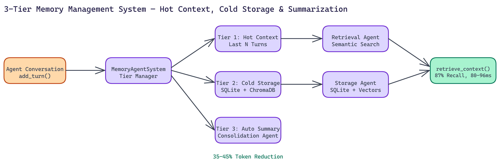

# 3-Tier Memory for LLM Agents: 35-45% Token Reduction Without Losing Context

[](https://github.com/abhishekgandhi-neo/Multi-Agent_Memory_Management_System_BY_NEO)



## The Problem

> Context windows are finite and LLMs forget. The naive fix is truncation — keep the last N turns, discard the rest. Simple to implement, terrible in practice: the information you discard might be exactly what the agent needs three steps later. The other naive fix is dumping everything into context, which works until costs spike, latency climbs, and you hit the context limit anyway. There's no good off-the-shelf solution between these two extremes.

NEO autonomously built the Multi-Agent Memory Management System to find a better path. The result is a 3-tier memory architecture that cuts token usage by **35 to 45 percent** while maintaining **87% semantic recall accuracy** across **25-turn conversations**.

## The 3-Tier Architecture

**Hot context** holds the last N conversation turns in full fidelity. This is always-present, always-accurate, zero-retrieval-cost memory. Recent exchanges stay exactly as they happened.

**Cold storage** is a SQLite + ChromaDB backed store for older conversation history. Rather than discarding past turns, the system embeds them as vectors and persists them. When the agent needs something from earlier in the conversation, semantic search retrieves it in **80 to 96 milliseconds**.

**Automatic summarization** bridges the two. When conversation history exceeds a threshold, the Consolidation Agent generates a compressed summary and stores it in cold storage. The full verbatim text isn't needed, but the semantic content is preserved and retrievable.

Three autonomous agents manage these tiers:

The **Retrieval Agent** handles semantic search against cold storage. It interprets the current query, searches the vector index, and returns relevant historical context to be injected into the hot context window.

The **Consolidation Agent** monitors conversation length and triggers summarization when thresholds are hit. It decides what to summarize, generates the summary, and coordinates the storage operation.

The **Storage Agent** manages the persistence layer. SQLite holds structured conversation metadata. ChromaDB holds the vector embeddings. The Storage Agent keeps these synchronized and handles the mechanics of reads and writes.

## Why This Works Better Than Alternatives

Simple truncation loses information permanently. This approach never discards anything; it changes how information is stored and accessed. The efficiency gain comes from not loading every historical turn into the context window on every request. You load what's relevant.

The 87% semantic recall figure comes from benchmarks across 50 simulated 25-turn conversations. NEO measured whether the system could retrieve relevant past context when needed. 87% accuracy with sub-100ms retrieval latency is competitive with much more complex retrieval-augmented generation setups.

The 35 to 45 percent token reduction means real cost savings at scale. If you're running thousands of agent sessions per day, cutting token consumption by 40% cuts your inference costs by roughly the same amount.

## Fully Local, No Cloud Dependency

The entire system runs locally. No external API calls for memory storage or retrieval. SQLite and ChromaDB are both embedded databases, meaning no database server to manage. The system runs on any machine that can run Python 3.12.

For development and testing, there's a mock mode that works without any API keys at all. You can validate the memory architecture and run benchmarks before connecting to a real LLM provider.

## Performance at a Glance

From NEO's benchmark suite across **50 simulated conversations**:

- **Average retrieval latency: 80 to 96ms**
- **Semantic recall accuracy: ~87%**
- **Token reduction versus naive full-history approach: 35 to 45%**
- Summarization trigger: configurable conversation length threshold

The benchmark suite is included in the repository. Run it yourself to see how the system performs on your hardware and with your specific conversation patterns.

## Getting Started

The `MemoryAgentSystem` class is the main entry point. It handles tier management, agent coordination, and the interface between your application and the memory stack.

```python
from memory_system import MemoryAgentSystem

memory = MemoryAgentSystem(session_id="user_123")

# Add turns as they happen
await memory.add_turn(role="user", content="What was the dataset we discussed earlier?")

# Retrieve relevant context before generating a response
context = await memory.retrieve_context(query="dataset discussed earlier")

# Per-session metrics
stats = memory.get_session_stats()
print(f"Token savings: {stats.token_reduction_percent}%")
```

The smoke test script gets you running immediately. The benchmark script gives you detailed performance metrics across simulated workloads.

## Where This Makes the Most Difference

Long-running agent sessions are the obvious target. Customer support bots, research assistants, coding agents with long project contexts, and any workflow where a session spans dozens or hundreds of turns all benefit directly.

It's also valuable for multi-session systems where a user interacts with an agent across multiple days or weeks. Persistent cold storage means the agent can recall relevant context from previous sessions without bloating every new conversation with historical data.

NEO built a 3-tier memory management system for LLM agents where semantic retrieval from cold storage replaces naive truncation, cutting token usage by 35–45% while maintaining 87% recall accuracy. See what else NEO ships at [heyneo.so](https://heyneo.so/).

---

## Try NEO in Your IDE

Install the NEO extension to bring AI-powered development directly into your workflow:

- **VS Code**: [NEO in VS Code](https://marketplace.visualstudio.com/items?itemName=NeoResearchInc.heyneo)
- **Cursor**: <a href="cursor://extension/NeoResearchInc.heyneo" style="color:#0066FF;font-weight:bold;">Install NEO for Cursor →</a>

---
