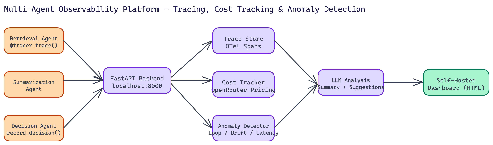

# Multi-Agent Observability: Tracing, Cost Tracking, and Anomaly Detection for AI Workflows

[](https://github.com/abhishekgandhi-neo/MultiAgent_Observability_Platform_by_NEO)



## The Problem

> You can't debug what you can't see. In multi-agent AI workflows, a chain of model calls, tool invocations, and decision branches can produce an output you don't trust with no clear way to understand why. Standard observability tools weren't designed for this — Datadog tracks infrastructure, Prometheus tracks metrics, but neither tells you that your retrieval agent looped **47 times**, or that your summarization step cost **$2.80** on a query that should have cost **$0.04**.

NEO autonomously built the Multi-Agent Observability Platform to fill that gap. It's self-hosted, production-ready, and designed specifically for the failure modes that show up in agent-based AI systems.

## What This Platform Tracks

The platform captures four categories of data that matter for multi-agent debugging.

**Agent traces**: Full execution traces across all agents in a workflow, compatible with OpenTelemetry standards. You get step-by-step reconstruction of what happened, in what order, with what inputs and outputs. Timeline visualization shows you where time was spent and where agents handed off to each other.

**Cost tracking**: Real-time cost calculations per agent, per session, and per workflow run. Costs are computed against OpenRouter's model pricing and updated continuously. When a workflow runs $10 over budget, you know which agent and which model caused it.

**Anomaly detection**: This is where the platform goes beyond metrics dashboards. The platform detects specific failure patterns common in agent workflows: infinite loops where an agent calls itself or a peer repeatedly without making progress, performance degradation where latency spikes beyond expected bounds, and decision drift where an agent's outputs stop correlating with its inputs.

**LLM-generated analysis**: Raw metrics are useful, but interpreting them takes time. The platform uses an LLM to generate natural-language workflow summaries and optimization suggestions. Instead of reading 200 rows of trace data, you get a paragraph explaining what happened and what to investigate.

## The Technical Setup

The backend runs on FastAPI with Uvicorn, chosen for async performance under concurrent trace ingestion from multiple agents running in parallel. Pydantic handles schema validation for all ingested data.

Setup involves cloning the repo, installing dependencies, setting your OpenRouter API key in `.env`, and starting the backend on localhost:8000. The dashboard is a self-contained HTML file that connects to the backend. No cloud account required, no vendor dependency.

```python
from observability_sdk import AgentTracer

tracer = AgentTracer(backend_url="http://localhost:8000")

@tracer.trace(agent_name="retrieval_agent")
async def retrieve_context(query: str) -> list[str]:
    # your retrieval logic
    decision = await make_retrieval_decision(query)
    tracer.record_decision(
        condition="relevance_threshold",
        rationale=f"Selected {len(decision.results)} chunks above 0.75 similarity"
    )
    return decision.results
```

The decorator pattern makes instrumentation lightweight. Add a decorator and a few `record_decision` calls, and the rest happens automatically.

## The API Surface

The backend exposes endpoints for everything you'd need to build dashboards or integrate with external tools:

- Message ingestion for agent-to-agent communications
- Decision recording with conditions and rationale
- Trace retrieval by session ID or time range
- Anomaly detection queries
- Optimization suggestion generation
- Cost summaries by agent, model, or session
- Full session replay for post-mortem analysis

Loop detection thresholds and model pricing are configurable, so you can tune sensitivity to your specific workflows.

## Why Self-Hosted Matters

Most observability SaaS products want your data on their servers. For AI workflows that process proprietary content, customer data, or sensitive business logic, that's a problem. Self-hosted means your traces, your costs, and your model interactions stay on your infrastructure.

It also means you control the retention policy, the access model, and the integration points. You can feed trace data into your existing data warehouse, trigger alerts through your existing on-call system, or extend the platform with custom anomaly detectors for your specific workflow patterns.

## Real-World Applications

This platform is most valuable during two phases of the agent development lifecycle.

During development, it helps you understand whether your agent graph is actually doing what you designed. Loops and unexpected decision patterns show up immediately in the anomaly feed. Cost tracking prevents runaway experiments.

In production, it gives you the visibility to catch degradation before users notice. If retrieval quality drops, latency climbs, or costs spike, you'll know before it compounds into a larger problem.

Teams building customer-facing AI products, internal automation workflows, or complex research pipelines have all found value here. Anywhere you're running more than one agent in a coordinated system, observability pays for itself quickly.

NEO built a self-hosted multi-agent observability platform where OpenTelemetry-compatible tracing, real-time cost tracking, and LLM-powered anomaly detection give teams visibility into agent workflows that standard infrastructure tools simply cannot provide. See what else NEO ships at [heyneo.so](https://heyneo.so/).

---

## Try NEO in Your IDE

Install the NEO extension to bring AI-powered development directly into your workflow:

- **VS Code**: [NEO in VS Code](https://marketplace.visualstudio.com/items?itemName=NeoResearchInc.heyneo)
- **Cursor**: <a href="cursor://extension/NeoResearchInc.heyneo" style="color:#0066FF;font-weight:bold;">Install NEO for Cursor →</a>

---
