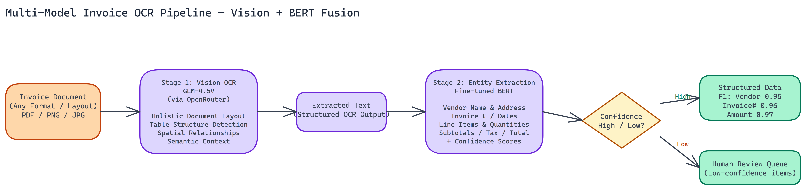

# Building a Multi-Model Invoice OCR Pipeline with Vision Transformers and BERT

[](https://github.com/dakshjain-1616/Multi-Model-Invoice-OCR-Pipeline)



## The Problem

> Invoice processing sounds simple until you're staring at 50 different invoice formats from 50 different vendors, each with its own layout quirks. Template-based systems break almost immediately. Rule-based parsers require constant maintenance. Standard OCR tools read text fine — but "April 15, 2024" could be an invoice date, a due date, or a service period, and "$4,200.00" could be a subtotal, a line item, or a total. Without structure-aware extraction, you're left doing post-processing guesswork on financial data where errors have real consequences.

NEO built a two-stage pipeline that fuses vision-based OCR with specialized entity extraction, and the results are strong enough for production.

## Two-Stage Architecture

The pipeline operates in two sequential stages, each specialized for a different kind of understanding.

### Stage 1: Vision-Based Text Extraction with GLM-4.5V

The pipeline uses GLM-4.5V via OpenRouter for the initial OCR pass. Unlike traditional OCR engines, vision transformers process the entire document layout holistically. They capture spatial relationships between elements, understand table structures, and maintain document semantics during extraction.

This matters because an invoice isn't just a list of text tokens. The proximity of a number to a label, the visual hierarchy of sections, the grouping of line items in a table: all of these carry meaning. GLM-4.5V handles this naturally.

OpenRouter's pricing model keeps costs reasonable for high-volume processing, which is important when you're running this against thousands of invoices per month.

### Stage 2: Entity Classification with Fine-Tuned BERT

Raw extracted text still needs to be mapped to structured fields. NEO fine-tuned a BERT model specifically for invoice entity recognition, training it to classify and extract:

- Vendor name and address
- Invoice number and date
- Due date and payment terms
- Line item descriptions, quantities, and unit prices
- Subtotals, taxes, and total amounts

Beyond classification, the model outputs a confidence score for each identified field. This is critical for production systems. You want to know when the model is uncertain so you can route those documents to a human reviewer rather than silently producing bad data.

## Performance on Real Invoice Data

NEO benchmarked the pipeline across a diverse set of invoice samples covering different industries, layouts, and document quality levels. The results:

- **Vendor identification: 0.95 F1-score**
- **Invoice number extraction: 0.96 F1-score**
- **Amount extraction: 0.97 F1-score**

The amount extraction score is particularly meaningful because financial accuracy is non-negotiable. Getting a total amount wrong cascades into accounting errors.

## Why Multi-Model Fusion Works Here

Single-model approaches force a trade-off: great OCR with mediocre entity understanding, or a large multimodal model that handles everything but costs more to run and is harder to fine-tune.

The two-stage design lets each model do what it does best. GLM-4.5V handles the visual complexity of document understanding. The fine-tuned BERT handles domain-specific semantic classification. You can also swap out either component independently if a better model emerges for one of the stages.

## Practical Deployment

The pipeline ships with a single entry point: `run_project.py`. It handles dependency verification, downloads the required model weights, processes sample invoices, and writes structured results. Setup takes about ten minutes and works out of the box.

Requirements are minimal: Python 3.10+, an OpenRouter API key (available free at openrouter.ai), and the BERT model weights. The API key is the only ongoing cost, and it's priced per token rather than per document.

## Use Cases Beyond Invoice Processing

The same architecture works for any structured document extraction task: purchase orders, receipts, contracts, shipping manifests. If the document type has consistent field semantics even when layouts vary, this two-stage approach handles it well.

NEO has also applied variations of this pipeline to expense report processing, customs documentation, and vendor statement reconciliation.

## What's Next

The natural extension is a feedback loop where corrected extractions from human reviewers feed back into the fine-tuning dataset. Over time, the BERT model improves on the specific document types your organization processes most often.

NEO is also experimenting with streaming outputs so that partial results are available before the full pipeline completes, useful for interactive applications where users want to see extraction in progress.

---

## How to Build This

Clone the repo and install dependencies:

```bash
git clone https://github.com/dakshjain-1616/Multi-Model-Invoice-OCR-Pipeline
cd Multi-Model-Invoice-OCR-Pipeline
pip install -r requirements.txt
```

You need Python 3.10 or later. The pipeline uses GLM-4.5V via OpenRouter for the vision stage, so set your API key in a `.env` file:

```bash
OPENROUTER_API_KEY=sk-or-...
```

The BERT model weights are downloaded automatically on first run. Run the entry point script against the included sample invoices:

```bash
python run_project.py
```

The script verifies dependencies, downloads model weights if needed, processes the sample invoices in the `samples/` directory, and writes structured JSON results to `results/`. Each output file contains the extracted fields (vendor name, invoice number, date, line items, totals) alongside a confidence score per field. Fields with confidence below the threshold are flagged for human review rather than passed downstream silently.

For a single invoice, you can call the pipeline directly:

```python
from pipeline import InvoicePipeline

pipeline = InvoicePipeline()
result = pipeline.process("invoice.pdf")
print(result.to_json())
```

Total setup takes about ten minutes, most of which is downloading the BERT weights on first run.

NEO built a multi-model invoice OCR pipeline where GLM-4.5V vision understanding and fine-tuned BERT entity extraction combine to achieve 95%+ accuracy across any invoice format, with confidence scores that flag uncertain extractions rather than passing bad data downstream. See what else NEO ships at [heyneo.so](https://heyneo.so/).

---

## Try NEO in Your IDE

Install the NEO extension to bring AI-powered development directly into your workflow:

- **VS Code**: [NEO in VS Code](https://marketplace.visualstudio.com/items?itemName=NeoResearchInc.heyneo)
- **Cursor**: <a href="cursor://extension/NeoResearchInc.heyneo" style="color:#0066FF;font-weight:bold;">Install NEO for Cursor →</a>

---
