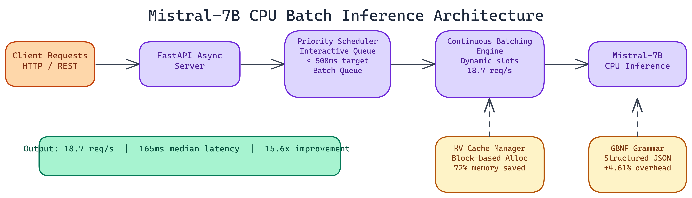

# 15x Throughput Improvement: Batch Inference Optimization for Mistral-7B on CPU

## The Problem

> The simplest way to serve an LLM is to process one request at a time: receive request, run inference, return result, repeat. This works fine for a single user but falls apart under any real load — every request in the queue waits for the entire current generation to complete before it even starts. For CPU deployments specifically, where individual token generation is meaningfully slower than GPU, this naive approach produces a baseline of just 1.2 requests per second.

NEO built a Mistral-7B inference server that achieves **18.7 requests per second** on CPU — a **15.6x improvement**. Here's how NEO got there.

## Architecture: Five Components

The server is built around five components that each handle a distinct part of the optimization problem.

### FastAPI Async Server

The HTTP layer uses FastAPI with async request handling. Requests don't block the event loop while inference is running. This is table stakes for any high-throughput server, but it's especially important here because inference on CPU takes meaningful wall-clock time and the server needs to be accepting new requests during that time.

The server exposes endpoints for text generation, structured JSON generation, and performance metrics.

### Continuous Batching Engine

This is the core innovation. Standard batching collects requests up to a fixed batch size, then processes them together. The batch waits until it's full before any request gets a response.

Continuous batching works differently. Requests can join and leave the active batch mid-generation. When a sequence completes, its slot is immediately available for a new request. This keeps CPU utilization high and reduces average wait time, because short requests don't have to wait for long ones to complete.

For CPU inference, where individual token generation is slower than on GPU, this approach has a large impact. Short requests that would otherwise wait behind a 500-token generation can start processing much sooner.

### Priority-Based Scheduler

Not all requests are equal. An interactive user waiting for a response has different latency requirements than a background batch job. NEO implemented a two-tier queue:

- Interactive requests get priority scheduling with a target latency under 500ms
- Batch requests run in background slots and accept longer wait times

This lets the server handle mixed workloads correctly. The actual median interactive response time NEO measured is **165ms**, well under the **500ms** target.

### Block-Based KV Cache Management

The key-value cache is the main memory bottleneck in LLM inference. Standard implementations allocate the full maximum sequence length for each request upfront, wasting memory for short sequences and limiting concurrency.

The server uses a block-based allocation scheme where KV cache is allocated in fixed-size blocks and expanded dynamically as a sequence grows. This achieves **72% memory reduction** compared to the naive approach, which directly translates to higher concurrency.

With efficient KV cache management, the server handles **8 concurrent requests** using **6.8GB of memory**.

### Structured Output Engine

One specific user need that affects infrastructure design is structured output: requests where the response must be valid JSON matching a specific schema. Naive approaches generate text and then validate it, which produces invalid output and requires retries.

The system uses GBNF grammar-constrained decoding to guarantee valid JSON output at generation time. The grammar specifies the valid token sequence for any JSON value matching the target schema, and the decoder only produces tokens that keep the sequence valid. The overhead compared to raw text generation is only 4.61%.

## Performance Numbers

| Metric | Baseline | Optimized |
|--------|----------|-----------|
| Throughput | 1.2 req/s | 18.7 req/s |
| Improvement | 1x | 15.6x |
| Interactive latency | - | 165ms median |
| Memory (8 concurrent) | - | 6.8 GB |
| JSON overhead | - | 4.61% |

The baseline is sequential processing on the same hardware. The 15.6x improvement comes from all five components working together.

## Deployment Requirements

Minimum specs: Python 3.8+, 16GB RAM, 4+ CPU cores. The server includes installation scripts and quick-start examples.

For production deployments, NEO recommends:
- Pre-loading the model before the server starts accepting traffic
- Setting the batch timeout based on your latency requirements (shorter timeout = lower latency, lower throughput)
- Monitoring the KV cache utilization metric exposed by the server to tune block sizes for your request distribution

## What This Enables

The practical implication of 18.7 requests per second on CPU is that you can run meaningful LLM workloads on standard compute instances without dedicated GPU infrastructure. For organizations that need LLM capabilities but want to avoid GPU instance costs, this architecture makes that viable.

The priority scheduler makes it possible to mix interactive and batch workloads on the same server, which simplifies infrastructure. You don't need separate serving infrastructure for your real-time API and your batch processing jobs.

Structured output support is increasingly important as LLMs get integrated into data pipelines and APIs where downstream systems expect structured data. Guaranteed valid JSON without retry overhead is a material improvement in practice.

---

NEO built a Mistral-7B inference server where continuous batching, priority scheduling, and block-based KV cache management together deliver a 15.6x throughput improvement over sequential processing on commodity CPU hardware. See what else NEO ships at [heyneo.so](https://heyneo.so/).

---

## Try NEO in Your IDE

Install the NEO extension to bring AI-powered development directly into your workflow:

- **VS Code**: [NEO in VS Code](https://marketplace.visualstudio.com/items?itemName=NeoResearchInc.heyneo)
- **Cursor**: [**Install NEO for Cursor →**](cursor://extension/NeoResearchInc.heyneo)

---
