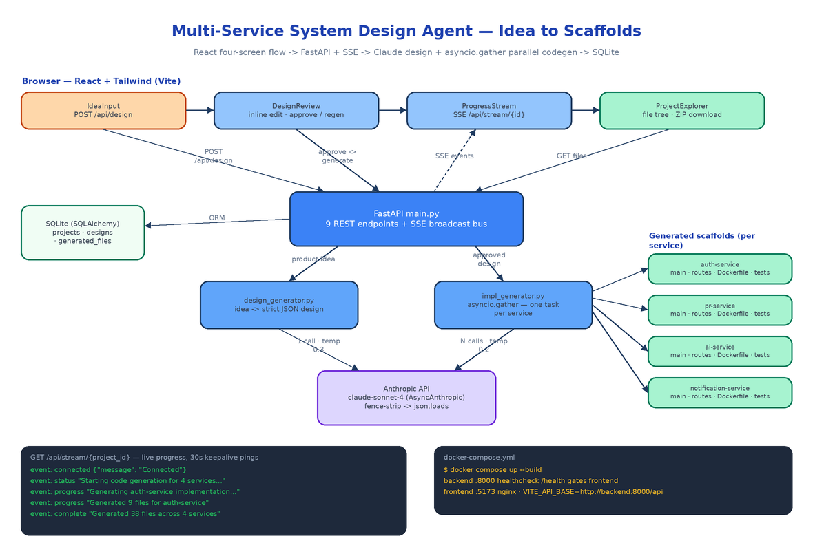

# Multi-Service System Design Agent: From a One-Sentence Idea to Generated Microservice Scaffolds

[](https://github.com/dakshjain-1616/Multi-Service-System-Design-Implementation-Agent)



## The Problem

> The whiteboard session goes well. Six services, clean boundaries, everyone nods. Then someone has to turn the photo of the whiteboard into actual repos — and the next two days disappear into `mkdir`, copy-pasted Dockerfiles, FastAPI boilerplate that is 90% identical across services, and a `docker-compose.yml` that nobody enjoys writing. By the time the first endpoint returns JSON, half the design decisions are already drifting from what was on the board.

The gap between "we know what we want to build" and "there is code to iterate on" is mostly mechanical work, and mechanical work is what LLMs are good at — if you put a human checkpoint in the right place. The Multi-Service System Design Agent is a web app that does exactly that: you type a product idea, Claude produces a structured system design, you review and edit it in the browser, and on approval the backend fans out one Claude call per service in parallel and streams scaffold generation progress back over Server-Sent Events. At the end you browse every generated file in a tree explorer and download the whole project as a ZIP.

## Four Screens, One State Machine

The React frontend (`App.tsx`) is a small state machine with four page states: `input → review → generating → explore`. Each state maps to one component and a specific slice of the API.

**IdeaInput** is a text area. Submitting it calls `POST /api/design`, which creates a `Project` row, sets its status to `generating_design`, and calls Claude.

**DesignReview** renders the returned design as collapsible sections — overview, architecture pattern, per-service definitions, data flow, deployment, security, scalability — each in a `<textarea>` you can edit directly. Two buttons: approve, or regenerate with your edits via `POST /api/design/approve` with `action: "regen"`.

**ProgressStream** opens an `EventSource` to `GET /api/stream/{project_id}` and renders generation events as they arrive. A deliberate ordering detail in `App.tsx`: the page transitions to `generating` *before* firing `POST /api/generate`, and the generate call is fire-and-forget — so the SSE subscription exists before the backend emits its first event, and no progress is lost.

**ProjectExplorer** fetches `GET /api/projects/{id}/files`, renders a file tree grouped by service with syntax highlighting, and builds the ZIP download client-side.

## Design Generation: Forcing Claude into a Schema

`backend/services/design_generator.py` is the first Claude integration. The system prompt pins the model to an exact JSON shape — `title`, `overview`, `architecture.pattern`, a `services` array where every service carries `name`, `language`, `framework`, `dependencies`, `api_endpoints`, `database_tables`, and `external_integrations`, plus `data_flow`, `deployment`, `api_gateway`, `security`, and `scalability` — and ends with "Output ONLY valid JSON. No markdown fences, no extra text."

Models do not always listen to that last line, so the parser defends itself: it strips leading and trailing ``` fences before `json.loads`. The call runs through `AsyncAnthropic` at `temperature=0.3` with `max_tokens=4096`, defaulting to `claude-sonnet-4-20250514` (overridable via `MODEL_NAME`, with automatic OpenRouter routing when `OPENROUTER_API_KEY` is set instead of `ANTHROPIC_API_KEY`).

Error handling is typed all the way up: a missing key or unparseable response raises `ValueError`, which `main.py` maps to HTTP 400; an API failure raises `RuntimeError`, mapped to HTTP 502 with an `AI service error` detail. Rate limits and invalid keys surface as structured JSON errors, not anonymous 500s.

## A Human Checkpoint Before Any Code Exists

Nothing gets generated until a person approves the design. `POST /api/design/approve` takes one of two actions. `approve` flips `design_approved` on the project and marks the latest `Design` row approved. `regen` accepts the user-edited design JSON, stores it as a new row in the `designs` table with an incremented `version`, and resets approval — so every iteration of the design is kept, and the thing the code generator consumes is exactly the JSON the user signed off on, edits included.

`POST /api/generate` refuses to run otherwise:

```python
if not project.design_approved:
    raise HTTPException(status_code=400, detail="Design must be approved before code generation")
```

## Parallel Scaffolding with asyncio.gather

When generation starts, `main.py` extracts the `services` array from the approved design and builds one `generate_service_impl(...)` coroutine per service, then runs them all at once:

```python
results = await asyncio.gather(*tasks, return_exceptions=True)
```

A 5-service design issues 5 concurrent Claude calls, so wall-clock time is roughly the cost of one service, not five. Each call (`impl_generator.py`, `temperature=0.2`, `max_tokens=8192`) receives both the individual service definition and the full design for cross-service context, and must return a JSON array of `{file_path, content, language}` objects covering the entry point, routes, models, config, `requirements.txt`, and a Dockerfile. The validator rejects anything that is not a list or is missing one of the three keys.

The `return_exceptions=True` matters. Results are partitioned into successes and failures; failures are broadcast as SSE `error` events naming the service. If *every* service fails, the project is marked `failed` and — crucially — the previously generated files are left untouched. Only after at least one service succeeds does the endpoint delete the old `generated_files` rows and write the new scaffold. A flaky API call never wipes a working previous generation.

## Live Progress Without Polling

The SSE layer is a small in-memory event bus in `main.py`: a `dict[int, list[asyncio.Queue]]` keyed by project ID. `_broadcast` pushes `{event, data}` payloads to every subscriber queue (dropping dead full queues), and `GET /api/stream/{project_id}` subscribes a fresh queue and yields `text/event-stream` frames from it. If nothing happens for 30 seconds, the generator emits a `ping` keepalive so proxies don't kill the connection; `X-Accel-Buffering: no` keeps Nginx from buffering the stream in the Docker setup.

The generators report through a progress callback that broadcasts `progress` events, so the browser sees the actual lifecycle:

```
event: connected  {"message": "Connected"}
event: status     {"message": "Starting code generation for 5 services..."}
event: progress   {"message": "Generating auth-service implementation..."}
event: progress   {"message": "Generated 9 files for auth-service"}
event: complete   {"message": "Generated 42 files across 5 services"}
```

## The API Surface and the Data Model

Nine endpoints plus a health check cover the whole lifecycle:

| Method | Path | What it does |
|--------|------|--------------|
| POST | `/api/design` | Product idea in, structured JSON design out |
| POST | `/api/design/approve` | `approve` or `regen` with edits (versioned) |
| POST | `/api/generate` | Parallel scaffold generation for all services |
| GET | `/api/stream/{project_id}` | SSE stream of generation events |
| GET | `/api/projects` | List projects |
| GET | `/api/projects/{id}` | Project with its design |
| GET | `/api/projects/{id}/files` | All generated files |
| GET | `/api/files/{id}` | Single file content |
| GET | `/health` | Healthcheck (gates the frontend container) |

SQLAlchemy manages three tables on SQLite: `projects` (idea, status, approved design JSON), `designs` (every design version as a JSON artifact), and `generated_files` (one row per scaffold file with `service_name`, `file_path`, `content`, `language`). `init_db()` runs in the FastAPI lifespan hook, so a fresh checkout needs zero database setup. The frontend's `api/client.ts` wraps every endpoint in typed fetch helpers, with TypeScript interfaces in `types/index.ts` mirroring the backend's Pydantic schemas.

## Two Containers and a Healthcheck

`docker compose up --build` runs the whole thing. The backend builds into a slim Python container on port 8000 with a `curl -f http://localhost:8000/health` healthcheck; the frontend builds the Vite bundle into an Nginx container on 5173 and declares `depends_on: condition: service_healthy`, so the UI never comes up pointing at a backend that isn't ready. Configuration is three environment variables: `ANTHROPIC_API_KEY` (required, read only from the environment — no keys in source), `DATABASE_URL` (defaults to `sqlite:///./projects.db`), and `VITE_API_BASE` for the frontend.

The backend ships 17 pytest tests across `test_design.py` and `test_impl.py` — schema validation, error handling, markdown-fence stripping — all with mocked Claude calls, so the suite runs in under a second.

## How to Build This with NEO

Open NEO in VS Code or Cursor and describe what you want to build. A good starting prompt for this project:

> "Build a web app that turns a plain product idea into a complete multi-service system design and generated code scaffolds. FastAPI backend (Python 3.11) with nine REST endpoints plus an SSE stream: POST /api/design calls Claude via AsyncAnthropic with a system prompt that forces a strict JSON design schema (services, api_endpoints, database_tables, deployment, security); POST /api/design/approve supports approve and regen actions with design versioning; POST /api/generate fans out one Claude call per service with asyncio.gather(return_exceptions=True), validates returned {file_path, content, language} arrays, preserves old files if all services fail, and broadcasts progress over an in-memory queue bus to GET /api/stream/{project_id} with 30-second keepalive pings. Store projects, designs, and generated_files in SQLite via SQLAlchemy with init on startup. React + TypeScript + Tailwind frontend with four states: IdeaInput, DesignReview with inline-editable textareas per section, ProgressStream over EventSource, and ProjectExplorer with a file tree, syntax highlighting, and ZIP download. Ship docker-compose with a backend healthcheck gating an Nginx frontend container, keys only from environment variables, and pytest coverage with mocked Claude calls."

<a href="https://heyneo.com/dashboard?section=new-chat&prompt=Build%20a%20web%20app%20that%20turns%20a%20product%20idea%20into%20a%20multi-service%20system%20design%20and%20generated%20code%20scaffolds.%20FastAPI%20backend%20with%209%20REST%20endpoints%20plus%20SSE%20streaming%2C%20Claude%20via%20AsyncAnthropic%20for%20structured%20design%20JSON%20and%20per-service%20scaffolds%20fanned%20out%20with%20asyncio.gather%2C%20SQLite%20via%20SQLAlchemy%2C%20React%20and%20Tailwind%20frontend%20with%20idea%20input%2C%20editable%20design%20review%2C%20live%20SSE%20progress%2C%20file%20explorer%20with%20ZIP%20download%2C%20docker-compose%20with%20backend%20healthcheck%20gating%20an%20nginx%20frontend." style="display:inline-block;background:#1e40af;color:#ffffff;padding:10px 22px;border-radius:6px;text-decoration:none;font-weight:600;font-size:14px;">Build with NEO →</a>

NEO scaffolds the FastAPI app, both Claude integrations, the SSE event bus, the SQLAlchemy models, all four React components, and the docker-compose setup. From there you point the implementation generator at your own stack conventions — swap the per-service prompt to emit Go or TypeScript services, add a step that pushes each scaffold to its own Git repo, or wire the design JSON into your existing infrastructure-as-code.

NEO built the pipeline that turns a whiteboard sentence into reviewable architecture and running scaffolds. See what else NEO ships at [heyneo.com](https://heyneo.com/).

---

## Try NEO in Your IDE

Install the NEO extension to bring AI-powered development directly into your workflow:

- **VS Code**: [NEO in VS Code](https://marketplace.visualstudio.com/items?itemName=NeoResearchInc.heyneo)
- **Cursor**: <a href="cursor://extension/NeoResearchInc.heyneo" style="color:#0066FF;font-weight:bold;">Install NEO for Cursor →</a>

---
