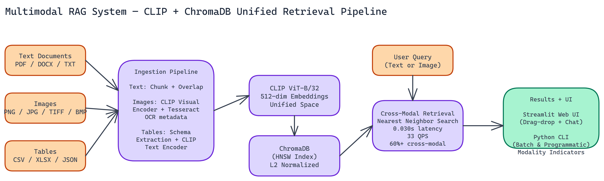

# Building a Multimodal RAG System That Retrieves Text, Images, and Tables Together

## The Problem

> Most RAG systems handle text. Send in a query, retrieve the relevant text chunks, feed them to an LLM. That works well when your knowledge base is entirely text-based. But real-world knowledge bases aren't like that — technical documentation has diagrams, financial reports have tables, product databases have images. If your retrieval system can only handle text, a large portion of your knowledge base is simply unsearchable.

NEO autonomously built a retrieval system that handles all three modalities through a single unified embedding space.

## The Core Problem: Unified Embeddings Across Modalities

The fundamental challenge in multimodal retrieval is comparing a text query against image content, or an image query against tabular data. These different data types don't have a natural shared representation.

CLIP solves this. OpenAI's Contrastive Language-Image Pretraining model was trained to align image and text representations in a shared embedding space. An image of a bar chart and a text description of that chart end up close to each other in CLIP's embedding space, even though they're completely different data types.

NEO uses CLIP ViT-B/32 to produce **512-dimensional embeddings** for all three modalities. Every piece of content in the knowledge base, whether a paragraph of text, a photograph, or a spreadsheet, gets embedded into the same 512-dimensional space. Retrieval becomes straightforward: embed the query, find the nearest neighbors.

## Ingestion Pipeline

The ingestion system handles three modality-specific processing paths that all feed into the same vector store.

### Text Processing

Text documents in PDF, DOCX, and TXT format go through recursive chunking. NEO splits documents into overlapping chunks of configurable size, preserving paragraph boundaries where possible. Each chunk gets embedded with CLIP's text encoder and stored with metadata: source document, page number, chunk index, and the original text.

Overlapping chunks ensure that content near chunk boundaries doesn't get split in ways that lose context.

### Image Processing

Images in PNG, JPG, TIFF, and BMP format go through two parallel processes. First, Tesseract OCR extracts any text embedded in the image (captions, labels, annotations). Second, the image itself gets encoded with CLIP's visual encoder.

The final embedding is the CLIP visual embedding, but the OCR text gets stored as metadata alongside it. This means a query for "quarterly revenue chart" can match an image based on visual similarity and also based on text found within the image.

### Table Processing

Tables from CSV, XLSX, and JSON files get processed through schema extraction. NEO extracts column names, data types, sample values, and any header information. This structured description of the table's content gets embedded with CLIP's text encoder, because describing what a table contains is fundamentally a language task.

This approach lets a text query like "customer churn by region" find a relevant CSV file based on the semantic match between the query and the table's schema description.

## Vector Storage with ChromaDB

All embeddings go into ChromaDB with HNSW (Hierarchical Navigable Small World) indexing. HNSW is an approximate nearest neighbor algorithm that trades a small amount of recall for significant speed. It's the standard choice for production vector databases: you might miss 1-2% of relevant results, but retrieval is 10-100x faster than exact search.

NEO applies L2 normalization to all embeddings before storage. This means cosine similarity and dot product similarity give equivalent results, and the HNSW index can use whichever is faster.

The result: **0.030 second** retrieval latency with **33 queries per second** average throughput. The retrieval step doesn't meaningfully add to end-to-end query latency.

## Cross-Modal Retrieval

The cross-modal accuracy NEO reports is **60%+** for text-to-image retrieval. When you submit a text query, more than 60% of the time the most visually relevant image appears in the top retrieved results.

For a baseline of random retrieval, that number would be close to zero. 60%+ reflects the quality of CLIP's shared embedding space for cross-modal matching.

This number varies by domain. Queries about content that CLIP has seen extensively during training (common objects, standard chart types, typical document layouts) perform better than highly specialized technical diagrams.

## User Interface

The system ships with two interfaces.

The **Streamlit web UI** provides drag-and-drop file uploads for knowledge base ingestion, a chat interface for submitting queries, and rich visualization of results that shows retrieved content with modality indicators and similarity scores. You can see at a glance whether a result came from a text chunk, an image, or a table.

The **Python CLI** supports programmatic access for batch ingestion and retrieval, integration into other pipelines, and automation.

## Production Readiness

The system includes error handling throughout the ingestion and retrieval paths, structured logging with enough detail to diagnose failures, and monitoring hooks for tracking retrieval latency and query patterns.

The Streamlit UI and batch processing capabilities run concurrently, so the web interface doesn't block background ingestion jobs.

## When to Use a Multimodal RAG System

The decision to use multimodal retrieval depends on your knowledge base composition. If more than 20-30% of your content is in non-text form (images, charts, diagrams, spreadsheets), a text-only RAG system has structural blind spots that a multimodal system addresses.

For knowledge bases that are almost entirely text, the complexity overhead of multimodal retrieval isn't worth it. Use the simpler system.

The clear use cases are: technical documentation with lots of diagrams, product catalogs with images and specification tables, research repositories mixing papers and figures, and any corpus where visual and tabular content carries as much information as the text.

## What's Next

The main extension NEO is working on is better table understanding. The current approach treats tables as described text, which misses numerical relationships within the data. A table-specific embedding model that understands row/column structure would improve retrieval for analytical queries.

Video is the other obvious modality to add. The CLIP architecture extends to video through frame-level sampling, though the indexing and retrieval patterns need adjustment for temporal content.

---

NEO built a multimodal RAG system where CLIP embeddings unify text, images, and tables into a single retrievable space—delivering 0.030-second latency and 60%+ cross-modal accuracy on queries that text-only systems simply cannot answer. See what else NEO ships at [heyneo.so](https://heyneo.so/).

---

## Try NEO in Your IDE

Install the NEO extension to bring AI-powered development directly into your workflow:

- **VS Code**: [NEO in VS Code](https://marketplace.visualstudio.com/items?itemName=NeoResearchInc.heyneo)
- **Cursor**: [**Install NEO for Cursor →**](cursor:extension/NeoResearchInc.heyneo)

---
