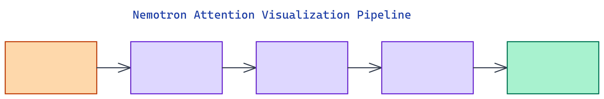

# Nemotron Attention Vis: Inspecting Attention Heads in 30B+ Models

[](https://github.com/dakshjain-1616/nemotron-attention-vis)



## The Problem

> Existing attention visualization tools like BertViz and TransformerLens target small encoder models. On 30B+ parameter architectures they either break or time out. Debugging why a frontier model fixates on the wrong token has no lightweight tooling.

NEO built nemotron-attention-vis to address this directly. It extracts per-layer, per-head attention matrices from `nvidia/Nemotron-Cascade-2-30B-A3B`, applies attention rollout to compute effective attention paths through all layers, and renders interactive HTML heatmaps. A mock mode runs in milliseconds on any laptop with no model download.

## Attention Rollout

**Attention rollout** is the technique from Abnar and Zuidema (2020) that computes effective attention through a deep network, not just the attention at a single layer. Each layer's attention matrix is multiplied recursively with the previous layers, accounting for residual connections. The result is a single matrix showing which input tokens truly influence each output position across the full model depth.

For a model with 8 attention layers and 16 heads, the raw data is a tensor of shape `[8, 16, seq_len, seq_len]`. Rollout collapses this to `[seq_len, seq_len]`, which is what gets rendered as the heatmap. Without rollout, you only see what layer 8 attended to, missing how layer 1 filtered information that never reached layer 8.

**Token importance scoring** adds another view: for each input token, sum the attention it receives across all layers and heads. This produces a ranking of which tokens the model treated as most relevant. A fine-tuned code model should score function signatures higher than inline comments. If it does not, the fine-tune did not take effect as intended.

## Mock Mode for Iteration Speed

The tool ships a `MockAttentionExtractor` that generates synthetic attention matrices in milliseconds. This is important because the real model is 30B parameters and requires a GPU with enough VRAM to load it. Most debugging and visualization work does not need the real model.

Mock mode uses the same data format as the real extractor, so your visualization pipeline, export logic, and downstream analysis scripts all work without modification. Switch to the real model by setting `mock=False` in the API call, pointing to a machine with a GPU.

```python
from nemotron_attention_v import visualize

# Mock mode — instant, offline, no download
html, json_path = visualize(
    prompt="Explain quantum computing",
    mock=True,
    output_dir="outputs",
    export_csv=True,
    rollout_view=True,
)
```

The call returns the path to the HTML heatmap and a JSON file with raw attention data. The JSON can be piped into notebooks or downstream analysis.

## Side-by-Side Prompt Comparison

The `compare_prompts` API runs two prompts through the same extraction pipeline and renders a side-by-side HTML diff of their attention maps. This is the core workflow for validating that a fine-tune changed the right patterns.

```python
from nemotron_attention_v import compare_prompts

html = compare_prompts(
    prompts=["The capital of France is", "Neural networks learn by"],
    mock=True,
    output_dir="outputs/comparison",
)
```

If you fine-tuned on code data and want to confirm the model now attends differently to syntax tokens than a baseline checkpoint does, run both checkpoints through `compare_prompts` on the same prompt. The side-by-side HTML makes the difference visible without writing any analysis code.

## Exports and Integration

Every visualization run produces three outputs. The **HTML heatmap** is a self-contained interactive file with tooltips showing exact attention weights per head. The **CSV export** has one row per `(layer, head, from_token, to_token)` combination with the attention weight, suitable for pandas analysis. The **JSON file** contains the full attention data plus metadata including model name, layer count, head count, and elapsed time.

The CSV is the most useful for quantitative comparisons. You can compute mean attention to specific token positions across heads, measure entropy per head to identify heads that have collapsed to attending to a single token, or track how attention to a particular token changes across fine-tuning checkpoints.

## How to Build This

Clone the repo and install:

```bash
git clone https://github.com/dakshjain-1616/nemotron-attention-vis
cd nemotron-attention-vis
pip install -r requirements.txt
```

Run the demo script in mock mode:

```bash
python scripts/demo.py --mock --prompt "Explain quantum computing"
```

This writes `outputs/attention_map.html` and opens it in the browser. For programmatic use:

```python
from nemotron_attention_v import visualize

html, json_path = visualize(
    prompt="def fibonacci(n):",
    mock=True,
    output_dir="outputs",
    export_csv=True,
    rollout_view=True,
)
print(f"Heatmap: {html}")
print(f"Data:    {json_path}")
```

For a two-prompt comparison:

```python
from nemotron_attention_v import compare_prompts

html = compare_prompts(
    prompts=["Function signatures matter", "Comments are optional"],
    mock=True,
    output_dir="outputs/comparison",
)
```

To run against the real model, set `mock=False`. The tool will load `nvidia/Nemotron-Cascade-2-30B-A3B` via HuggingFace on the local GPU. Run the test suite to verify the installation:

```bash
pytest tests/ -q
# 90 passed in ~2s
```

NEO built an offline-first attention visualizer for Nemotron-Cascade-2-30B-A3B that works without a GPU download and scales to real model inspection when you need it. See what else NEO ships at [heyneo.so](https://heyneo.so/).

---

## Try NEO in Your IDE

Install the NEO extension to bring AI-powered development directly into your workflow:

- **VS Code**: [NEO in VS Code](https://marketplace.visualstudio.com/items?itemName=NeoResearchInc.heyneo)
- **Cursor**: <a href="cursor://extension/NeoResearchInc.heyneo" style="color:#0066FF;font-weight:bold;">Install NEO for Cursor →</a>

---
